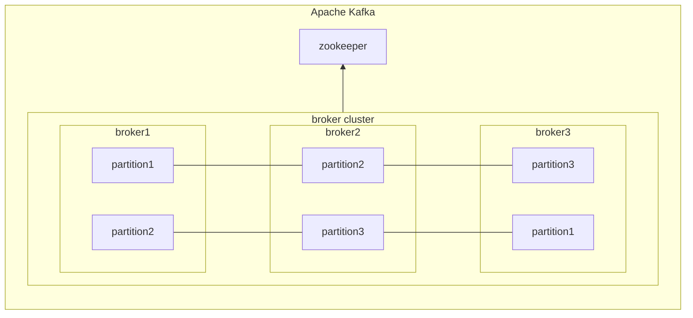
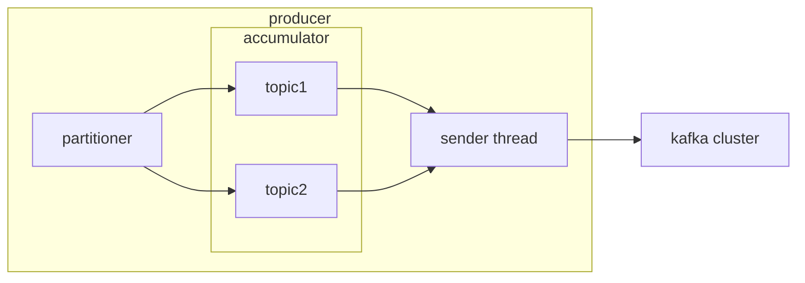
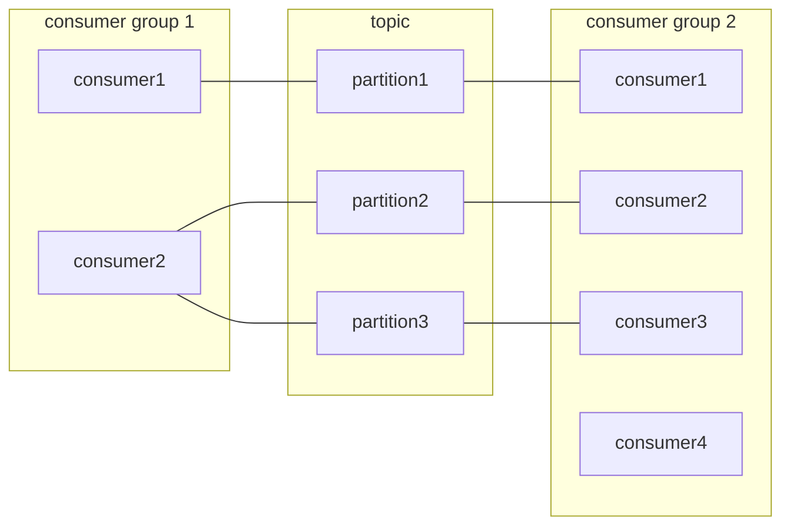

# Apache Kafka Application Programing

## 1. Kafka Architecture

- broker  
  클라이언트 요청을 처리하며 record를 cluster 내부에 분산 저장한다.
  - controller  
    broker 상태를 관리하고 broker가 cluster에 빠지면 해당 broker에 존재하는 leader partition을 재분배한다.
  - coordinator  
    consumer group의 상태를 확인하고 partition을 consumer에 매칭되도록 분배한다.
- zookeeper  
  broker 상태를 관리한다.
- topic  
  record를 구분하기 위해 사용되는 단위
- partition  
  실제 record가 저장되는 FIFO 형태의 자료구조이다. replication.factor 값에 따라 토픽의 partition 숫자가 결정된다.
- record  
  timestamp, key, headers, value, offset으로 구성되어 있다.

## 2. Kafka producer client

record를 전송할 때, producer client는 leader partition이 있는 broker와 통신한다.

### Ack

- 0: leader partition broker에 전송 성공
  - producer 장애 -> 유실
  - leader partition broker 장애 -> 유실
- 1: leader partition record 적재 성공
  - producer 장애 -> 유실
  - leader partition broker 장애 -> 유실
  - ack timeout -> 중복
- all: min.sync.replica follower partition에 record가 적재 성공
  - producer 장애 -> 유실
  - ack timeout -> 중복

### Partition key

- default partitioner는 key가 있을 때, key hash로 partition을 match
- clustering producer application 환경에서 예상과 다르게 메세지 순서가 다르게 적재될 수 있음
  - A 애플리케이션 API 호출 & produce 호출
  - B 애플리케이션 API 호출 & produce 호출
  - B 애플리케이션 sender 스레드가 accumulator 버퍼에서 records publish
  - A 애플리케이션 sender 스레드가 accumulator에서 records publish

### Idempotent producer

Exactly once delivery 전송을 위해 record 전송할 때, PID와 sequence number를 함께 전송한다.

## 3. Kafka consuemr client

### Partition Assign

consumer 그룹으로 묶인 consumer가 토픽을 구독해서 record를 가져갈 때, 1개의 partition은 최대 1개의 consumer에 할당 가능하다.

### Commit & Offset

consumer는 카프카 broker로부터 record를 어디까지 가져갔는지 commit을 통해 기록한다. 특정 토픽의 partition을 어떤 consumer 그룹이 몇 번째 가져갔는지 카프카 broker 내부에서 사용되는 내부 토픽(__consumer_offsetts)에 기록된다. auto commit 경우 rebalacing 영향으로 consumer가 처리하는 record가 중복 또는 유실될 수 있다.

### Rebalancing

consumer 그룹에 새로운 consumer가 추가되거나 제외되는 상황에 partition이 재할당된다. 리밸런싱이 발생할 때, consumer 그룹의 consumer들이 토픽에 record를 읽을 수 없다.

- session.timeout.ms  
  broker가 consumer와 연결이 끊어지는 최대 시간이다. heartbeat를 보내지 않으면 consumer에 이상이 발생했다고 판단하고 rebalancing을 시작한다. 보통 heartbeat 주기의 3배로 설정한다.
- heartbeat.interval.ms  
  heartbeat를 전송하는 시간 간격이다.
- max.poll.interval.ms  
  poll() 메소드를 호출하는 간격의 최대 시간을 지정한다. 주기적으로 poll을 호출하지 않으면 consumer에 이상이 발생했다고 판단하고 rebalancing을 시작한다.

### ConsumerRebalanceListener

poll 메소드를 통해 반환 받은 record를 모두 처리하기 전에 rebalancing이 발생하면 record를 중복 처리할 수 있다. rebalancing 발생 했을 때, 처리한 record 기준으로 commit을 시도해야 한다.

### Consumer LAG

LOG-END-OFFSET과 consumer offset 간의 차이다.
