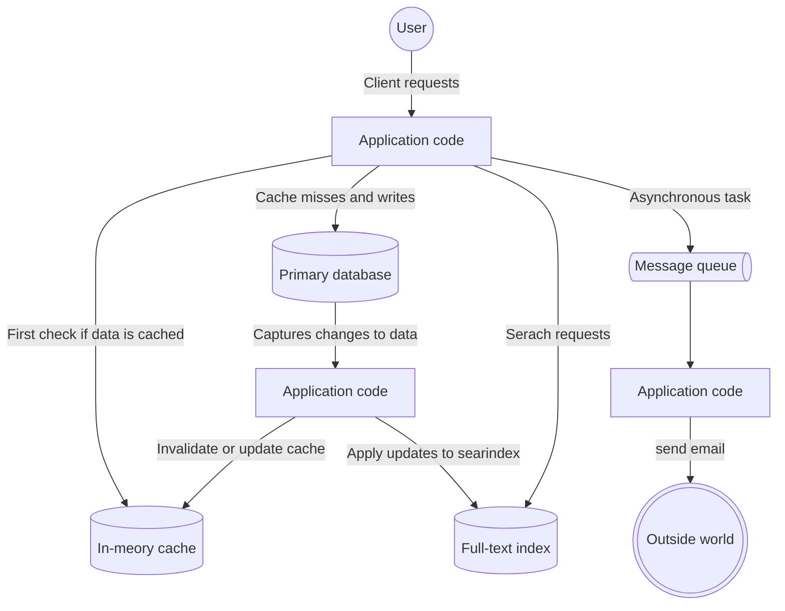
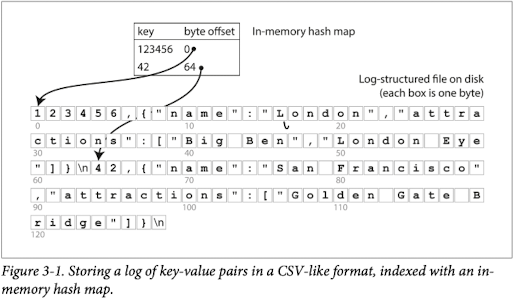
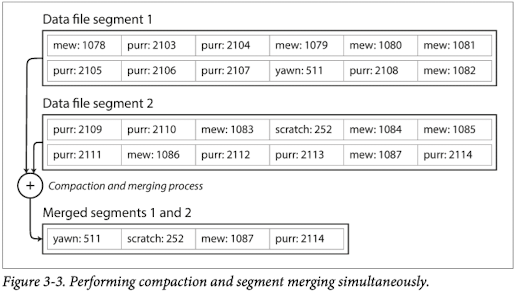

# Part Ⅰ. Foundations of Data Systems

## 1. Reliable, Scalable, and Maintainable Application

A data-intensive application is typically built from standard building blocks that provide commonly needed functionality.

- Store data so that they, or another application, can find it again later (database)
- Remember the result of an expensive operation, to speed up reads (cache)
- Allow users to search data by keyword or filter it in various ways (search index)
- Send a message to another process, to be handled asynchronously (stream processing)
- Periodically crunch a large amount of accumulated data (batch processing)

We will start by exploring the fundamentals of what we are trying to achieve: reliable, scalable, and maintainable data systems.

### Thinking About Data Systems

When you combine several tools in order to provide a service, the service's interface or application programming interface (API) usually hides those implementation details from clients.
Now you have essentially created a new, special-purpose data system from smaller, general-purpose components.
Your composite data system may provide certain guarantees: e.g., that the cache will be correctly invalidated or updated on writes so that outside clients see consistent results.
You are now not only an application developer, but also a data system designer.



### Reliability

The system should continue to work correctly (perform the correct function at the desired level of performance) even in the face of adversity(hard or soft-ware faults, and event human error)

- The application can perform the function that the user expected.
- It can tolerate the user making mistakes or using the software in unexpected ways.
- Its performance is good enough for the required use case, under the expected load and data volume.
- The system prevent unauthorized access and abuse.

### Scalability

Scalability is the term we use to describe a system's ability to cope with increased load.
Note that it is not a one-dimensional label that we can attach to a system.
Discussing scalabiltiy means considering questions like "If the system grows in a particular way, what are our options for coping with the growth?" and "How can we add computing resources to handle the additional load?"

#### Describing Load

The best choice of parameters depends on the architecture of your system: it may be requests per second to a web server, the ratio of reads to writes in a database, the number of simultaneously active users in chat room, the hit rate on a cache, the distribution of followers per user, or something else.

#### Describing Performance

Once you have described the load on your system, you can investigate what happens when the load increases.

- When you increase a load parameter and keep the system resource unchanged, how is the performance of your system affected?
- When you increase a load parameter, how much do you need to increase resources if you want to keep performance unchanged?

Both questions require performance numbers, performance numbers can vary and may be values such as response time, throughput, and more.

We need to think of response time not as a single value, but as a distribution of values.
High percentiles of response time(tail latencies) are important because they directly affect the user's experience of the service.

### Maintainability

Over time, many different people will work on the system, and they should all be able to work on it productively.

- Operability  
Make it easy for operations teams to keep the system running smoothly.
- Simplicity  
Make it easy for new engineers to understand the system, by removing as much as possible from the system.
- Evolvability  
Make it easy for engineers to make changes to the system in the future, adapting it for unanticipated use cases as requirements change.

## 2. Data Models and Query Languages

Data models are perhaps the most important part of developing software, because they have such a profound effect: not only on how the software is written, but also on how we think about the problem that we are solving.

### Relational Models Versus Document Models

#### Relational Models

- Advantages
  - Efficiently represents relationships like many-to-one and many-to-many using joins and foreign keys.
  - Facilitates easy normalization, helping to reduce data redundancy.
- Disadvantages
  - The mismatch between object-oriented programming and the relational model (impedance mismatch) requires additional effort to manage.
  - Joins involving foreign keys may result in frequent disk random access, leading to poor performance when handling many joins.

#### Document Models

- Advantages
  - Can easily represent unstructured data formats like JSON.
  - Good read performance, as a single query can fetch most of the required data due to data locality.
  - Flexible schema, making it easier to manage items with varying structures within a collection.
- Disadvantages
  - Weaker support for joins, making it difficult to represent relationships like many-to-one and many-to-many.
  - Denormalization can lead to issues of data duplication and inconsistency.

### Query Languages for Data

A declarative query language is attractive because it is typically more concise and easier to work with than an imperative API.
But more importantly, it also hides implementation details of the database engine.
Declarative languages often lend themselves to parallel execution.

#### MapReduce

MapReduce is a fairly low-level programming model for distributed execution on a cluster of machines.

### Graph-Like Data Model

As the connection within your data becomes more complex, it becomes more natural to start modeling your data as a graph.
Graph model are not limited to such homogeneous data: an equally powerful use of graphs is to provide a consistent way of storing completely different types of objects in a single datastore.

#### Property Graphs

1. Any vertex can have an edge connecting it with any other vertex. There is no schema that restricts which kinds of things can or cannot be associated.
2. Given any vertex, you can efficiently find both its incoming and its outgoing edges, and thus traverse the graph.
3. By using different labels for different kinds of relationships, you can store several different kinds of information in a single graph, while still maintaining a clean data model.

#### The Cypher Query Language

Cypher is a declarative query language for property graphs.

```CYPHER
CREATE
  (NAmerica:Location {name:'North America', type:'continent'}),
  (USA:Location {name:'United States', type:'country' }),
  (Idaho:Location {name:'Idaho', type:'state' }),
  (Lucy:Person {name:'Lucy'}),
  (Idaho) -[:WITHIN]-> (USA) -[:WITHIN]-> (NAmerica),
  (Lucy) -[:BORN_IN]-> (Idaho)
```

```CYPHER
MATCH
  (person) -[:BORN_IN]-> () -[:WITHIN*0..]-> (us:Location {name:'United States'}),
  (person) -[:LIVES_IN]-> () -[:WITHIN*0..]-> (us:Location {name:'Europe'})
RETURN person.name
```

#### Graph Queries in SQL

```SQL
WITH RECURSIVE
  in_usa(vertex_id) AS (
      SELECT vertex_id FROM vertices WHERE properties->>'name' = 'United States'
    UNION
      SELECT edges.tail_vertex FROM edges
        JOIN in_usa ON edges.head_vertex = in_usa.vertex_id
        WHERE edges.label = 'within'
  ),

  in_europe(vertex_id) AS (
      SELECT vertex_id FROM vertices WHERE properties->>'name' = 'Europe'
    UNION
      SELECT edges.tail_vertex FROM edges
        JOIN in_usa ON edges.head_vertex = in_europe.vertex_id
        WHERE edges.label = 'within'
  ),
  born_in_usa(vertex_id) AS (
      SELECT edges.tail_vertex FROM edges
        JOIN in_usa ON edges.head_vertex = in_usa.vertex_id
        WHERE edges.label = 'born_in'
  ),
  born_in_europe(vertex_id) AS (
      SELECT edges.tail_vertex FROM edges
        JOIN in_europe ON edges.head_vertex = in_europe.vertex_id
        WHERE edges.label = 'lives_in'
  )

SELECT vertices.properties->>'name'
FROM vertices
JOIN born_in_usa ON vertices.vertex_id = born_in_usa.vertex_id
JOIN born_in_usa ON vertices.vertex_id = lives_in_europe.vertex_id
```

## 3. Storage and Retrieval

You do need to select a storage engine that is appropriate for your application, from the many that are available.
In order to tune a storage engine to perform well on your kind of workload, you need to have a rought idea of what the storage engine is doing under the hood.

### Data Structures That Power your Database

The general idea behind indexes is to keep some additional metadata on the side, which acts as a signpost and helps you to locate the data you want.

#### Hash Indexes

Keep an in-memory hash map where every key is mapped to a byte offset in the data file—
the the location at which the value can be found.



Break the log into segments of a certain size by closing a segment file when it reaches a certain size, and making subsequent writes to a new segment file.
We can then perform compaction on these segments.
**Compaction** means throwing away duplicate keys in the log, and keeping only the most recent update for each key.



#### SStable and LSM tree

Require that the sequence of key-value pairs is sorted by key.
We call this format Sorted String Table (SSTable).
We also require that each key only appears once within each merged segment file (the compaction process ensure that).

- In-memory indexes can be sparse because of sorting.
- It uses a red-black tree or AVL tree(memtable) to maintain a sorted structure on disk.

##### Performance optimizations

- The LSM-tree algorithm can be slow when looking up keys that do not exist in the database. A Bloom filter is a memory-efficient data structure for approximating the contents of a set.
- There are strategies to determin the order and timing of how SSTables are compacted and merged.
  - In size-tiered compaction, newer and smaller SSTables are successively merged into older and larger SSTables.
  - In leveled compaction, the key range is split up into smaller SSTables and older data is moved  into separatee "levels," which allows the compaction to proceed more incrementally and use less disk space.

#### B-Tree

The log-structured indexs we saw earlier break the database down into variable-size segments, typically serveral megabytes or more in size, and always write a segment seuentially.
B-trees break the database down into fixed-size blocks or pages and read or write one page at a time.

One page is designed as the root of the B-tree.
Each child is responsible for a continuous range of keys, and the keys between the references indicate where the boundaries between those ranges lie.

### Transaction Processing or Analytics?

| Property | Transaction processing systems (OLTP) | Analytics systems (OLAP) |
|---|---|---|
| Main read pattern | Small number of records per query, fetched by key | Aggregate over large number of records |
| Main write pattern | Random-access,low-latency writes from user input | Bulk import(ETL) or event stream |
| Primarily used by | End user/customer, via web application | Internal analyst, for decision support |
| What data represents | Latest state of data(current point in time) | History of events that happened over time |
| Dataset size | Gigabytes to terabytes | Terabytes to petabytes |

This separate database was called a data warehouse.

### Column-Oriented Storage

The idea behind column-oriented storage is simple: don't store all the values from one row together, but store all the values from each column together instead.
If each column is stored in a separate file, a query only needs to read and parse those columns that are used in that query, which can save a lot of work.

#### Column-oriented storage and column families

Cassandra and HBase have a concept of column families, which they inherited from Bigtable.
However, it is very misleading to call them column-oriented: within each column family, they store all columns from a row together, along with a row key, and they do not use column compression.
Thus, the Bigtable model is still mostly row-oriented.

#### Aggregation: Data Cubes and Materialized Views

One way of creating such a cache is a materialized view.
In a relational data model, it is often defined like a standard (virtual) view: a table-like object whose contents are the results of some query.
The difference is that materialized view is an actual copy of the query results, written to disk, whereas a virtual view is just a shortcut for writing queries.

## 4. Encoding and Evolution

- Backward compatibility  
  Newer code can read data that was written by older code.  
- Forward compatibility  
  Older code can read data that was written by newer code.

### Formats for Encoding Data

Program usually work with data in (at least) two different representations:

1. In memory, data is kept in objects, structs, lists, arrays, hash tables, trees, and so on.
These data structures are optimized for efficient access and manipulation by the CPU (typically using pointers).
2. When you want to write data to a file or send it over the network, you have to encode it as some kind of self-contained sequence of bytes(for example, a JSON document).
Since a pointer wouldn't make sense to any other process.

The translation from the in-memory representation to a byte sequence is called encoding, and the reverse is called decoding.

#### Language-Specific Formats

Programming language-specific encodings(Serializable, Marshal, pickle) are restricted to a single programming language and often fail to provide forward and backward compatibility.

#### JSON, XML, and Binary Variants

Textual formats like JSON, XML, and CSV are widespread, and their compatibility depends on how you use them.
These formats are somewhat vague about datatypes, so you have to be careful with things like number and binary strings.

#### Thrift, Protocol Buffers and Avro

Binary schema-driven formats like Thrift, Protocol Buffers, and Avro allow compact, efficient encoding with clearly defined forward and backward compatibility semantics.
The schemas can be useful for documentation and code generation in statically typed languages.
However, they have the downside that needs to be decoded before it is human-readable.

#### What is the writer's schema

- Large file with lots of records  
- Database with individually written records
- Sending records over a network connection

### Modes of Dataflow

- Dataflow Through Databases  
  Forward compatibility is often required.
- Dataflow Through Services: REST and RPC  
  Backward compatibility is required on request and forward compatibility is required on response.
- Message-Passing Dataflow  
  Forward compatibility is required on the producer.
