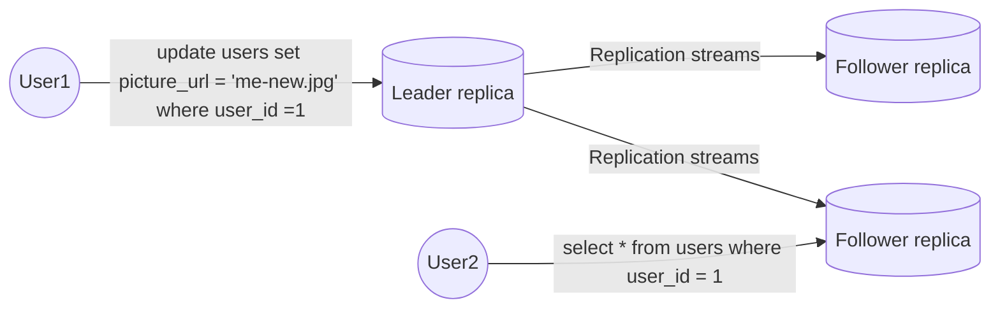

# Part Ⅱ. Distributed Data

There are various reasons why you might want to distribute a database across multiple machines.

- Scalability  
  If your data volume, read load, or write load grows bigger than a single machine can handle, you can potentially spread the load across multiple machines.
- Fault tolerance/high availability  
  If your application needs to continue working even if one machine(or several machines, or network, or an entire datacenter) goes down, you can use multiple machines to give you redundancy.
- Latency  
  If you have users around the world, you might want to have servers at various locations worldwide so that each user can be served from a datacenter that is geographically close to them.

In the shared-nothing architecture approach, Each machine or virtual machine running the database software is called node.
Each node uses its CPUs, RAM, and disks independently.
Any coordination between nodes is done at the software level, using a conventional network.

In this chapter, we focus on shared-nothing architectures-not because they are necessarily the best choice for every use case, but rather because they require the most caution from you, the application developer.
If your data is distributed across multiple nodes, you need to be aware of the constraints and trade-offs that occur in such a distributed system-the database cannot magically hide these from you.

## 5. Replication

Replication means keeping a copy of the same data on multiple machines that are connected via a network.

### Leaders and Followers

The most common solution for replication is called leader-based replication(also known as active/passive or master-slave replication).

#### Synchronous Versus Asynchronous Replication

The advantage of synchronous replication is that the follower is guaranteed to have an up-to-date copy of the data that is consistent with the leader.
The disadvantage is that if the synchronous follower doesn't respond, the write cannot be processed.

In practice, if you enable synchronous replication on a database, it usually means that one of the followers is synchronous, and the others are asynchronous.
Often, leader-based replication is configured to be completely asynchronous.

#### Setting Up New Followers

1. Take a consistent snapshot of the leader's database at some point in time.
2. Copy the snapshot to the new follower node.
3. The follower connects to the leader and requests all the data changes that have happened since the snapshot was taken.
4. When the follower has processed the backlog of data changes since the snapshot, we say it has ***caught up***.

#### Handing Node Outages

##### Leader failure: Failover

Failover process consist of the following steps:

1. Determining that the leader has failed.
There is no foolproof way of detecting what has gone wrong, so most systems simply use a timeout.
2. Choosing a new leader.
This could be done through an election process, or a new leader could be appointed by a previously elected controller node.
The best candidate for leadership is usually the replica with the most up-to-date data changes from the old leader.
3. Reconfiguring the system to use the new leader.
Clients now need to send their write requests to the new leader.
Clients now need to send their write requests to the new leader.
If the old leader comes back, it might still believe that it is the leader, not realizing that the other replicas have forced it to step down.
The system needs to ensure that the old leader becomes a follower and recognizes the new leader.

Failover is fraught with things that can go wrong:

- If asynchronous replication is used, the new leader may not have received all the writes from the old leader before it failed.
If the former leader s the cluster after a new leader has been chosen, what should happen to those writes?
The new leader may have received conflicting writes in the meantime.
The most common solution is for the old leader's unreplicated writes to simply be discarded, which may violate client's durability expectations.
- Discarding writes is especially dangerous if other storage systems outside of the database need to be coordinated with the database contents.
For example, an out-of-date MySQL follower was promoted to leader.
The database used an autoincrementing counter to assign primary keys to new rows, but because the new leader's counter lagged behind the old leader's, it reused some primary keys that were previously assigned by the old leader.
These primary keys were also used in a Redis store, so the reuse of primary keys resulted in inconsistency between MySQL and Redis.
- It could happen that two nodes both believe that they are the leader.
This situation is called *split brain*.
- What is the right timeout before the leader is declared dead?

#### Implementation of Replication Logs

##### Statement-based replication

The leader logs every write request (statement) that it executes and sends that statement log to its followers.
There are various ways in which this approach to replication can break down.

- Any statement that calls a nondeterministic function is likely to generate a different value on each replica.
- If statements use an autoincrementing column, or if they depend on the existing data in the database, they must be executed in exactly the same order on each replica, or else they have different effects.

##### Write-ahead(WAL) log shipping

The leader sends WAL logs across the network to its followers.
When the follower processes this log, it builds a copy  of the exact same data structures as found on the leader.
The main disadvantage is that the log describes the data on a very low level.
This makes replication closely coupled to the storage engine.
If the database changes its storage format from one version to another, it is typically not possible to run different versions of the database software on the leader and the followers.

##### Logical log replication

A logical log for a relational database is usually a sequence of records describing writes to database tables at the granularity of a row.
A logical log format is also easier for external applications to parse.
This aspect is useful if you want to send the contents of a database to an external system, such as a data warehouse for offline analysis, or for building custom indexes and caches.
This technique is called *change data capture*.

##### Trigger-based replication

You may need to move replication up to the application layer.
An alternative is to use features that are available in many relational databases: *triggers* and *stored procedure*.

### Problems with Replication Lag

#### Reading Your Own Writes

#### Monotonic Reads

#### Consistent Prefix Reads

#### Solution for Replication Lag

### Multi-Leader Replication

### Leaderless Replication

## 6. Partitioning

## 7. Transactions

## 8. The Trouble with Distributed Systems

## 9. Consistency and Consensus
