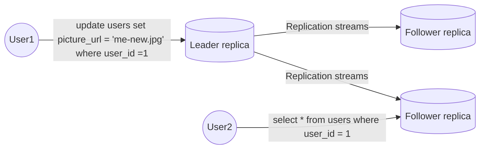
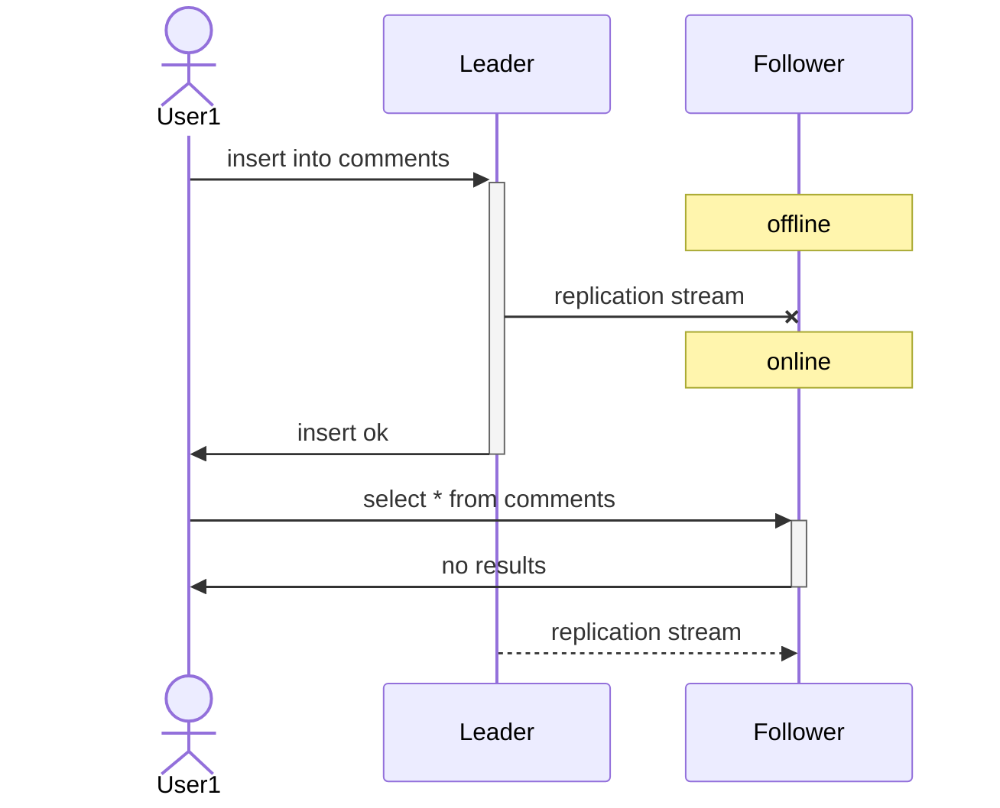
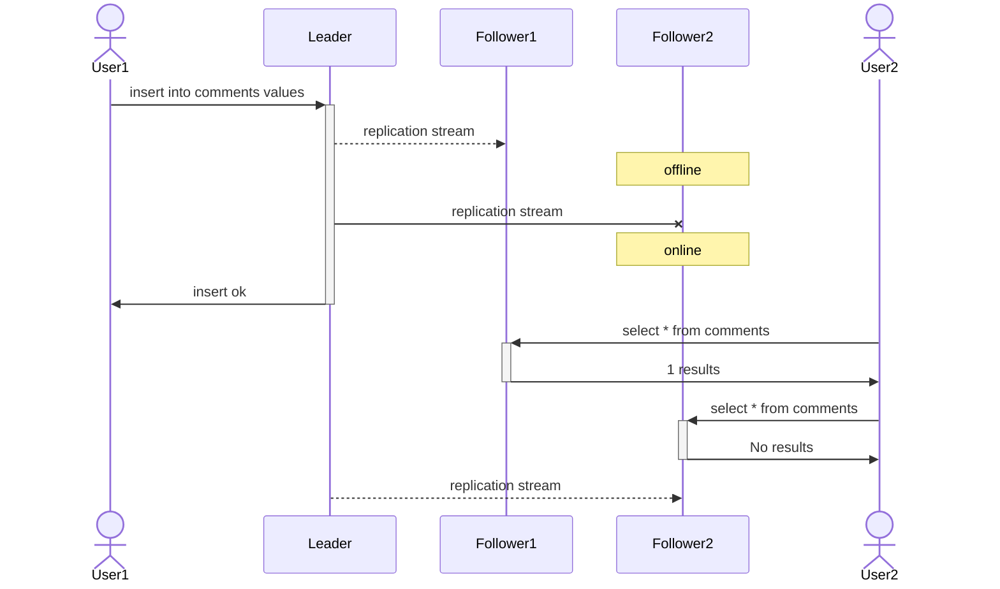
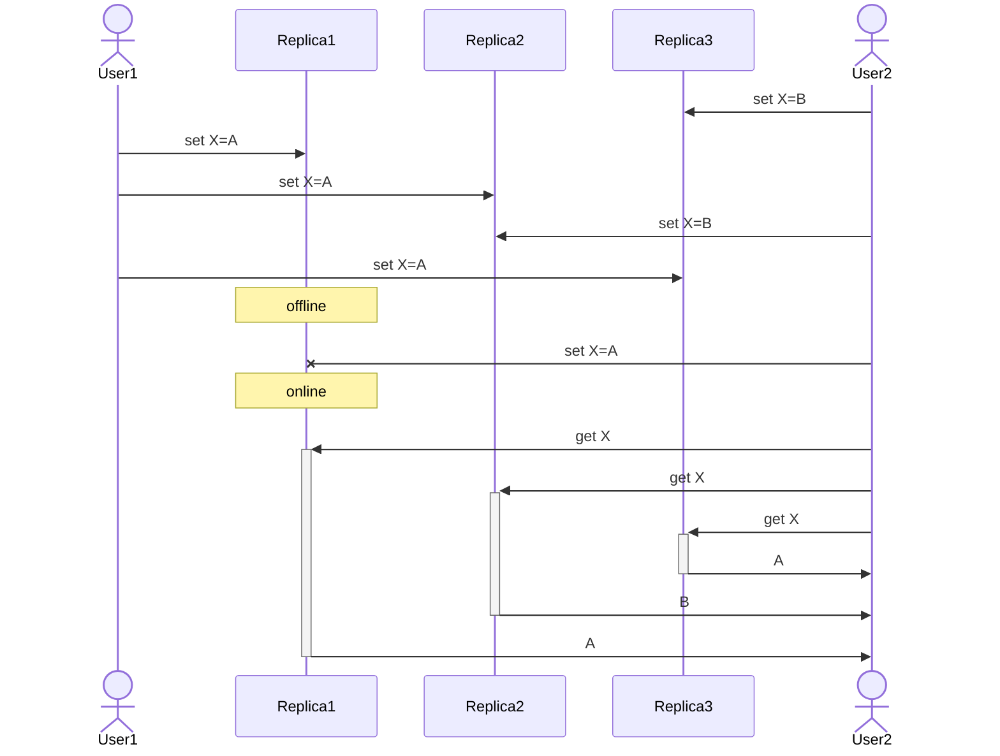

# Part Ⅱ. Distributed Data

There are various reasons why you might want to distribute a database across multiple machines.

- Scalability  
  If your data volume, read load, or write load grows bigger than a single machine can handle, you can spread the load across multiple machines.
- Fault tolerance/high availability  
  If your application needs to continue working even if one machine goes down, you can use multiple machines to give you redundancy.
- Latency  
  If you have users around the world, you might want to have servers at various locations worldwide so that each user can be served from a datacenter that is geographically close to them.

In the shared-nothing architecture approach, Each machine running the database software is called node.
Each node uses its CPUs, RAM, and disks independently.
Any coordination between nodes is done at the software level, using a conventional network.

In this chapter, we focus on shared-nothing architectures-not because they are necessarily the best choice for every use case, but rather because they require the most caution from the application developer.
If your data is distributed across multiple nodes, you need to be aware of the constraints and trade-offs that occur in such a distributed system-the database cannot magically hide these from you.

## 5. Replication

Replication means keeping a copy of the same data on multiple machines that are connected via a network.

### Leaders and Followers

The most common solution for replication is called ***leader-based*** replication(also known as active/passive or master-slave replication).

#### Synchronous Versus Asynchronous Replication

The advantage of synchronous replication is that the follower is guaranteed to have an up-to-date copy of the data that is consistent with the leader.
The disadvantage is that if the synchronous follower doesn't respond, the write cannot be processed.

In practice, if you enable synchronous replication on a database, it usually means that one of the followers is synchronous, and the others are asynchronous.
Often, leader-based replication is configured to be completely asynchronous.

#### Setting Up New Followers

1. Take a consistent snapshot of the leader's database at some point in time.
2. Copy the snapshot to the new follower node.
3. The follower connects to the leader and requests all the data changes that have happened since the snapshot was taken.
4. When the follower has processed the backlog of data changes since the snapshot, we say it has *caught up*.

#### Handing Node Outages

##### Leader failure: Failover

Failover process consist of the following steps:

1. Determining that the leader has failed.
There is no foolproof way of detecting what has gone wrong, so most systems simply use a timeout.
2. Choosing a new leader.
This could be done through an election process, or a new leader could be appointed by a previously elected controller node.
The best candidate for leadership is usually the replica with the most up-to-date data changes from the old leader.
3. Reconfiguring the system to use the new leader.
Clients now need to send their write requests to the new leader.
If the old leader comes back, it might still believe that it is the leader, not realizing that the other replicas have forced it to step down.
The system needs to ensure that the old leader becomes a follower and recognizes the new leader.

Failover is fraught with things that can go wrong:

- If asynchronous replication is used, the new leader may not have received all the writes from the old leader before it failed.
If the former leader rejoin the cluster after a new leader has been chosen, what should happen to those writes?
The most common solution is for the old leader's unreplicated writes to simply be discarded, which may violate client's durability expectations.
- Discarding writes is especially dangerous if other storage systems outside of the database need to be coordinated with the database contents.
For example, an out-of-date MySQL follower was promoted to leader.
The database used an autoincrementing counter to assign primary keys to new rows, it reused some primary keys that were previously assigned by the old leader.
These primary keys were also used in a Redis store, so the reuse of primary keys resulted in inconsistency between MySQL and Redis.
- It could happen that two nodes both believe that they are the leader.
This situation is called split brain.
- What is the right timeout before the leader is declared dead?

#### Implementation of Replication Logs

##### Statement-based replication

The leader logs every write request(statement) that it executes and sends that statement log to its followers.
There are various ways in which this approach to replication can break down.

- Any statement that calls a nondeterministic function is likely to generate a different value on each replica.
- If statements use an autoincrementing column, or if they depend on the existing data in the database, they must be executed in exactly the same order on each replica, or else they have different effects.

##### Write-ahead(WAL) log shipping

The leader sends WAL logs across the network to its followers.
When the follower processes this log, it builds a copy  of the exact same data structures as found on the leader.
The main disadvantage is that the log describes the data on a very low level.
This makes replication closely coupled to the storage engine.
If the database changes its storage format from one version to another, it is typically not possible to run different versions of the database software on the leader and the followers.

##### Logical log replication

A logical log for a relational database is usually a sequence of records describing writes to database tables at the granularity of a row.
A logical log format is also easier for external applications to parse.
This aspect is useful if you want to send the contents of a database to an external system, such as a data warehouse for offline analysis, or for building custom indexes and caches.
This technique is called *change data capture*.

##### Trigger-based replication

You may need to move replication up to the application layer.
An alternative is to use features that are available in many relational databases: *triggers* and *stored procedure*.

### Problems with Replication Lag

The read-scaling architecture approach only realistically works with asynchronous replication-if you tried to synchronously replicate to all followers, a single node failure or network outage would make the entire system unavailable for writing.
Unfortunately, if an application reads from an asynchronous follower, it may see outdated information if the follower has fallen behind.
This effect is known as ***eventual consistency***.
The delay between a rite happening on the leader and being reflected on a follower is called ***replication lag***.

#### Reading Your Own Writes

***Read-after-write consistency*** is a guarantee that if the use reload the page, they will always see any updates they submitted themselves.
To implement read-after-write consistency, You have some way of knowing whether something might have been modified, without actually querying it: authorization, last update time or timestamp.
Another complication arises when the same user is accessing your service from multiple devices.
In this case you may want to provide ***cross-device read-after consistency***.

- Metadata will need to be centralized for approaches that require remembering the timestamp of the user's last update.
- There is no guarantee that connections from different devices will be routed to the same datacenter.

#### Monotonic Reads

You may see an old value; ***monotonic reads*** only means that if one user makes several reads in sequence, they will not see time go backward.
It's a lesser guarantee than strong consistency, but a stronger guarantee than eventual consistency.

#### Consistent Prefix Reads

Preventing this kind of anomaly requires another type of guarantee: ***consistent prefix reads***.
This guarantee says that if a sequence of writes happens in a certain order, then anyone reading those writes will see them appear in the same order.
One solution is to make sure that any writes that are causally related to each other are written to the same partition.

#### Solution for Replication Lag

It would be better if application developers didn't have to worry about subtle replication issues and could just trust their databases to "do the right thing."
This is why ***transaction*** exist: they are a way for a database to provide stronger guarantees so that the application can be simpler.

### Multi-Leader Replication

A natural extension of the leader-based replication model is to allow more than one node to accept writes.
Replication still happens in the same way: each node that processes a write must forward that data change to all the other nodes.
We call this a ***multi-leader*** configuration(also known as master-master or active/active replication).

#### Handling Write Conflicts

The biggest problem with multi-leader replication is that write conflicts can occur, which means that conflict resolution is required.

- Synchronous versus asynchronous conflict detection  
  By making the conflict detection synchronous, you would lose the main advantage of multi-leader replication: allowing each replica to accept writes independently.
- Conflict avoidance  
  The simplest strategy for dealing with conflicts is to avoid them.
  Since many implementations of multi-leader replication handle conflicts quite poorly, avoiding conflict is a frequently recommended approach.
- Converging toward a consistent state  
  If each replica simply applied writes in the order that it saw the writes, the database would end up in an inconsistent state.
  If a timestamp is used, this technique is known as *last write wins*.
- Custom conflict resolution
  - On write  
    As soon as the database system detects a conflict in the log of replicated changes, it calls the conflict handler.
    It runs in a background process.
  - On read  
    When a conflict is detected, all the conflicting write are stored.
    The next time the data is read, these versions of the data are returned to the application.

#### Multi-Leader Replication Topologies

- Circular topology
- Star topology
- All-to-All topology

A problem with circular and star topologies is that if just one node fails, it can interrupt the flow of replication messages between other nodes, causing them to be unable to communicate until the node is fixed.
All-to-all topologies can have issues.
Some network links may be faster than others, with the result that some replication messages may "overtake" others.
This is a problem of causality.

### Leaderless Replication

In some leaderless implementations, the client directly sends its writes to several replicas, while in others, a coordinator node does this on behalf of the client.
However, unlike a leader database, that coordinator does not enforce a particular ordering of writes.

#### Writing to the Database When a Node Is Down

```mermaid
sequenceDiagram
  actor User1
  participant Replica1
  participant Replica2
  participant Replica3
  
  rect rgb(54, 58, 106)
  User1->>+Replica3: set key=user1 value=new
  User1->>+Replica2: set key=user1 value=new
  note over Replica1: offline
  User1-xReplica1: set key=user1 value=new
  note over Replica1: online
  Replica2->>-User1: ok
  Replica3->>-User1: ok
  end
  
  rect rgb(40, 86, 49)
  actor User2
  User2->>+Replica1: get key=user1
  User2->>+Replica2: get key=user1
  User2->>+Replica3: get key=user1
  Replica3->>-User2: value=new version=7
  Replica2->>-User2: value=new version=7
  Replica1->>-User2: value=old version=6

  User2->>+Replica1: set key=user1 value=new version=7
  Replica1->>-User2: ok
  end
```

##### Read repair and anti-entropy

- Read repair  
  The client detect a stale value and writes the newer values back to that replica
  This approach works well for values that are frequently read.
- Anti-entropy process  
  Some datastores have a background process that constantly looks for differences in the data between replicas and copies any missing data from one replica to another.  

##### Quorums for reading and writing

If there are n replicas, every write must be confirmed by w nodes to be considered successful, and we must query at least r nodes for each read.
As long as w + r > n, we expect to get an up-to-date value when reading.
Reads and writes that obey these r and w values are called *quorum* reads and writes.

#### Limitation of Quorum Consistency

- If sloppy quorum is used, the w writes may end up on different nodes than the r reads.
- If two writes occur concurrently, it is not clear which one happened first.
- If a write happens concurrently with a read, it's undetermined whether the read returnㄴ the old or the new value.
- If a write succeeded on some replicas but failed on others, and overall succeeded on fewer than w replicas, it is not roll backed on the replicas where it succeeded.
- If a node carrying a new value fails, and its data is restored from a replica carrying an old value.

#### Detecting Concurrent Writes

The problem is that events may arrive in a different order at different nodes, due to variable network delays and partial failures.

##### Last write win

We can attach a timestamp to each write, pick the biggest timestamp as the most "recent," and discard any writes with an earlier timestamp.
This conflict resolution algorithm, called last write wins (LWW).
LWW achieves the goal of eventual convergence, but at the cost of durability.

##### The "happens-before" relationship and concurrency

Whether one operation happens before another operation is the key to defining what concurrency means.
In fact, we can simply say that two operations are concurrent if neither happens before the other.

What we need is an algorithm to tell us whether two operations are concurrent or not.
If one operation happened before another, the later operation should overwrite the earlier operation, but if the operations are concurrent, we have a conflict that needs to be resolved.

##### Capturing the happens-before relationships

Server can determine whether two operations are concurrent by looking at the version numbers.
When a write includes the version numbers from a prior read, that tells us which previous state the write is based on.
If you make a write without including a version number, it is concurrent with all other writes, so it will not overwrite anything-it will just be returned as one of the values on subsequent reads.

##### Version vectors

The collection of version numbers from all the replicas is called a version vector

## 6. Partitioning

## 7. Transactions

## 8. The Trouble with Distributed Systems

## 9. Consistency and Consensus
