# Part Ⅱ. Distributed Data

There are various reasons why you might want to distribute a database across multiple machines.

- Scalability  
  If your data volume, read load, or write load grows bigger than a single machine can handle, you can spread the load across multiple machines.
- Fault tolerance/high availability  
  If your application needs to continue working even if one machine goes down, you can use multiple machines to give you redundancy.
- Latency  
  If you have users around the world, you might want to have servers at various locations worldwide so that each user can be served from a datacenter that is geographically close to them.

In the shared—nothing architecture approach, each machine running the database software is called node.
Each node uses its CPUs, RAM, and disks independently.
Any coordination between nodes is done at the software level, using a conventional network.

In this chapter, we focus on shared-nothing architectures-not because they are necessarily the best choice for every use case, but rather because they require the most caution from the application developer.
If your data is distributed across multiple nodes, you need to be aware of the constraints and trade-offs that occur in such a distributed system-the database cannot magically hide these from you.

## 5. Replication

Replication means keeping a copy of the same data on multiple machines that are connected via a network.

### Leaders and Followers

The most common solution for replication is called **leader-based** replication(also known as active/passive or master-slave replication).


#### Synchronous Versus Asynchronous Replication

The advantage of synchronous replication is that the follower is guaranteed to have an up-to-date copy of the data that is consistent with the leader.
The disadvantage is that if the synchronous follower doesn't respond, the write cannot be processed.

In practice, if you enable synchronous replication on a database, it usually means that one of the followers is synchronous, and the others are asynchronous.
Often, leader-based replication is configured to be completely asynchronous.

#### Setting Up New Followers

1. Take a consistent snapshot of the leader's database at some point in time.
2. Copy the snapshot to the new follower node.
3. The follower connects to the leader and requests all the data changes that have happened since the snapshot was taken.
4. When the follower has processed the backlog of data changes since the snapshot, we say it has *caught up*.

#### Handing Node Outages

##### Leader failure: Failover

Failover process consist of the following steps:

1. Determining that the leader has failed.
There is no foolproof way of detecting what has gone wrong, so most systems simply use a timeout.
2. Choosing a new leader.
This could be done through an election process, or a new leader could be appointed by a previously elected controller node.
The best candidate for leadership is usually the replica with the most up-to-date data changes from the old leader.
3. Reconfiguring the system to use the new leader.
Clients now need to send their write requests to the new leader.
If the old leader comes back, it might still believe that it is the leader.
The system needs to ensure that the old leader becomes a follower and recognizes the new leader.

Failover is fraught with things that can go wrong:

- If asynchronous replication is used, the new leader may not have received all the writes from the old leader before it failed.
If the former leader rejoin the cluster after a new leader has been chosen, the old leader's unreplicated writes usually are discarded, which may violate client's durability expectations.
- Discarding writes is especially dangerous if other storage systems outside of the database need to be coordinated with the database contents.
For example, an out-of-date MySQL follower was promoted to leader.
The database used an autoincrementing counter to assign primary keys to new rows, it reused some primary keys that were previously assigned by the old leader.
These primary keys were also used in a Redis store, so the reuse of primary keys resulted in inconsistency between MySQL and Redis.
- It could happen that two nodes both believe that they are the leader.
This situation is called split brain.
- What is the right timeout before the leader is declared dead?

#### Implementation of Replication Logs

##### Statement-based replication

The leader logs every write request(statement) that it executes and sends that statement log to its followers.

- Any statement that calls a nondeterministic function is likely to generate a different value on each replica.
- If statements use an autoincrementing column, or if they depend on the existing data in the database, they must be executed in exactly the same order on each replica, or else they have different effects.

##### Write-ahead(WAL) log shipping

The leader sends WAL logs across the network to its followers.
When the follower processes this log, it builds a copy  of the exact same data structures as found on the leader.
The main disadvantage is that the log describes the data on a very low level.
This makes replication closely coupled to the storage engine.
If the database changes its storage format from one version to another, it is typically not possible to run different versions of the database software on the leader and the followers.

##### Logical log replication

A logical log for a relational database is usually a sequence of records describing writes to database tables at the granularity of a row.
A logical log format is also easier for external applications to parse.
This aspect is useful if you want to send the contents of a database to an external system, such as a data warehouse for offline analysis, or for building custom indexes and caches.
This technique is called *change data capture*.

##### Trigger-based replication

You may need to move replication up to the application layer.
An alternative is to use features that are available in many relational databases: *triggers* and *stored procedure*.

### Problems with Replication Lag

The read-scaling architecture approach only realistically works with asynchronous replication.
If you tried to synchronously replicate to all followers, a single node failure or network outage would make the entire system unavailable for writing.
Unfortunately, if an application reads from an asynchronous follower, it may see outdated information if the follower has fallen behind.
This effect is known as **eventual consistency**.
The delay between a write happening on the leader and being reflected on a follower is called **replication lag**.

#### Reading Your Own Writes

**Read-after-write consistency** is a guarantee that if the use reload the page, they will always see any updates they submitted themselves.
To implement read-after-write consistency, You have some way of knowing whether something might have been modified, without actually querying it.
Another complication arises when the same user is accessing your service from multiple devices.
In this case you may want to provide **cross-device read-after consistency**.

- Metadata will need to be centralized for approaches that require remembering the timestamp of the user's last update.
- There is no guarantee that connections from different devices will be routed to the same datacenter.


#### Monotonic Reads

**Monotonic reads** means that if one user makes several reads in sequence, they will not see time go backward.
It's a lesser guarantee than strong consistency, but a stronger guarantee than eventual consistency.


#### Consistent Prefix Reads

**Consistent prefix reads** is a guarantee that if a sequence of writes happens in a certain order, then anyone reading those writes will see them appear in the same order.
One solution is to make sure that any writes that are causally related to each other are written to the same partition.


#### Solution for Replication Lag

It would be better if application developers didn't have to worry about subtle replication issues and could just trust their databases to "do the right thing."
This is why **transaction** exist: they are a way for a database to provide stronger guarantees so that the application can be simpler.

### Multi-Leader Replication

A natural extension of the leader-based replication model is to allow more than one node to accept writes.
Replication still happens in the same way: each node that processes a write must forward that data change to all the other nodes.
We call this a **multi-leader** configuration(also known as master-master or active/active replication).

#### Use Case for Multi-Leader Replication

- Multi-datacenter operation
- Clients with offline operation
- Collaborative editing

#### Handling Write Conflicts

The biggest problem with multi-leader replication is that write conflicts can occur, which means that conflict resolution is required.

##### Synchronous versus asynchronous conflict detection

By making the conflict detection synchronous, you would lose the main advantage of multi-leader replication: allowing each replica to accept writes independently.

##### Conflict avoidance

The simplest strategy for dealing with conflicts is to avoid them.
Since many implementations of multi-leader replication handle conflicts quite poorly, avoiding conflict is a frequently recommended approach.

##### Converging toward a consistent state

If each replica simply applied writes in the order that it saw the writes, the database would end up in an inconsistent state.
If a timestamp is used, this technique is known as last write wins.

##### Custom conflict resolution

- On write  
As soon as the database system detects a conflict in the log of replicated changes, it calls the conflict handler.
It runs in a background process.
- On read  
When a conflict is detected, all the conflicting write are stored.
The next time the data is read, these versions of the data are returned to the application.

#### Multi-Leader Replication Topologies

- Circular topology
- Star topology
- All-to-All topology

A problem with circular and star topologies is that if just one node fails, it can interrupt the flow of replication messages between other nodes, causing them to be unable to communicate until the node is fixed.
All-to-all topologies can have issues.
Some network links may be faster than others, with the result that some replication messages may "overtake" others.
This is a problem of causality.

### Leaderless Replication

In some leaderless implementations, the client directly sends its writes to several replicas, while in others, a coordinator node does this on behalf of the client.
However, unlike a leader database, that coordinator does not enforce a particular ordering of writes.

#### Writing to the Database When a Node Is Down


##### Read repair and anti-entropy

- Read repair  
  The client detect a stale value and writes the newer values back to that replica.
  This approach works well for values that are frequently read.
- Anti-entropy process  
  Some datastores have a background process that constantly looks for differences in the data between replicas and copies any missing data from one replica to another.  

##### Quorums for reading and writing

If there are n replicas, every write must be confirmed by w nodes to be considered successful, and we must query at least r nodes for each read.
As long as w + r > n, we expect to get an up-to-date value when reading.
Reads and writes that obey these r and w values are called *quorum* reads and writes.

#### Limitation of Quorum Consistency

- If sloppy quorum is used, the w writes may end up on different nodes than the r reads.
- If two writes occur concurrently, it is not clear which one happened first.
- If a write happens concurrently with a read, it's undetermined whether the read return the old or the new value.
- If a write succeeded on some replicas but failed on others, and overall succeeded on fewer than w replicas, it is not roll backed on the replicas where it succeeded.
- If a node carrying a new value fails, and its data is restored from a replica carrying an old value.

#### Detecting Concurrent Writes

The problem is that events may arrive in a different order at different nodes, due to variable network delays and partial failures.


##### Last write win

We can attach a timestamp to each write, pick the biggest timestamp as the most "recent," and discard any writes with an earlier timestamp.
This conflict resolution algorithm, called **last write wins** (LWW).
LWW achieves the goal of eventual convergence, but at the cost of durability.

##### The "happens-before" relationship and concurrency

Whether one operation happens before another operation is the key to defining what concurrency means.
In fact, we can simply say that two operations are concurrent if neither happens before the other.

What we need is an algorithm to tell us whether two operations are concurrent or not.
If one operation happened before another, the later operation should overwrite the earlier operation, but if the operations are concurrent, we have a conflict that needs to be resolved.

##### Capturing the happens-before relationships

Server can determine whether two operations are concurrent by looking at the version numbers.
When a write includes the version numbers from a prior read, that tells us which previous state the write is based on.
If you make a write without including a version number, it is concurrent with all other writes, so it will not overwrite anything-it will just be returned as one of the values on subsequent reads.

##### Version vectors

The collection of version numbers from all the replicas is called a version vector.

## 6. Partitioning

Partitions are defined in such a way that each piece of data belongs to exactly one partition.
The main reason for wanting to partition data is scalability.
Different partitions can be placed on different nodes in a shared-nothing cluster.
Thus, a large dataset can be distributed across many disks, and the query load can be distributed across many processors.

### Partitioning and Replication

Partitioning is usually combined with replication so that copies of each partition are stored on multiple nodes.
Each node may be the leader for some partitions and a follower for other partitions.


### Partitioning of Key-Value Data

Our goal with partitioning is to spread the data and the query load evenly across nodes.
If the partitioning is unfair, so that some partitions have more data or queries than others, we call it **skewed**.
A partition with disproportionately high load is called a **hot spot**.

#### Partitioning by Key Range

One way of partitioning is to assign a continuous range of keys to each partition.
The ranges of keys are not necessarily evenly spread, because your data may not be evenly distributed.

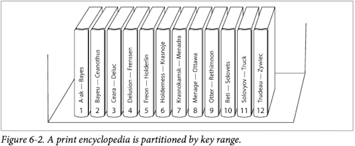

Within each partition, we can keep keys in sorted order.
This has the advantage that range scans are easy, and you can treat the keys as a concatenated index in order to fetch several related records in one query.

The downside of key range partitioning is that certain access patterns can lead to hot spots.
To avoid writing time based key data on the same partition, you could prefix each timestamp with another name so that the partitioning is first by sensor and then by time.

#### Partitioning by Hash of Key

A good hash function takes skewed data and makes it uniformly distributed.
Once you have a suitable hash function for keys, you can assign each partition for a range of hashes, and every key whose hash falls within a partition's range will be stored in that partition.

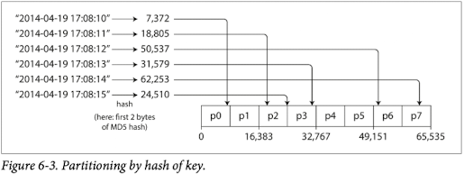

This technique is good at distributing keys fairly among the partitions.
The partition boundaries can be evenly spaced, or they can be chosen pseudorandomly (in which case the technique is sometimes known as **consistent hashing**).

Unfortunately by using the hash of the key for partitioning we lose a nice property of key-range partitioning.
Keys that were nice adjacent are now scattered across all the partitions, so their sort order is lost.

#### Skewed Workloads and Relieving Hot Spots

Hot spots can't avoid them entirely: in the case where all reads and writes are for the same key, you still end up with all requests being routed to the same partition.
Most data systems are not able to automatically compensate for such a highly skewed workload, so it's the responsibility of the application to reduce the skew.
For example, if one key is known to be very hot, a simple technique is to add a random number to the beginning or end of the key.

### Partitioning and Secondary Indexes

#### Partitioning Secondary Indexes by Document

A document index is also known as a local index.
In this approach, Each partition maintains its own secondary indexes, covering only the documents in that partition.


#### Partitioning Secondary Indexes by Term

We can construct a global index that covers data in all partitions.
A global index must also be partitioned, but it can be partitioned differently from the primary key index.

Red cars from all partitions appear under color:red in the index: but the index is partitioned so that colors starting with the letters a to r appear in partition 0 and colors with s to z appear in partition 1.
We call this kind of index term-partitioned, because the term we're looking for determines the partition of the index.


### Rebalancing Partitions

The process of moving load from one node in the cluster to another is called rebalancing.

- After rebalancing, the load should be shared fairly between the nodes in the cluster.
- While rebalancing is happening, the database should continue accepting read and writing.
- No more data than necessary should be moved between nodes, to make rebalancing fast and to minimize the network and disk I/O load.

#### How not to do it: hash mod n

The problem with the mod N approach is that if the number of nodes N changes, most of the keys will need to be moved from one node to another.

#### Fixed number of partitions

Create many more partitions than there are nodes, and assign several partitions to each node.
Only entire partitions are moved between nodes.
The number of partitions does not change, nor does the assignment of keys to partitions.
The only thing that changes is the assignment of partitions to nodes.


#### Dynamic partitioning

When a partition grows to exceed a configurable size, it is split into two partitions so that approximately half of the data ends up on each side of the split.
Conversely, if lots of data is deleted and a partition shrinks below some threshold, it can be merged with an adjacent partition.

#### Partitioning proportionally to nodes

With dynamic partitioning, the number of partitions is proportional to the size of the dataset.
With a fixed number of partitions the size of each partition is proportional to the size of the dataset.
A third option is to make the number of partitions proportional to the number of nodes-in other words, to have a fixed number of partitions per node

### Request Routing

1. Allow clients to contact any node. If that node coincidentally owns the partition to which the request applies, it can handle the request directly; otherwise, it forwards the request to the appropriate node, receives the reply, and passes their reply along to the client.
2. Send all requests from clients to a routing tier first, which determines the node that should handle each request and forwards it accordingly.
3. Require that clients be aware of the partitioning and the assignment of partitions to nodes.


Many distributed data systems rely on a separate coordination service such as ZooKeeper to keep track of this cluster metadata.
Each node registers itself in ZooKeeper and ZooKeeper maintains the authoritative mappings of partitions to nodes.
Other actors, such as the routing tier or the partitioning-aware client, can subscribe to this information in ZooKeeper.
Whenever a partition changes ownership, or a node is added or removed, ZooKeeper notifies the routing tier so that it can keep its routing information up to date.


## 7. Transactions

A transaction is a way for an application to group several reads and writes together into a logical unit.
With transactions, error handling becomes much simpler for an application, because it doesn't need to worry about partial failure.

### The Slippery Concept of a Transaction

#### The meaning of ACID

The safety guarantees provided by transactions are often described by the well known acronym ACID, which stands for Atomicity, Consistency, Isolation, and Durability.

##### Atomicity  

In multi-threaded programming, if one thread executes an atomic operation, that means there is no way that another thread could see the half-finished result of the operation.
In the context of ACID, the ability to abort a transaction on error and have all writes from that transaction discarded is the defining feature of ACID atomicity.

##### Consistency

The idea of ACID consistency is that you have certain statements about your data (invariants) that must always be true.
If a transaction starts with a database that is valid according to these invariants, and any writes during the transaction preserve the validity, then you can be sure that the invariants are always satisfied.

However, this idea of consistency depends on the application's notion of invariants, and it's the application's responsibility to define its transaction correctly so that they preserve consistency.

##### Isolation

Concurrently running transactions shouldn't interfere with each other.
For example, if one transaction makes several writes, then another transaction should see either all or none of those writes, but not subset.

##### Durability

Durability is the promise that once a transaction has been committed successfully, any data it has written will not be forgotten, even if there is a hardware fault or the database crashes.

In a single-node database, durability typically means that the data has been written to nonvolatile storage such as a hard drive or SSD.
In a replicated database, durability may mean that the data has been successfully copied to some number of nodes.
In practice, there is no one technique that can provide absolute guarantees.

#### Single-Object and Multi-Object Operations

##### Handling errors and aborts

Although retrying an aborted transaction is a simple and effective error handling mechanism, it isn't perfect.

- If the transaction actually succeeded, but the network failed while the server tried to acknowledge the successful commit to the client, then retrying the transaction causes it to be performed twice.
- If the error is due to overload, retrying the transaction will make the problem worse, not better.
- It is only worth after transient errors; after permanent error a retry would be pointless.
- If the transaction also has side effects outside of the database, those side effects may happen even if the transaction is aborted.

### Weak Isolation Levels

In practice, serializable isolation has a performance cost, and many databases don't want to play that price.
It's therefore common for systems to use weaker levels of isolation, which protect against some concurrency issues, but not all.

#### Read Committed

Read committed makes two guarantees:

1. When reading from the database, you will only see data that has been committed (no dirty read).
2. When writing to the database, you will only overwrite data that has been committed (no dirty write).

Databases prevent dirty writes by using row-level locks. Most databases prevent dirty reads using the approach illustrated below:
for every object that is written, the database remembers both the old committed value and the new value set by the transaction that currently holds the write lock.


#### Snapshot Isolation and Repeatable Read


This anomaly is called a nonrepeatable read or read skew.
Snapshot isolation idea is that each transaction reads from a consistent snapshot of the database—the transaction sees all the data that was committed in the database at the start of the transaction.

From a performance point of view, a key principle of snapshot isolation is reader never block writers, and writes never block readers.
This allows a database to handle long-running read queries on a consistent snapshot at the same time as processing writes, without any lock between the two.

To implement snapshot isolation, the database must potentially keep several different committed versions of an object, because various in-progress transactions may need to see the state of the database at different points in time.
Because it maintains several versions of an object side by side, this technique is known as multi-version concurrency control.

#### Preventing Lost Updates

The lost update problem can occur if an application reads some value from the database, modifies it, and writes back the modified value (a read-modify-write cycle).

##### Atomic write operations

Many databases provide atomic update operations, which remove the need to implement read-modify-write cycle in application code.
They are usually the best solution if your code can be expressed in terms of those operations.

```SQL
UPDATE counters SET value = value + 1 where key = 'foo';
```

Atomic operations are usually implemented by taking an exclusive lock on the object when it is read so that no other transaction can read it until the update has been applied.
Not all writes can easily be expressed in terms of atomic operations—but in situations where atomic operations can be used, they are usually best choice.
Unfortunately object-relational mapping frameworks make it easy to accidentally write code that performs unsafe read-modify-write cycles instead of using atomic operations provided by the database.

##### Explicit locking

Another option for preventing lost updates is for the application to explicitly lock objects that are going to be updated.
Then the application can perform a read-modify-write cycle, and if any other transaction tries to concurrently read the same object, it is forced to wait until the first read-modify-write cycle has completed.

```SQL
BEGIN TRANSACTION;
SELECT * FROM figures where name = 'robot' AND game_id = 222 FOR UPDATE;
-- Check whether move is valid
UPDATE figures SET position = 'c4' WHERE id=1234;
COMMIT;
```

This works, but to get it right, you need to carefully think about your application logic.
It's easy to forget to add a necessary lock somewhere in the code, and thus introduce a race condition.

##### Automatically detecting lost updates

Atomic operation and locks are ways of preventing lost updates by forcing the read-modify-write cycles to happen sequentially.
An alternative is to allow them to execute in parallel and, if the transaction manager detects a lost update, abort the transaction and force it to retry its read-modify-write cycle.
Lost update detection is a great feature, because it doesn't require application code to use any special database features.

##### Compare-and-set

In databases that don't provide transactions, you sometimes find an atomic compare-and-set operation.
The purpose of this operation is to avoid lost updates by allowing an update to happen only if the value has not changed since you last read it.

```SQL
UPDATE wiki_page SET content = 'new content' WHERE id = 1234 and content = 'old content'
```

##### Conflict resolution and replication

A common approach in such replicated databases is to allow concurrent writes to create several conflicting versions of a value, and to use application code or special data structures to resolve and merge these versions after the fact.

#### Write Skew and Phantoms

##### Characterizing write skew

You think of write skew as a generalization of the lost update problem.
Write skew can occur if two transactions read the same objects, and then update some of those objects (different transactions may update different objects).
In the special case where different transactions update the same object, you get a dirty write or lost update anomaly.

##### Phantoms causing write skew

This effect, where a write in one transaction changes the result of a search query in another transaction, is called a phantom.
Snapshot isolation avoids phantom in read-only queries.
But in read-write transactions, phantom can lead to particularly tricky cases of write skew.

### Serializability

Serializable isolation is usually regarded as the strongest isolation level.
It guarantees that even though transactions may execute in parallel, the end result is the same as if they had executed one at a time, serially, without any concurrency.

#### Actual Serial Execution

The simplest way of avoiding concurrency problems is to remove the concurrency entirely: to execute only one transaction at a time, in serial order, on a single thread.
A system designed for single-threaded execution can sometimes perform better than a system that supports concurrency, because it can avoid the coordination overhead of locking.
However, its throughput is limited to that of a single CPU core.

- Every transaction must be small and fast.
- It is limited to use cases where the active dataset can fit in memory.
- Write throughput must be low enough to be handled on a single CPU core, or else transactions need to be partitioned without requiring cross-partition coordination.
- Cross-partition transactions are possible, but there is a hard limit to the extent to which they can be used.

#### Two-Phase Locking (2PL)

**Two phase locking** is similar, but makes the lock requirements much stronger.
Several transactions are allowed to concurrently read the same object as long as nobody is writing to it.
But as soon as anyone wants to write an object, exclusive access is required.
In 2PL, they block readers and vice versa.
The lock can either be in shared mode or in exclusive mode.

The big downside of two-phase locking is performance.
This is partly due to the overhead of acquiring and releasing all those locks, but more importantly due to reduced concurrency.

##### Index-range locks

Most databases with 2PL actually implement **index-range locking** (also known as next-key locking), which is a simplified approximation of predicate locking.
If there is no suitable index where range lock can be attached, the database can fall back to a shared lock on the entire table.

#### Serializable Snapshot Isolation (SSI)

Two-phase locking is a so-called pessimistic concurrency control mechanism: it is based on the principle that if anything might possibly go wrong, it's better to wait until the situation is safe again before doing anything.
It is like mutual exclusion, which is used to protect data structures in multi-threaded programming.

Serial execution is pessimistic to the extreme.
We compensate for the pessimism by making each transaction very fast to execute, so it only needs to hold the "lock" for a short time.

**Serializable snapshot** is an optimistic concurrency control technique.
Optimistic in this context means that instead of blocking if something potentially dangerous happens, transactions continue anyway, in the hope that everything will turn out all right.
When a transaction wants to commit, the database checks whether anything had happened; if so, the transaction is aborted and to be retried.

It performs badly if there is high contention, as this leads to a high proportion of transactions needing to abort.
However, if there is enough spare capacity, optimistic concurrency control techniques tend to perform better than pessimistic ones.
Content can be reduced with commutative atomic operations: for example, if several transactions concurrently want to increment a counter, it doesn't matter in which order the increments are applied.

##### Decision based on an outdated premise

The database doesn't know how the application logic uses the result of that query.
To be safe, the database needs to assume that any change in the query result (the premise) means that writes in that transaction may be invalid.
In other words, there may be a causal dependency between the queries and the writes in the transaction.

##### Detecting writes that affect prior reads

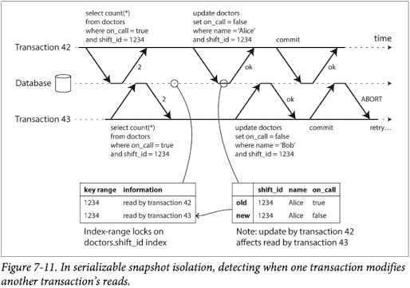

##### Performance of serializable snapshot isolation

One trade-off is the granularity at which transactions' reads and writes are tracked.
Compared to two-phase locking, the big advantage of serializable snapshot isolation is that one transaction doesn't need to block waiting for locks held by another transaction.

## 8. The Trouble with Distributed Systems

### Faults and Partial Failures

In a distributed system, there may well be some parts of the system that are broken in some unpredictable way, even though other parts of the system are working fine.
This is known as a **partial failure**.
The difficulty is that partial failures are nondeterministic.

### Unreliable Networks

The internet and most internal networks in datacenter are asynchronous packet networks.
In this kind of network, one node can send a message (a packet) to another node, but the network gives no guarantees as to when it will arrive, or whether it will arrive at all.

The usual way of handling unbounded delay is a timeout: after some time you give up waiting and assume that the response is not going to arrive.

#### Latency and Resource Utilization

Latency guarantees are achievable in certain environments, if resources are statically partitioned (e.g, dedicated hardware and exclusive bandwidth allocations).
However, it comes at the cost of reduced utilization—in other words, it is more expensive.
On the other hand, multi-tenancy with dynamic resource partitioning provides better utilization, so it is cheaper, but it has the downside of variable delays.

### Unreliable Clocks

In a distributed system, time is a tricky business, because communication is not instantaneous: it takes time for a message to travel across the network from one machine to another.

Moreover, each machine on the network has its own clock, which is an actual hardware device: usually a quartz crystal oscillator.
These devices are not perfectly accurate, so each machine has its own notion of time, which may be slightly faster or slower than on other machines.
It is possible to synchronize clocks to some degree: the most commonly used mechanism is the Network Time Protocol (NTP), which allows the computer clock to be adjusted according to the time reported by a group of servers.

#### Monotonic Versus Time-of-Day Clocks

- Time-of-day clocks  
Time-of-day clocks are usually synchronized with NTP, which means that a timestamp from one machine (ideally) means the same as a timestamp on another machine.
In particular, if the local clock is too far ahead of the NTP server, it may be forcibly reset and appear to jump back to a previous point in time.
For example, *clock-gettime(CLOCK_REALTIME)* on Linux and *System.currentTimeMillis()* in Java.
- Monotonic clocks  
A monotonic clock is suitable for measuring a duration (time interval), such as a timeout or a service's response time: *clock_gettime(CLOCK_MONOTONIC)* on Linux and *System.nanoTime()* in Java.
The name comes from the fact they are guaranteed to always move forward.

#### Process Pause

A node in a distributed system must assume that its execution can be paused for a significant length of time at any point.
During the pause, the rest of the world keeps moving and may even declare the paused node dead because it's not responding.
Eventually, the paused node may continue running, without even noticing that it was asleep until it checks its clock sometime later.

### Knowledge, Truth, and Lies

#### The Truth Is Defined by the Majority

A distributed system cannot exclusively rely on a single node, because a node may fail at any time, potentially leaving the system stuck and unable to recover.
Instead, many distributed algorithms rely on a quorum, that is, voting among the nodes: decisions require some minimum number of votes from several nodes in order to reduce the dependence on any one particular node.

Most commonly, the quorum is an absolute majority of more than half the node. A majority quorum allows the system to continue working if individual nodes have failed.

##### The leader and the lock

Implementing this in a distributed system requires care: even if a node believes that it is "the chosen one", that doesn't necessarily mean a quorum of nodes agrees!
A node may have formerly been the leader, but if the other nodes declared it dead in the meantime., it may have been demoted and another leader may have already been elected.

If a node continues acting as the chosen one, even though the majority of nodes have declared it dead, it could cause problems in a system that is not carefully designed.

##### Fencing tokens

We need to ensure that a node that is under a false belief of being "the chosen one" cannot disrupt the rest of the system.

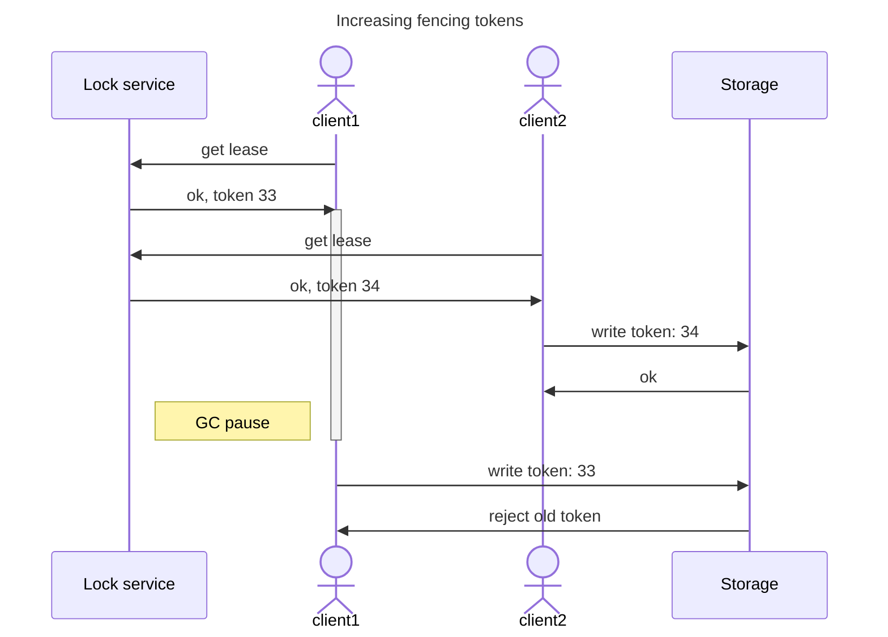

#### Byzantine Faults

Distributed systems problems become much harder if there is a risk that nodes may "lie"—for example, if a node may claim to have received a particular message when in fact it didn't.
Such behavior is known as a **Byzantine fault**.

#### System Model and Reality

We define a system model, which is an abstraction that describes what things an algorithm may assume.

With regard to timing assumptions, three system models are in common use:

- Synchronous model  
The synchronous model assumes bounded network delay, bounded process pauses, and bounded clock error.
- Partially synchronous model  
Partial synchrony means that a system behaves like a synchronous system most of the time, but it sometimes exceeds the bounds for network delay, process pauses, and clock drift.
- Asynchronous model  
In this model, an algorithm is not allowed to make any timing assumptions, it does not even have a clock. Some algorithms can be designed for the asynchronous model, but it is very restrictive.

With regard to node failure assumptions, three system models are in common use:

- Crash-stop faults
- Crash-recovery faults
- Byzantine faults

The partially synchronous model with crash-recovery faults is generally the most useful model.

#### Correctness of an algorithm

To define what it means for an algorithm to be correct, we can describe its properties.
Properties can be distinguished between two different kinds of properties: **safety** and **liveness** properties.
Safety is often informally defined as nothing bad happens, and liveness as something good eventually happens.

## 9. Consistency and Consensus

### Consistncy Guarantees

Most replicated databases provide at least eventual consistency, which means that if you stop writing to the database and wait for some unspecified length of time, then eventually all read requests will return the same value.
However, this is a very weak guarantee—it doesn't say anything about when the replicas will converge.
Until the time of convergence, reads could return anything or nothing.

We will explore stronger consistency models that data systems may choose to provide.
They don't come for free: systems with stronger guarantees may have worse performance or be less fault-tolerant than systems with weaker guarantees.
Nevertheless, stronger guarantees can be appealing because they are easier to use correctly.

### Linearizability

It is the idea behind linearizability that the database could give the illusion that there is only one replica.
Maintaining the illusion of a single copy of the data means guaranteeing that the value read is the most recent, up-to-date value, and doesn't come from a stale cache or replica.
In other words, linearizability is a recency guarantee.

#### What Makes a System Linearizable?

Below figure shows clients concurrently reading and writing the same key x in a linearizable database.
In the distributed systems literature, x is called a register—in practice, it could be one key in a key-value store, one row in a relational database, or one document in a document database.

```mermaid
gantt
  dateFormat X
  axisFormat %s
  section Client A
    read(x)=>0: 0, 2
    read(x)=>1: 4, 6
    read(x)=>1: 8, 10
  section Client B
    read(x)=>0: 2, 4
    read(x)=>1: 6, 8
  section Client C
    write(x, 1)=>ok: 3, 7
```

In a linearizable system we imagine that there must be some point in time (between the start and end of the write operation) at which the value of x atomically flips from 0 to 1.

Each operation in the figure below is marked with a vertical line at the time when we think the operation was executed.
The requirement of linearizability is that the lines joining up the operation markers always move forward in time, never backward.
This requirement ensures the recency guarantee we discussed earlier: once a new value has been written or read, all subsequent reads see the value that was written, until it is overwritten again.

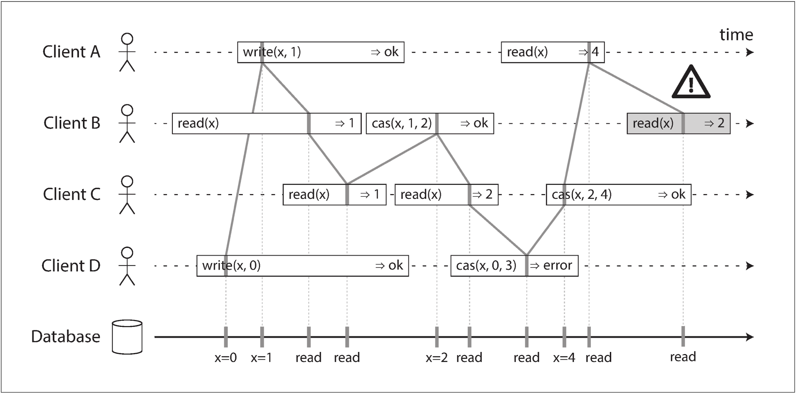

#### Relying on Linearizability

##### Locking and leader election

A system that uses single-leader replication needs to ensure that there is indeed only one leader.
One way of electing a leader is to use a lock.
No matter how this lock is implemented, it must be linearizable.

##### Constraints and uniqueness guarantees

If you want to enforce this constraint as the data is written, you need linearizability.

##### Cross-channel timing dependencies  

Without the recency guarantee of linearizability, race conditions between these two channels are possible.

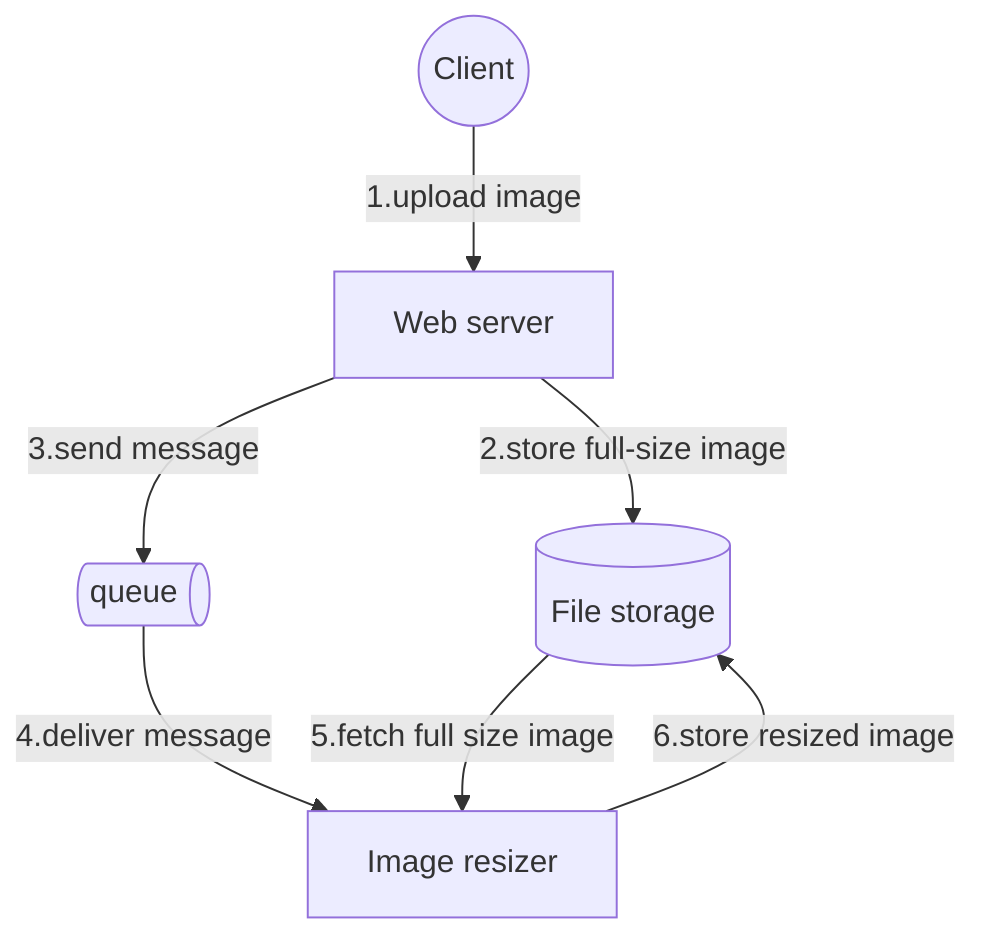

#### Implementing Linearizable

The simplest linearizable implementation would be to really only use a single copy of the data.
However, that approach would not be able to tolerate faults.
The most common approach to making a system fault-tolerant is to use replication

- Single-leader replication (potential linearizable)  
If you make reads from the leader, or form synchronously updated follower, they have the potential to be linearizable. However, not every single-leader database is actually linearizable, either by design (because is uses snapshot isolation) or due to concurrency bugs.
- Consensus algorithm (linearizable)  
Some consensus algorithms bear a resemblance to single-leader replication. However, consensus protocols contain measures to prevent split brain and stale replicas.
- Multi-leader replication (not linearizable)  
They concurrently process writes on multiple nodes and asynchronously replicate them to other nodes.
- Leaderless replication (probably not linearizable)  
Network delay, Last write win conflict resolution based on time-of-day clocks, and Sloppy quorums ruin any chance of linearizability

#### The Cost of Linearizability

With a multi-leader database, each datacenter can continue operating normally: since wirtes from one datacenter are asynchronously replicated to the other, the writes are simply queued up and exchanged when network connectivity is restored.

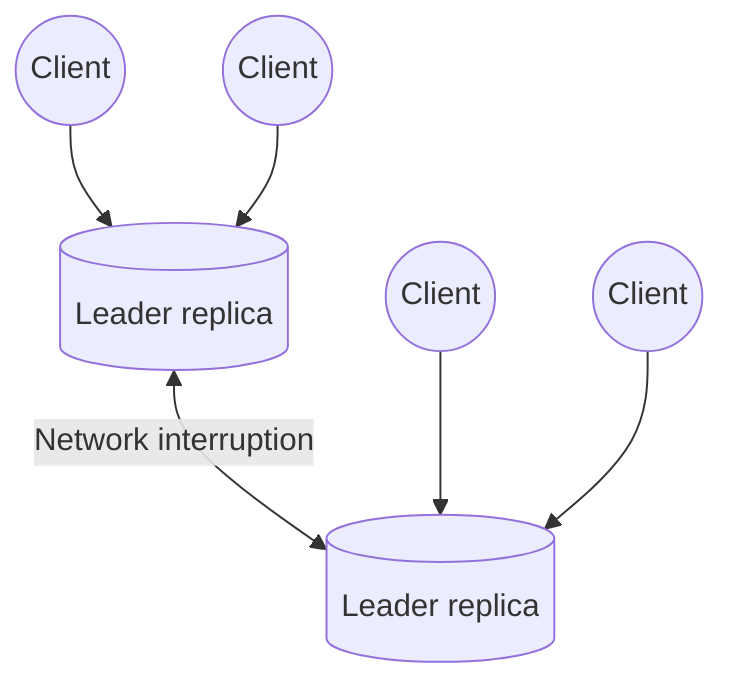

If the network between database is interrupted in a single-leader setup, clients connected to the follower database cannot contact the leader, so they cannot make any writes to the database, nor any linearizable reads.
If the application requires linearizable reads and writes, the network interruption cause the application to become unavailable.

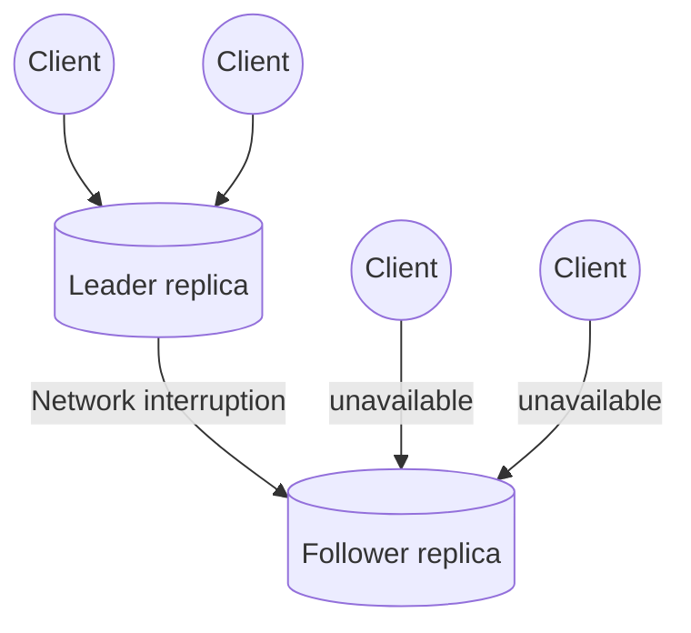

When a network fault occurs, you have to choose between either linearizability or total availability.
Thus, a better way of phrasing **CAP** would be either Consistent or Available when Partitioned.

Many distributed database that choose not to provide linearizable guarantees: they do so primarily to increase performance, not so much for fault tolerance.
Linearizability is slow.

### Ordering Guarantees

#### Ordering and Causality

Ordering helps preserve causality.
Causality imposes an ordering on events: cause comes before effect; a message is sent before that message is received; the question comes before the answer.
These chains of causally dependent operations define the causal order in the system.
If a system obeys the ordering imposed by causality, we way that it is causally consistent.

##### The causal order is not a total order

A total order allows any two elements to be compared, so if you have two elements, you can always say which one is greater and which one is smaller.
For example, natural numbers are totally ordered.

However, mathematical sets are not totally ordered.
We say they are incomparable, and therefore mathematical sets are partially ordered: in some cases one set is greater than another (if one set contains all the elements of another), but in other cases they are incomparable.

- Linearizability  
In a linearizable system, we have a total order of operations: if the system behaves as if there is only a single copy of the data, and every operation is atomic, this means that for any two operations we can always say which one happened first.
- Causality  
We say that two operations are concurrent if neither happened before the other.
Put antoher way, two events are ordered if they are causally related, but they are incomparable if they are concurrent.
This means that causality defines a partial order, not a total order: some operations are ordered with respect to each other, but some are incomparable.

#### Sequence Number Ordering

In order to determine the causal ordering, we can use sequence numbers or timestamps to order events.
In a database with single-leader replication, the leader can simply increment a counter for each operation, and thus assign a monotonically increasing sequence number to each operation.

##### Lamport timestamps

If there is not single leader, it is less clear how to generate sequence numbers for operations.
There is a simple method for generating sequence numbers that is consistent with causality.
It is called a Lamport timestamp.
Each node has a unique identifier, and each node keeps a counter of the number operations it has processed.
The lamport timestamp is then simply a pair of (counter, node ID).

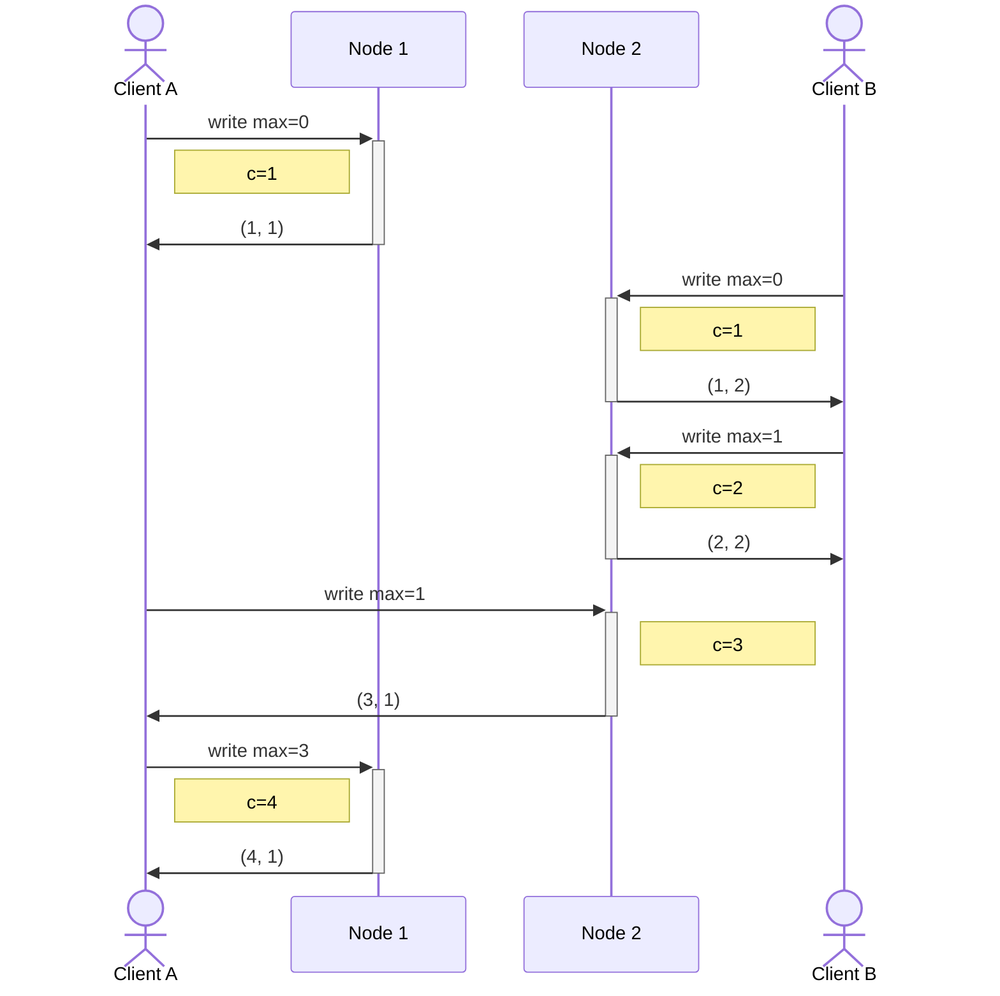

Every node and every client keeps track of the maximum counter value it has seen so far, and includes that maximum on every request.
When a node receives a request or response with a maximum counter value greater than its own counter value, it immediately increase its own counter to that maximum.

##### Timstamp ordering is not sufficient

Consider a system that needs to ensure that a username uniquely identifies a user account.
When a node has just received a request from a user to create a username, and needs to decide right now whether the request should succeed or fail.
At that moment the node does not know wheter another node is concurrently in the process of creating an account with the same username, and what timestamp that order node may asign to the operation.

The problem here is that the toatl order of operations only emerges after you have collected all of the operations.
The idea of knowing when your total order is finalized is captured in the topic of total order broadcast.

#### Total Order Broadcast

Single-leader replication determines a total order of operations by choosing one node as the leader and sequencing all operations on a single CPU core on the leader.
The challenge then is how to scale the system if the throughput is greater than a single leader can handle, and also how to handle failover if the leader fails.
In the distributed literature, this is known as total order broadcast or atomic broadcast.

Total order broadcast is usually described as a protocol for exchanging messages between nodes.
Informally, it requires that two safety properties always be statisfied:

- Reliable delivery (No message are lost)
- Totally ordered delivery (Mesage are deliverd to every node in the same order)

### Distributed Transactions and Consensus

#### Atomic Commit and Two-Phase Commit (2PC)

Two-phase commit is an algorithm for achieving atomic transaction commit across multiple nodes—i.e., to ensure that either all nodes commit or all nodes abort.

```mermaid
sequenceDiagram
  actor Coordinator
  participant Database 1
  participant Database 2

  Coordinator->>+Database 1: write data
  Database 1->>-Coordinator: OK
  Coordinator->>+Database 2: write data
  Database 2->>-Coordinator: OK

  rect rgb(54, 58, 106)
    Coordinator->>+Database 1: prepare
    Database 1->>-Coordinator: yes/No
    Coordinator->>+Database 2: prepare
    Database 2->>-Coordinator: yes/No
  end
  rect rgb(40, 86, 49)
    Coordinator->>+Database 1: commit/abort
    Database 1->>-Coordinator: ok
    Coordinator->>+Database 2: commit/abort
    Database 2->>-Coordinator: ok
  end
```

2PC uses a new component: a coordinator (also known as transaction manager).
The coordinator is often implemented as a library within the same application process that is requesting the transaction, but it can also be a separate process or service.

A 2PC transaction begins with the application reading and writing data on multiple database nodes.
We call these database nodes participants in the transaction.
When the application is ready to commit, the coordinator begins phase 1: it sends a *prepare* request to each of the nodes, asking them whether they are able to commit.
The coordinator then tracks the responses from the participants:

- If all participants reply "yes", indicating they are ready to commit, then the coordinator sends out a commit request in phase 2, and the commit actually takes place.
- If any of the participants replies "no", the coordinator sends an abort request to all nodes in phase 2.

#### Distributed Transactions in practice

- Database-internal distributed transactions  
Some distributed database support internal transactions among the nodes of that database.
In this case, all the nodes participaiting in the transaction are running the same database software.
- Heterogeneous distributed transactions  
In a heterogeneous transaction, the participants are two or more different technologies.
A distributed transaction across these systems must ensure atomic commit, even though the systems may be entirely different under the hood.

#### Fault-Tolerant Consensus

Consensus means getting several nodes to agree on something.
The consensus problem is normally formalized as follows: one or more nodes may propose values, and the consensus algorithm decides on one of those values.

In this formalism, a consensus algorithm must satisfy the following properties:

- Uniform agreement  
No two nodes decide differently
- Integrity  
No node decides twice
- Validity  
If a node decides value v, then v was proposed by some node.
- Termination  
Every node that does not crash eventually decides some value.

Termination is liveness property, whereas the other three are safety properties.
There is a limit to the number of failures that an algorithm can tolerate: in fact, it can be proved that any consensus algorithm requires at least a majority of nodes to be functioning correctly in order to assure termination.
That majority can safely form a quorum.

##### Consensus algorithm and total order broadcast

Most of consensus algorithms (VSR, Paxos, Raft, and Zab) don't directly use the formal model described here.
Instead, they decide on a sequence of values, which makes them total order broadcast algorithms.

Remember that total order broadcast requires message to be delivered exactly once, in the same order, to all nodes.
If you think about it, this is equivalent to performing several rounds of consensus: in each round, nodes propose the message that they want to send next and then decide on the next message to be delivered in the total order.

##### Epoch numbering and quorums

All of these consensus protocols can make a weaker guarantee: the protocols define an epoch number (called the ballot number in Paxos, view number in Viewstamped Replication, and term number in Raft) and guarantee that within each epoch, the leader is unique.

Every time the current leader is thought to be dead, a vote is started among the nodes to elect a new leader.
This election is given an incremented epoch number, and thus epoch numbers are totally ordered and monotonically increasing.
If there is a conflict between two different leaders in two different epochs, then the leader with the higher epoch number prevails.

For every decision that a leader wants to make, it must send the proposed value to the other nodes and wait for a quorum of nodes to respond in favor of the proposal.
A node votes in favor of a proposal only if it is not aware of another leader with a higher epoch.
