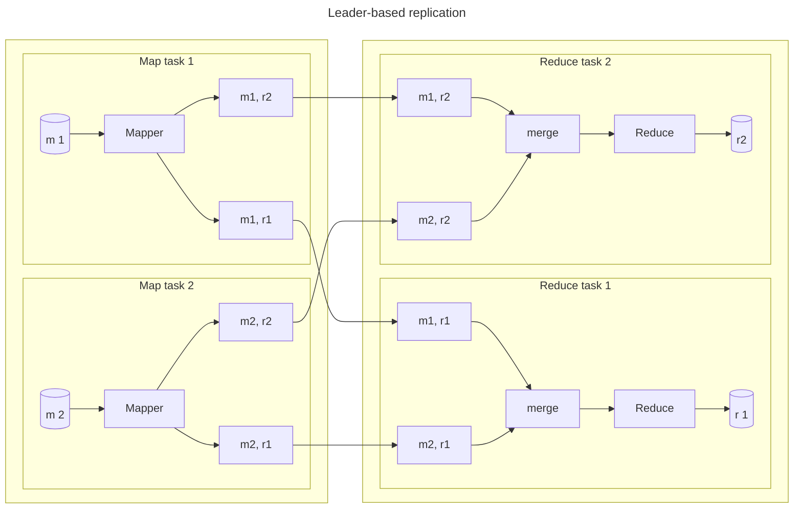
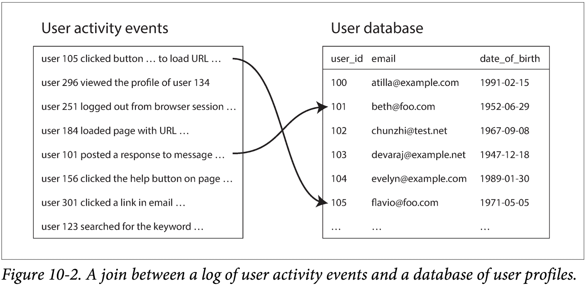
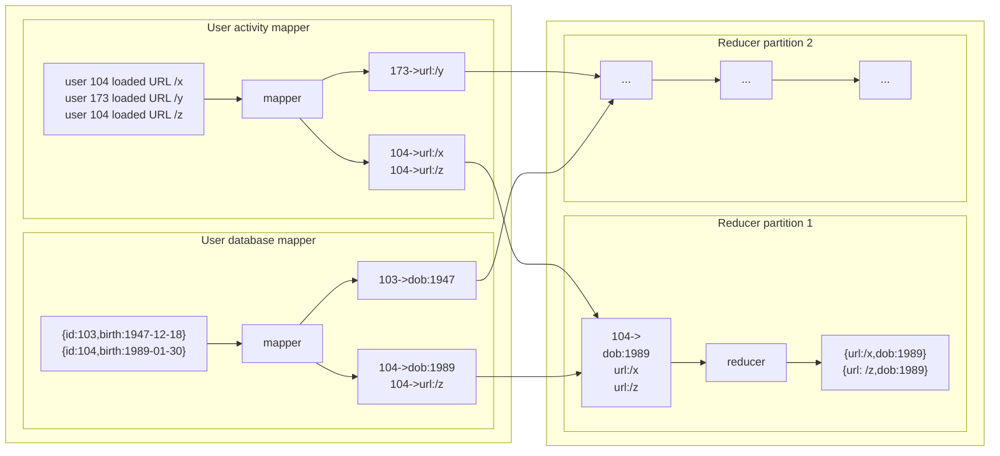

# Ⅲ. Derived Data

There is no one database that can satisfy all those different needs simultaneously.
We will examine the issue around integrating multiple different data systems, potentially with different data models and optimized for different access patterns, into one coherent application architecture.

On a high level, systems that store and process data can be grouped into two broad categories:

- System of record  
A system of record, also known as source of truth, holds the authoritative version  of your data.
- Derived data systems  
Data in a derived system is the result of taking some existing data from another system and transforming or processing it in some way. A classic example is a cache: data can be served from the cache if present, but if the cache doesn't contain what you need, you can fall back to the underlying database.

## 10. Batch Processing

Let's distinguish three different types of systems:

- Services (online systems)  
A service waits for a request or instruction from a client to arrive. When one is received, the service tries to handle it as quickly as possible and sends a response back.
- Batch processing systems (offline systems)  
A batch processing system takes a large amount of input data, runs a job to process it, and produces some output data.
- Stream processing systems (near-real-time systems)  
Stream processing is somewhere between online and offline processing.
Like a batch processing system, a stream processor consumes input and produces outputs.

Batch processing is an important building block in our quest to build reliable, scalable, and maintainable applications.

### Batch Processing with Unix Tools

Say you have a web server that appends a line to a log file every time it serves a request.
For example, using the nginx default access log format, one line of the log might look like this:

```log
216.84.210.78 - - [27/Feb/2015:17:55:11 ++0000] "GET /css/typograph.css HTTP/1.1" 200 3377 "http://martin.kleppmann.com/" "Mozilla/5.0 (Macintosh; Intel Mac OS X 10_9_5 AppleWebKit/537.36 (KHTML, like Gecko) Chrome/40.02214.115 Safari/537.36
```

#### Simple Log Analysis

```sh
cat /var/log/nginx/access.log |
  awk '{print $7}' |
  sort             |
  uniq -c          |
  sort -r -n       |
  head -n 5
```

It will process gigabytes of log files in a matter of seconds, and you can easily modify the analysis to suit your needs.
If the job's working set is larger than the available memory, the sorting approach has the advantage that it can make efficient use of disks.
It's the same principle as we discussed in SSTables and LSM-Trees: chunks of data can be sorted in memory and written out to disk as segment files, and then multiple sorted segments can be merged into a larger sorted file.

#### The Unix Philosophy

##### A uniform interface

In Unix, the interface is a file. A file is just an ordered sequence of bytes.
Because that is such a simple interface, many different things can be represented using the same interface: an actual file on the filesystem, a communication channel to another process (Unix socket, stdin, stdout), a device driver (/dev/audio or /dev/lp0).

##### Separation of logic and wiring

Another characteristic feature of Unix tools is their use of standard input and standard output.
This allows a shell user to wire up the input and output in whatever way they want; the program doesn't know or care where the input is coming from and where the output is going to.

### MapReduce and Distributed Filesystems

While Unix tools use stdin and stdout as input and output, MapReduce jobs read and write files on a distributed filesystem.
In Hadoop's implementation of MapReduce, that filesystem is called HDFS (Hadoop Distributed File System), an open source reimplementation of the Google File System (GFS).

HDFS is based on the shared-nothing principle.
HDFS consists of a daemon process running on each machine, exposing a network service that allows other nodes to access files stored on that machine.
A central server called the NameNode keeps track of which file blocks are stored on which machine.
Thus, HDFS conceptually creates one big filesystem that can use the space on the disks of all machines running the daemon.

#### MapReduce Job Execution

**MapReduce** is a programming framework with which you can write code to process large dataset in a distributed filesystem like HDFS.

- Mapper  
The mapper is called once for every input record, and its job is to extract the key and value from the input record.
For each input, it generate any number of key-value pairs.
It does not keep any state from one input record to the next, so each record is handled independently.
- Reducer  
The mapReduce framework takes the key-value pairs produced by the mappers, collects all the values belonging to the same key, and calls the reducer with an iterator over that collection of values.
The reducer can produce output records.

##### Distributed execution of MapReduce

The main difference from pipelines of Unix commands is that MapReduce can parallelize a computation across many machines, without you having to write code to explicitly handle the parallelism.

Its parallelization is based on partitioning: the input to a job is typically a directory in HDFS, and each file or file block within the input directory is considered to be a separate partition that can be processed by a separate map task.



To ensure that all key-value pairs with the same key end up at the same reducer, the framework use a hash of the key to determine which reduce task should receive a particular key-value pair.
Whenever a mapper finishes reading its input file and writing its sorted output files, the MapReduce scheduler notifies the reducers that they can start fetching the output files from that mapper.
The Reducers connect to each of the mappers and download the files of sorted key-value pairs for their partition.
The process of partitioning by reduer, sorting, and copying data partitions from mappers to reducer is known as the shuffle.

##### MapReduce workflows

It is very common for MapReduce jobs to be chained together into workflows, such that the output of one job becomes the input to the next job.
The Hadoop MapReduce framework does not have any particular support for workflows, so this chaining is done implicitly by directory name: the first job must be configured to writes its output to a designated directory in HDFS, and the second job must be configured to read that same directory name as its input.
From the MapReduce framework's point of view, they are two independent jobs.

A batch job's output is only considered valid when the job has completed successfully.
Therefore, one job in a workflow can only start when the prior jobs have completed successfully.
To handle these dependencies between job executions, various workflow schedulers for Hadoop have been developed.

#### Reduce-Side Joins and Grouping

In many datasets it is common for one record to have an association with another record: a foreign key in a relational meodel, a document reference in a document model, or an edge in a graph model.
A join is necessary whenever you have some code that needs to access records on both sides of that association.

When we talk about joins in the context of batch processing, we mean resolving all ocurrences of some assocication within a dataset.

##### Example: analysis of user activity events

On the left is a log of events describing the things that logged-in users did on a website, and on the right is a database of users.
An analytics task may need to correlate user activity with user profile information: for example, if the profile contains the user's age or date of birth, the system could determine which pages are most popular with which age groups.



The simplest implementation of this join would go over the activity events one by one and query the user database for every user ID it encounters.
But it would most likely suffer from poor performance: the processing throughput would be limited by the round-trip time to the database server, and running large number of queries in parallel could easily overwhelm the database.
Moreover, querying a remote database would mean that the batch job becomes nondeterministic, because the data in the remote database might change.

Thus, a better approach would be to take a copy of the user database and to put it in the same distributed filesystem as the log of user activity events.

##### Sort-merge joins

When the MapReduce framework partitions the mapper output by key and then sorts the key-value pairs, the effect is that all the activity events and the user record with the same user ID become adjacent to each other in the reducer input.
The MapReduce job can even arrange the records to be sorted such that the reducer always sees the record from the user database first, followed by the activity events in timestamp order—this technique is known as a secondary sort.



Since the reducer processes all of the records for a particular user ID in one go, it only needs to keep one user record in memory at any one time, and it never needs to make any requests over the network.
This algorithm is known as a sort-merge join.

#### Map-Side Joins

The reduce-side approach has the advantage that you do not need to make any assumptions about the input data.
However, the downside is that all that sorting, copying to reducers, and merging of reducer inputs can be quite expensive.

If you can make certain assumptions about your input data, it is possible to make joins faster by using a so-called map-side join.
This approach uses a cut-down MapReuce job in which there are no reducers and no sorting.

- Broadcast hash joins  
The simplest way of performing a map-side join applies in the case where a large dataset is joined with a small dataset.
In particular, the small dataset needs to be small enough that it can be loaded entirely into memory in each of the mappers.
- Partitioned hash joins  
If the inputs to the map-side join are partitioned in the same way, then the hash join approach can be applied to each partition independently.
This approach works if both of the joni's inputs have the same number of partitions, with records assigned to partitions based on the same key and the same hash function.
- Map-side merge joins  
Another variant of a map-side join applied if the input datasets are not only partitioned in the same way, but also sorted based on the same key.

#### The Output of Batch Workflows

- Building search indexes
- Key-value stores as batch process output(classifier and recommendation systems)

#### Comparing Hadoop to Distributed Databases

Msassively parallel processing databases focus on parallel execution of analytic SQL queries on a cluster of machines, while the combination of MapReduce and a distributed filesystem provides something much more like a general-purpose operating system that can run arbitrary programs.

### Beyond MapReduce

#### Materialization of Intermiediate State

The files on the distributed filesystem are simply intermediate state: a means of passing data from one job to the next.
MapReduce's approach of fully materializing intermiediate state has downsides compared to Unix pipes:

- Skew or varying load on different machines means that a job often has a few straggler tasks that take much longer to complete than the others.
- Mappers are often redundant.
- Storing intermediate state in a distributed filesystem means those files are replicated across several nodes.

##### Dataflow engines

New execution engines  for distributed batch computations handle an entire workflow as one job, rather than breaking it up into independent subjobs.

Unlike in MapReduce, these functions need not take the strict roles of alternating map and reduce, but instead can be assembled in more flexible wasy.
We call these functions operators.

#### High-Level APIs and Language

## 11. Stream Processing

## 12. The Future of Data Systems
