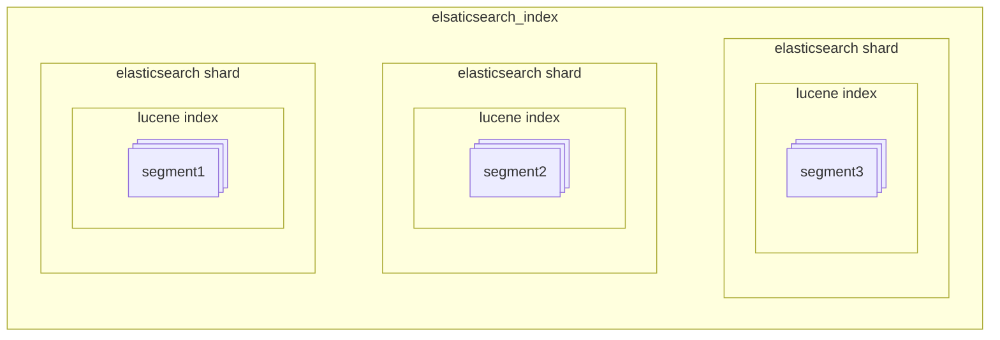
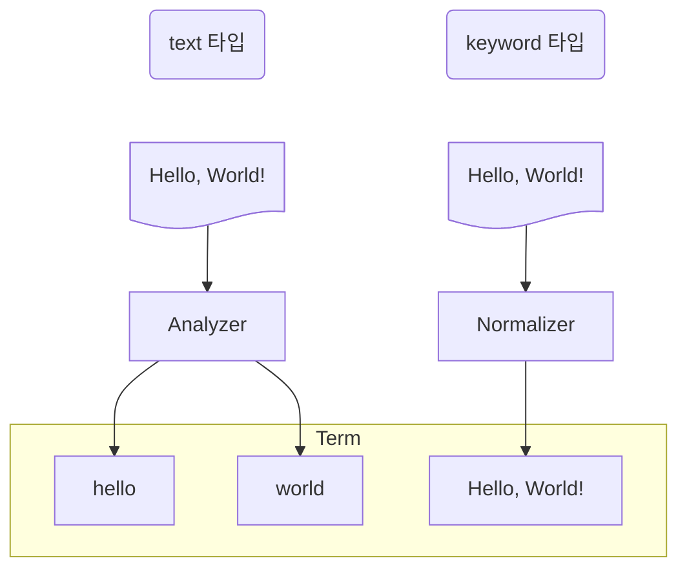
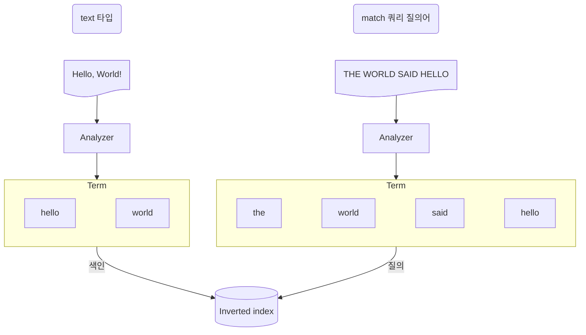

# Elasticsearch

## 2. 엘라스틱서치 기본 동작과 구조

### 2.2 엘라스틱서치 구조 개괄

#### 노드의 역할  

엘라스틱서치의 노드는 data node, master node, coordinator node 등 여러 역할 중 하나 이상의 역할을 맡아 수행한다.

- 샤드를 보유하고 샤드에 실제 읽기와 쓰기 작업을 수행하는 노드를 **data node**라고 한다.
- 클러스터를 관리하는 중요한 역할을 하는 노드를 **master node**라고 한다. 마스터 노드는 마스터 후보 노드 중에서 1대가 선출된다.
- 클라이언트의 요청을 받아서 데이터 노드에 요청을 분배하고 클라이언트에게 응답을 돌려주는 노드는 **coordinator node**라고 한다.

### 2.3 엘라스틱서치 내부 구조와 루씬

문서 색인 요청이 들어오면 Lucene은 문서를 분석해 inverted index를 생성한다.

#### 2.3.2 Lucene Commit

Lucene은 파일을 연 시점에 색인이 완료된 문서만 검색할 수 있다.
index의 변경 사항을 검색에 반영하고 싶다면 메모리에 있는 변경 내용을 인덱스 파일에 동기화 작업이 필요하다.
이 작업을 Lucene commit이라고 한다.
작업 결과 inverted index를 immutable segment 파일에 저장한다.

#### 2.3.5 Translog

엘라스틱서치가 비정상적으로 종료된 경우 disk에 기록되지 않은 변경 사항은 유실된다.
엘라스틱서치는 모든 변경 사항에 대해 Lucene commit 하는 대신 translog 파일에 작업 로그를 저장한다.
샤드 복구 단계에서 translog 파일 읽어 유실된 데이터를 복구한다.


#### 2.3.4 루씬 인덱스와 엘라스틱서치 인덱스

여러 세그먼트가 모이면 하나의 루씬 인덱스가 된다. 루씬은 이 인덱스 내에서만 검색이 가능하다.
엘라스틱서치 샤드는 이 루씬 인덱스 하나를 래핑한 단위다. 엘라스틱서치 샤드 여러 개가 모이면 엘라스틱서치 인덱스가 된다.



## 3. 인덱스 설계

### 3.1 인덱스 설정

```HTTP
PUT [인덱스 이름]
{
  "settings": {
    "number_of_shards": 1,
    "number_of_replicas": 1,
    "refresh_interval": "1S"
  },
  "mappings": {
    "properties": {},
  }
}
```

- number_of_shards: 인덱스가 데이터를 몇 개의 샤드로 쪼갤지 지정한다.
- number_of_replicas: 주 샤드 하나당 복제본 샤드를 몇 개 둘 것인지 지정한다.
- refresh_interval: 해당 인덱스를 대상으로 refresh를 얼마나 자주 수행할지 지정한다.

### 3.2 매핑과 필드 타입

매핑은 문서가 인덱스에 어떻게 색인되고 저장되는지 정의하는 부분이다.
매핑을 어떻게 지정하느냐에 따라 서비스 운영 양상이 많이 달라지며 성능의 차이도 크다.
동적 매핑은 예기치 않은 신규 필드가 포함된 데이터 인입 등의 상황에 있어 유연한 운영을 가능하게 해 준다.
하지만 신규 필드 추가가 예정돼 있다면 동적 매핑에 기대지 말고 매핑을 지정하는 것이 좋다.

#### array

엘라스틱서치에는 배열을 표현하는 별도의 타입 구분이 없다.
색인 과정에서 데이터가 단일 데이터인지 배열 데이터인지 상관없이 각 값마다 하나의 독립적인 inverted index을 구성한다.

#### object

내부적으로는 평탄화된 키-값 쌍으로 색인된다.
object 타입의 배열은 배열을 구성하는 객체 데이터를 독립적인 데이터로 취급하지 않는다.

```json
{
  "spec.cores": [12, 6, 6],
  "spec.memory": [128, 64, 32]
}
```

#### nested

nested 타입은 object 타입과 다르게 배열 내 각 객체를 독립적으로 취급한다.
nested 타입은 객체 배열의 각 객체를 내부적으로 별도의 루씬 문서로 분리해 저장한다.
이런 동작 방식 때문에 nested 쿼리라는 전용 쿼리를 이용해 검색해야 한다.
nested 타입을 많이 사용할 경우 성능 문제가 발생할 수 있다.

```HTTP
GET nested_test/_search
{
  "query": {
    "nested": {
      "path": "spec",
      "query": {}
    }
  }
}
```

#### text 타입과 keyword 타입

text로 지정된 필드 값은 analyzer가 적용된 후 색인된다.
analyzer에 의해 여러 token으로 쪼개지고 쪼개진 token으로 inverted index를 구성한다.
최종적으로 역색인에 들어가는 형태를 term이라고 한다.
keyword로 지정된 필드 값은 노말라이저(normalizer)라는 간단한 전처리만을 거친 뒤 단일 term으로 inverted index에 들어간다.



match 쿼리는 검색 대상 필드가 text 타입인 경우 검색 질의어도 analyzer로 분석한다.



text 타입은 analyzer를 적용하여 여러 token으로 쪼개 색인하며, keyword 타입은 normalizer를 적용하여 단일 token으로 색인한다.
색인 방식 차이가 있어 text 타입은 주로 전문 검색에 적합하고 keyword 타입은 일치 검색에 적합하다.
정렬 집계, 스크립트 작업의 대상이 될 필드는 text 타입보다 keyword 타입을 쓰는 편이 낫다.

- doc_values  
  text와 annotated_text을 제외한 타입의 정렬, 집계, 스크립트 작업 시 사용되는 캐시 자료구조다.
  디스크를 기반으로 한 자료 구조로 파일 시스템 캐시를 통해 효율적으로 정렬, 집계, 스크립트 작업을 수행할 수 있다.
- fielddata  
  text와 annotated_text 타입의 정렬, 집계, 스크립트 작업 시 사용되는 캐시 자료구조다.
  inverted index 전체를 읽어들여 힙 메모리에 올려 힙을 순식간에 차지해 OOM 등 많은 문제를 발생 시킬 수 있다.

### 3.3 Analyzer와 Tokenizer

Analyzer는 0개 이상의 character filter, 1개의 tokenizer, 0개 이상의 token filter로 구성된다.
먼저 analyzer는 입력한 텍스트에 character filter를 적용하여 문자열을 변형시킨 뒤 tokenizer를 적용하여 여러 token으로 쪼갠다.
쪼개진 token stream에 token filter를 적용해서 token에 특정한 변형을 가한 결과가 최종적으로 분석 완료된 term이다.


- Character filter: character stream을 받아서 특정한 문자를 추가, 변경, 삭제한다.
- Tokenizer: character stream을 받아서 여러 token으로 쪼개어 token stream을 만든다.
- Token filter: token stream을 받아서 token을 추가, 변경, 삭제한다.

#### Analyzer API

```HTTP
GET _analyze
POST _analyze
GET [인덱스 이름]/_analyze
POST [인덱스 이름]/_analyze
```

#### 커스텀 analyzer 등록

```HTTP
PUT analyzer_test
{
  "settings": {
    "analysis": {
      "char_filter": {
        "my_char_filter": {
          "type": "mapping",
          "mappings": ["ⅰ. => 1.","ⅱ. => 2.","ⅲ. => 3.","ⅳ. => 4."]
        }
      }, 
      "analyzer": {
        "my_analyzer": {
          "char_filter": ["my_char_filter"],
          "tokenizer": "whitespace",
          "filter": ["lowercase"]
        }
      }
    }
  },
  "mappings": {
    "properties": {
      "myText": {
        "type": "text",
        "analyzer": "my_analyzer"
      }
    }
  }
}
```

### 3.4 템플릿

템플릿을 사전에 정의해 두면 인덱스 생성 시 사전 정의한 설정대로 인덱스가 생성된다.

```HTTP
PUT _index_template/my_template
{
  "index_patterns": ["pattern_test_index-*"],
  "priority": 1,
  "template": {
    "settings": {
      "number_of_shards": 2,
      "number_of_replicas": 2
    },
    "mappings": {
      "properties" : {
        "myTextField": {
          "type": "text"
        }
      }
    }
  }
}
```

### 3.5 라우팅

라우팅은 엘라스틱서치가 인덱스를 구성하는 샤드 중 몇 번 샤드를 대상으로 작업을 수행할지 지정하기 위해 사용한다.
라우팅 값은 문서를 색인할 때 문서마다 하나씩 지정할 수 있다.
작업 대상 샤드 번호는 지정된 라우팅 값을 해시한 후 주 샤드의 개수로 나머지 연산을 수행한 값이 된다.
라우팅 값을 지정하지 않고 문서를 색인하는 경우 라우팅 기본값은 _id 값이 된다.
색인 시 라우팅 값을 지정했다면 조회, 업데이트, 삭제, 검색 등의 작업에서도 똑같이 라우팅을 지정해야 한다.

라우팅 값을 명시하지 않고 검색하면 전체 샤드를 대상으로 검색을 요청하게 된다.
인덱스 내에서 _id 값의 고유성 검증은 샤드 단위로 보장된다.
라우팅 값이 다르게 지정되면 한 인덱스 내에서 같은 _id를 가진 문서가 여러 개 생길 수도 있다.

## 4. 데이터 다루기
