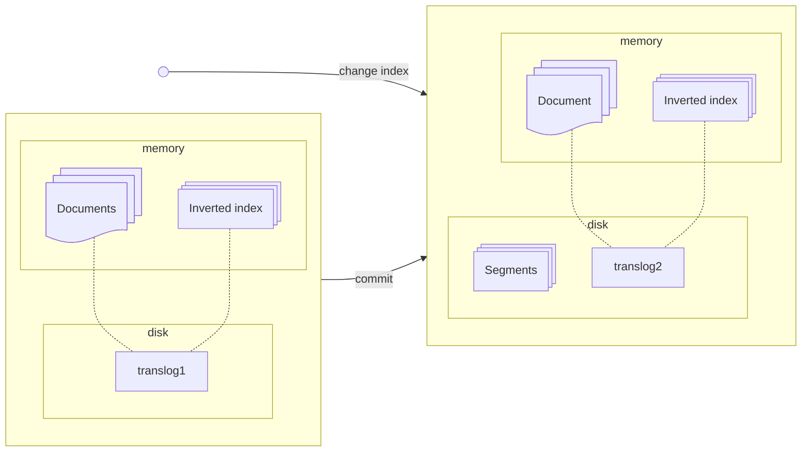
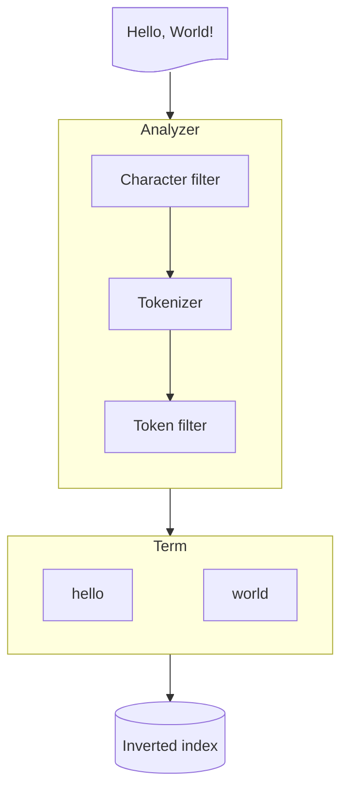
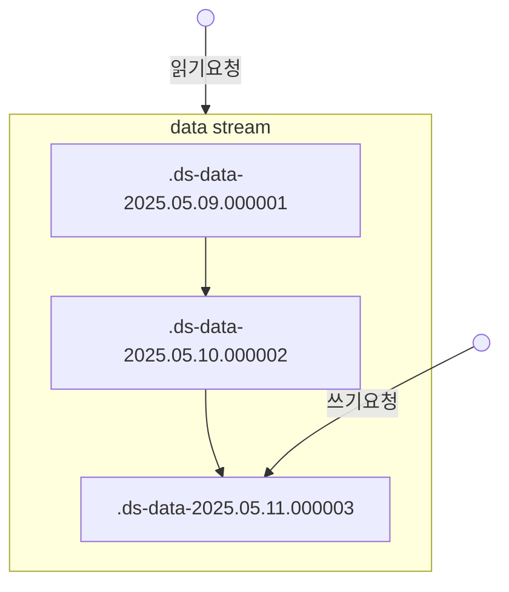

# Elasticsearch

```sh
docker cp elasticsearch_es01_1:/usr/share/elasticsearch/config/certs/ca/ca.crt config/.
curl -v --cacert config/ca.crt -u elastic:elastic https://localhost:9200
```

## 2. 엘라스틱서치 기본 동작과 구조

### 2.2 엘라스틱서치 구조 개괄

#### 노드의 역할  

엘라스틱서치의 노드는 data node, master node, coordinator node 등 여러 역할 중 하나 이상의 역할을 맡아 수행한다.

- 샤드를 보유하고 샤드에 실제 읽기와 쓰기 작업을 수행하는 노드를 **data node**라고 한다.
- 클러스터를 관리하는 중요한 역할을 하는 노드를 **master node**라고 한다. 마스터 노드는 마스터 후보 노드 중에서 1대가 선출된다.
- 클라이언트의 요청을 받아서 데이터 노드에 요청을 분배하고 클라이언트에게 응답을 돌려주는 노드는 **coordinator node**라고 한다.

### 2.3 엘라스틱서치 내부 구조와 루씬

문서 색인 요청이 들어오면 Lucene은 문서를 분석해 inverted index를 생성한다.

#### 2.3.2 Lucene Commit

Lucene은 파일을 연 시점에 색인이 완료된 문서만 검색할 수 있다.
index의 변경 사항을 검색에 반영하고 싶다면 메모리에 있는 변경 내용을 인덱스 파일에 동기화 작업이 필요하다.
이 작업을 Lucene commit이라고 한다.
작업 결과 inverted index를 immutable segment 파일에 저장한다.

#### 2.3.5 Translog

엘라스틱서치가 비정상적으로 종료된 경우 disk에 기록되지 않은 변경 사항은 유실된다.
엘라스틱서치는 모든 변경 사항에 대해 Lucene commit 하는 대신 translog 파일에 작업 로그를 저장한다.
샤드 복구 단계에서 translog 파일 읽어 유실된 데이터를 복구한다.



#### 2.3.4 루씬 인덱스와 엘라스틱서치 인덱스

여러 세그먼트가 모이면 하나의 루씬 인덱스가 된다. 루씬은 이 인덱스 내에서만 검색이 가능하다.
엘라스틱서치 샤드는 이 루씬 인덱스 하나를 래핑한 단위다. 엘라스틱서치 샤드 여러 개가 모이면 엘라스틱서치 인덱스가 된다.


## 3. 인덱스 설계

### 3.1 인덱스 설정

```HTTP
PUT [인덱스 이름]
{
  "settings": {
    "number_of_shards": 1,
    "number_of_replicas": 1,
    "refresh_interval": "1S"
  },
  "mappings": {
    "properties": {
      "createdDate": {
        "type": "date",
        "format": "strict_date_time || epoch_millis"
      },
      "keywordString": {
        "type": "keyword"
      },
      "longValue": {
        "type": "long"
      },
      "textString": {
        "type": "text"
      }
    }
  }
}
```

- number_of_shards: 인덱스가 데이터를 몇 개의 샤드로 쪼갤지 지정한다.
- number_of_replicas: primary 샤드 하나당 replica 샤드를 몇 개 둘 것인지 지정한다.
- refresh_interval: 해당 인덱스를 대상으로 refresh를 얼마나 자주 수행할지 지정한다.

### 3.2 매핑과 필드 타입

매핑은 문서가 인덱스에 어떻게 색인되고 저장되는지 정의하는 부분이다.
매핑을 어떻게 지정하느냐에 따라 서비스 운영 양상이 많이 달라지며 성능의 차이도 크다.
동적 매핑은 예기치 않은 신규 필드가 포함된 데이터 인입 상황에 있어 유연한 운영을 가능하게 해 준다.
하지만 신규 필드 추가가 예정돼 있다면 동적 매핑에 기대지 말고 매핑을 지정하는 것이 좋다.

#### array

엘라스틱서치에는 배열을 표현하는 별도의 타입 구분이 없다.
색인 과정에서 데이터가 단일 데이터인지 배열 데이터인지 상관없이 각 값마다 하나의 독립적인 inverted index을 구성한다.

#### object

내부적으로는 평탄화된 키-값 쌍으로 색인된다.
object 타입의 배열은 배열을 구성하는 객체 데이터를 독립적인 데이터로 취급하지 않는다.

```json
{
  "spec.cores": [12, 6, 6],
  "spec.memory": [128, 64, 32],
  "spec.storage": [8000, 8000, 4000]
}
```

#### nested

nested 타입은 object 타입과 다르게 배열 내 각 객체를 독립적으로 취급한다.
nested 타입은 객체 배열의 각 객체를 내부적으로 별도의 루씬 문서로 분리해 저장한다.
이런 동작 방식 때문에 nested 쿼리라는 전용 쿼리를 이용해 검색해야 한다.
nested 타입을 많이 사용할 경우 성능 문제가 발생할 수 있다.

```HTTP
PUT nested_test
{
  "mappings": {
    "spec": {
      "type": "nested",
      "properties": {
        "cores": {
          "type": "long"
        },
        "memory": {
          "type": "long"
        },
        "storage": {
          "type": "long"
        }
      }
    }
  }
}

GET nested_test/_search
{
  "query": {
    "nested": {
      "path": "spec",
      "query": {
        "bool": {
          "must": [
            {"term": {"spec.cores": "6"}},
            {"term": {"spec.memory": "64"}},
          ]
        }
      }
    }
  }
}
```

#### text 타입과 keyword 타입

text로 지정된 필드 값은 analyzer가 적용된 후 색인된다.
analyzer에 의해 여러 token으로 쪼개지고 쪼개진 token으로 inverted index를 구성한다.
최종적으로 역색인에 들어가는 형태를 term이라고 한다.
keyword로 지정된 필드 값은 normalizer라는 간단한 전처리만을 거친 뒤 단일 term으로 inverted index에 들어간다.


match 쿼리는 검색 대상 필드가 text 타입인 경우 검색 질의어도 analyzer로 분석한다.


text 타입은 analyzer를 적용하여 여러 token으로 쪼개 색인하며, keyword 타입은 normalizer를 적용하여 단일 token으로 색인한다.
색인 방식 차이가 있어 text 타입은 주로 전문 검색에 적합하고 keyword 타입은 일치 검색에 적합하다.
정렬 집계, 스크립트 작업의 대상이 될 필드는 text 타입보다 keyword 타입을 쓰는 편이 낫다.

- doc_values  
  text와 annotated_text을 제외한 타입의 정렬, 집계, 스크립트 작업 시 사용되는 캐시 자료구조다.
  디스크를 기반으로 한 자료 구조로 파일 시스템 캐시를 통해 효율적으로 정렬, 집계, 스크립트 작업을 수행할 수 있다.
- fielddata  
  text와 annotated_text 타입의 정렬, 집계, 스크립트 작업 시 사용되는 캐시 자료구조다.
  inverted index 전체를 읽어들여 힙 메모리에 올려 힙을 순식간에 차지해 OOM 등 많은 문제를 발생 시킬 수 있다.

### 3.3 Analyzer와 Tokenizer

Analyzer는 0개 이상의 character filter, 1개의 tokenizer, 0개 이상의 token filter로 구성된다.
먼저 analyzer는 입력한 텍스트에 character filter를 적용하여 문자열을 변형시킨 뒤 tokenizer를 적용하여 여러 token으로 쪼갠다.
쪼개진 token stream에 token filter를 적용해서 token에 특정한 변형을 가한 결과가 최종적으로 분석 완료된 term이다.



- character filter: character stream을 받아서 특정한 문자를 추가, 변경, 삭제한다.
- tokenizer: character stream을 받아서 여러 token으로 쪼개어 token stream을 만든다.
- token filter: token stream을 받아서 token을 추가, 변경, 삭제한다.

#### Analyzer API

```HTTP
GET _analyze
POST _analyze
GET [인덱스 이름]/_analyze
POST [인덱스 이름]/_analyze
```

#### 커스텀 analyzer 등록

```HTTP
PUT analyzer_test
{
  "settings": {
    "analysis": {
      "char_filter": {
        "my_char_filter": {
          "type": "mapping",
          "mappings": ["ⅰ. => 1.","ⅱ. => 2.","ⅲ. => 3.","ⅳ. => 4."]
        }
      }, 
      "analyzer": {
        "my_analyzer": {
          "char_filter": ["my_char_filter"],
          "tokenizer": "whitespace",
          "filter": ["lowercase"]
        }
      }
    }
  },
  "mappings": {
    "properties": {
      "myText": {
        "type": "text",
        "analyzer": "my_analyzer"
      }
    }
  }
}
```

#### 한국어 형태소 분석 analyzer 플러그인 설치

```sh
bin/elasticsearch-plugin install analysis-nori
```

```HTTP
POST _analyze
{
  "analyzer": "nori",
  "text": "우리는 컴퓨터를 다룬다."
}
```

### 3.4 템플릿

템플릿을 사전에 정의해 두면 인덱스 생성 시 사전 정의한 설정대로 인덱스가 생성된다.

```HTTP
PUT _index_template/[template 이름]
{
  "index_patterns": ["pattern_test_index-*"],
  "priority": 1,
  "template": {
    "settings": {
      "number_of_shards": 2,
      "number_of_replicas": 2
    },
    "mappings": {
      "properties" : {
        "myTextField": {
          "type": "text"
        }
      }
    }
  }
}
```

### 3.5 라우팅

라우팅은 엘라스틱서치가 인덱스를 구성하는 샤드 중 몇 번 샤드를 대상으로 작업을 수행할지 지정하기 위해 사용한다.
라우팅 값은 문서를 색인할 때 문서마다 하나씩 지정할 수 있다.
작업 대상 샤드 번호는 지정된 라우팅 값을 해시한 후 primary 샤드의 개수로 나머지 연산을 수행한 값이 된다.
라우팅 값을 지정하지 않고 문서를 색인하는 경우 라우팅 기본값은 _id 값이 된다.
색인 시 라우팅 값을 지정했다면 조회, 업데이트, 삭제, 검색 등의 작업에서도 똑같이 라우팅을 지정해야 한다.

라우팅 값을 명시하지 않고 검색하면 전체 샤드를 대상으로 검색을 요청하게 된다.
인덱스 내에서 _id 값의 고유성 검증은 샤드 단위로 보장된다.
라우팅 값이 다르게 지정되면 한 인덱스 내에서 같은 _id를 가진 문서가 여러 개 생길 수도 있다.

## 4. 데이터 다루기

### 4.1 단건 문서 API

#### 4.1.1 색인 API

```HTTP
// 덮어 씌우기 가능
PUT [인덱스 이름]/_doc/[_id]

// _id 자동 생성
POST [인덱스 이름]/_doc

// 덮어 씌우기 불가
PUT [인덱스 이름]/_create/[_id]
POST [인덱스 이름]/_create/[_id]
```

##### refresh

refresh 매개변수를 지정하면 문서를 색인한 직후에 해당 샤드를 refresh 해서 즉시 검색 가능하게 만들 것인지 여부를 지정할 수 있다.

| refresh 값 | 동작 방식 |
|---|---|
| true | 색인 직후 문서가 색인된 샤드를 refresh하고 응답을 반환한다. |
| wait_for | 색인 이후 문서가 refresh될 때 까지 기다린 후 응답을 반환한다. |
| false | refresh와 관련된 동작을 수행하지 않는다.(default) |

#### 4.1.2 조회 API

검색과는 다르게 색인이 refresh 되지 않은 상태에서도 변경된 내용을 확인할 수 있다.

```HTTP
// 메타 데이터 포함
GET [인덱스 이름]/_doc/[_id]

// 본문만 검색
GET [인덱스 이름]/_source/[_id]

// _source_includes와 _source_excludes 파라미터를 사용해 필요한 조회한다.
GET [인덱스 이름]/_doc[_id]?_source_includes=p*,views&_source_excludes=public
```

#### 4.1.3 업데이트 API

엘라스틱서치의 업데이트 작업은 기존 문서의 내용을 조회한 뒤 부분 업데이트될 내용을 합쳐 새 문서를 만들어 색인하는 형태로 진행된다.

```HTTP
// doc 방식
POST [인덱스 이름]/_update/[_id]
{
  "doc": {
    "views": 36,
    "updated": "2019-01-17T1405:01.234Z"
  },
  "detect_noop": false, // 기존 문서를 확인하고 변경할 내용이 없다면 쓰기 작업을 하지 않는다.
  "doc_as_upsert": true // 기존 문서가 없을 때 신규 문서로 추가하는 옵션
}

// script 방식
POST [인덱스 이름]/_update/[_id]
{
  "script": {
    "source": "ctx._source.views += params.amount", // 스크립트 본문
    "lang": "painless",
    "params": {                                     // 스크립트 본문에서 사용할 매개변수
      "amount": 1
    }
  }
}
```

#### 4.1.4 삭제 API

```HTTP
DELETE [인덱스 이름]/_update/[_id]
```

### 4.2 복수 문서 API

#### 4.2.1 bulk API

bulk API는 요청 본문을 JSON이 아니라 NDJSON 형태로 만들어서 보낸다.
NDJSON은 여러 줄의 JSON을 줄바꿈 문자로 구분한다.
Content-Type 헤더도 application/json 대신 application/x-ndjson을 사용해야 한다.
동일한 인덱스, _id, 라우팅 조합을 가진 요청은 동일한 primary 샤드로 요청돼 bulk API 기술된 순서대로 실행된다.

```HTTP
POST _bulk
{"index":{"_index":"bulk_test","_id":"1"}}
{"field1":"value1"}
{"delete":{"_index":"bulk_test","_id":2}}
{"create":{"_index":"bulk_test","_id":3}}
{"field1":"value3"}
{"update":{"_id":"1","_index":"bulk_test"}}
{"doc":{"field2":"value2"}}
{"index":{"_index":"bulk_test","_id":4,"routing":"a"}}
{"field1":"value4"}

POST [인덱스 이름]/_bulk
{"delete":{"_index":"bulk_test","_id":2}}
```

#### 4.2.2 multi get API

```HTTP
GET _mget
{
  "docs":[
    {
      "_index": "bulk_test",
      "_id": 1
    },
    {
      "_index": "bulk_test",
      "_id": 4,
      "routing": "a"
    },
    {
      "_index": "my_index",
      "_id": 1,
      "_source": {
        "include": ["p*"],
        "exclude": ["point"]
      }
    }
  ]
}

GET [인덱스 이름]/_mget
{
  "ids": ["1", "3"]
}
```

#### 4.2.3 update by query

```HTTP
POST bulk_test/_update_by_query
{
  "script": {
    "source": "ctx._source.field1 = ctx._source.field1 + '-' + ctx._id",
    "lang": "painless"
  },
  "query": {
    "exists": {
      "field": "field1"
    }
  },
  "conflicts": "proceed"
}
```

엘라스틱서치는 query 절의 검색 조건에 맞는 문서를 찾아 일종의 스냅샷을 찍는다.
이후 각 문서마다 지정된 스크립트에 맞게 업데이트를 실행한다.
여러 문서의 업데이트가 순차적으로 진행되는 도중 다른 작업으로 인해 문서에 변경이 생길 수 있다.
스냅샷을 찍어 뒀던 문서에 변화가 생긴 문서를 발견하면 이를 업데이트하지 않는다.
conflict 매개변수를 abort로 지정하면 충돌 발견 시 작업을 중단하며, proceed로 지정하면 다음 작업으로 넘어간다.

##### Throttling

update by query API는 문제가 생긴 데이터를 일괄적으로 처리하거나 변경된 비즈니스 요건에 맞게 데이터를 일괄 수정하는 작업 등에 많이 활용된다.
이런 대량 작업을 수행하면 운영 중인 서비스에도 영향을 줄 수 있다.
그러한 상황을 피하기 위해 적절한 throttling을 적용해 작업 속도를 조정하고 클러스터 부하와 서비스 영향을 최소화할 수 있다.

```HTTP
POST bulk_test/_update_by_query?scroll_size=1000&scroll=1m&requests_per_seconds=500
```

- scroll_size  
업데이트 전 먼저 검색을 수행하는 도큐먼트 수
- scroll  
검색 조건을 만족한 모든 문서를 대상으로 검색이 처음 수행됐을 당시 상태를 search context에 보존한다.
search context를 얼마나 보존할지 지정하는 것이 scroll 설정이다.
- request_per_second  
초당 몇 개까지 작업을 수행할 것인지를 지정한다.

##### 비동기적 요청과 tasks API

엘라스틱서치에서 update by query 요청 시에는 wait_for_completion 매개변수를 false로 지정하면 비동기적으로 처리를 할 수 있다.

```HTTP
// 등록
POST bulk_test/_update_by_query?wait_for_completion=false

// 조회
GET .tasks/[task id]
GET _tasks/[task id]

// 취소
POST _tasks/[task id]/_cancel

// throttling 동적 변경
POST _update_by_query/[task id]/_rethrottle?requests_per_second=100

// task 결과 삭제
DELETE .tasks/_doc/[task id]
```

##### slicing

slices 매개변수를 지정하면 검색과 업데이트를 지정한 개수로 쪼개 병렬적으로 수행한다.
auto로 지정하면 엘라스틱서치가 적절한 개수를 지정해서 작업을 병렬 수행한다.
보통은 지정한 인덱스의 primary 샤드 수가 슬라이스의 수가 된다.

```HTTP
POST [인덱스 이름]/_update_by_query?slices=auto
```

#### 4.2.4 delete by query

지정한 검색 쿼리로 삭제할 대상을 지정한 뒤에 삭제를 수행하는 작업이다.

```HTTP
POST [인덱스 이름]/_delete_by_query
```

### 4.3 검색 API

#### 4.3.1 검색 대상 지정

```HTTP
GET [인덱스 이름]/_search
POST [인덱스 이름]/_search
GET _search
POST _search
```

인덱스 이름을 지정할 때는 와일드카드 문자 *를 사용할 수 있다.
콤마로 구분하여 검색 대상을 여럿 지정하는 것도 가능하다.

#### 4.3.2 쿼리 DSL 검색과 쿼리 문자열 검색

```HTTP
// 쿼리 DSL 검색
GET my_index/_search
{
  "query": {
    "match": {
      "title": "hello"
    }
  }
}

// 쿼리 문자열 검색
GET my_index/_search?q=title:hello
```

#### 4.3.3 match_all 쿼리

match_all 쿼리 모든 문서를 매치하는 쿼리

```HTTP
POST [인덱스 이름]/_search
{
  "query": {
    "match_all": {}
  }
}
```

#### 4.3.4 match 쿼리

지정한 필드의 내용이 질의어와 매치되는 문서를 찾는 쿼리다.
필드가 text 타입이라면 등록된 analyzer로 질의어가 분석된다.
이 때 질의어 term과 field 값의 term의 기본 match 동작은 OR 조건으로 동작한다.
operator를 and로 지정하면 모든 term이 매치된 문서만 검색되도록 변경할 수 있다.

```HTTP
POST [인덱스 이름]/_search
{
  "query": {
    "match": {
      "fieldName": {
        "query": "test query sentence"
      }
    }
  }
}

POST [인덱스 이름]/_search
{
  "query": {
    "match": {
      "fieldName": {
        "query": "test query sentence",
        "operator": "and"
      }
    }
  }
}
```

#### 4.3.5 term & terms 쿼리

term 쿼리는 지정한 필드의 값이 질의어와 정확히 일치하는 문서를 찾는 쿼리다.
필드가 keyword 타입이라면 등록된 normalizer로 질의어가 분석된다.
text 타입의 필드를 대상으로 term 쿼리를 사용하는 경우는 질의어는 normalizer 처리를 거치지만 필드의 값은 analyzer로 분석한 뒤 생성된 역색인을 이용하게 된다.

```HTTP
POST [인덱스 이름]/_search
{
  "query": {
    "term": {
      "fieldName": {
        "value": "test"
      }
    }
  }
}

POST [인덱스 이름]/_search
{
  "query": {
    "terms": {
      "fieldName": ["hello", "world"]
    }
  }
}
```

#### 4.3.7 range 쿼리

필드의 값이 특정 범위 내에 있는 문서를 찾는 쿼리다.
엘라스틱서치는 문자열 필드를 대상으로 한 range 쿼리를 부하가 큰 쿼리로 분류한다.

```HTTP
POST [인덱스 이름]/_search
{
  "query": {
    "range": {
      "fieldName": {
        "gte": 100,
        "lt": 200
      }
    }
  }
}

POST [인덱스 이름]/_search
{
  "query": {
    "range": {
      "dateField": {
        "gte": "2019-01-15T00:00:00.000Z||+36/d",
        "lt": "now-3h/d"
      }
    }
  }
}
```

##### Date Math

- ||: 날짜 시간 문자열의 마지막에 붙인다.
- now: 현재 시각을 나타낸다.
- +&-: 지정된 시간만큼 더하거나 빼는 연산을 수행한다.
- /: 버림을 수행한다.

#### 4.3.8 prefix 쿼리

필드의 값이 지정한 질의어로 시작하는 문서를 찾는 쿼리다. prefix 검색도 무거운 쿼리로 분류된다.
만약 prefix 쿼리를 서비스로 호출 용도로 사용하려면 매핑에 index_prefixes 설정을 넣는 방법이 있다.

```HTTP
POST [인덱스 이름]/_search
{
  "query": {
    "prefix": {
      "fieldName": {
        "value": "hello"
      }
    }
  }
}

POST [인덱스 이름]
{
  "mappings": {
    "properties": {
      "prefixField": {
        "type": "text",
        "index_prefixes": {
          "min_chars": 3,
          "max_chars": 5
        }
      }
    }
  }
}
```

#### 4.3.9 exists 쿼리

지정한 필드를 포함한 문서를 검색한다.

```HTTP
POST [인덱스 이름]/_search
{
  "query": {
    "exists": {
      "field": "fieldName"
    }
  }
}
```

#### 4.3.10 bool 쿼리

여러 쿼리를 조합하여 검색하는 쿼리다. must, must_not, filter, should 4가지 종류의 조건절에 다른 쿼리를 조합하여 사용한다.
must 조건절과 filter 조건절에 들어간 하위 쿼리는 모두 AND 조건으로 만족해야 최종 검색 결과에 포함된다.
must_not 조건절에 들어간 쿼리를 만족하는 문서는 최종 검색 결과에서 제외된다.
should 조건절에 들어간 쿼리는 minimum_should_match에 지정한 개수 이상의 하위 쿼리를 만족하는 문서가 최종 검색 결과에 포함된다.

```HTTP
POST [인덱스 이름]/_search
{
  "query": {
    "bool": {
      "must": [
        {"term": {"field1.keyword": {"value": "hello"}}},
        {"term": {"field2.keyword": {"value": "world"}}}
      ], 
      "filter": [
        {"term": {"field3.keyword": {"value": true}}}
      ],
      "must_not": [
        {"term": {"field4.keyword": {"value": "elasticsearch-test"}}}
      ],
      "should": [
        {"term": {"field4.keyword": {"value": "elasticsearch"}}},
        {"term": {"field5.keyword": {"value": "lucene"}}}
      ],
      "minimum_should_match": 1
    }
  }
}
```

##### query context과 filter context

점수를 매기지 않고 단순히 조건을 만족하는지 여부만을 참과 거짓으로 따지는 검색 과정을 filter context라고 한다.
문서가 주어진 검색 조건을 얼마나 더 잘 만족하는지 유사도 점수를 매기는 검색 과정을 query context라고 한다.

| | query context | filter context |
|---|---|---|
| 질의 개념 | 문서가 질의어와 얼마나 잘 매치되는가 | 질의 조건을 만족하는가 |
| 점수 | 계산함 | 계산하지 않음 |
| 성능 | 상대적으로 느림 | 상대적으로 빠름 |
| 캐시 | 캐시 활용 불가 | 캐시 활용 가능 |
| 종류 | bool의 must, bool의 should, match, term 등 | bool의 filter, bool의 must_not, exists, range, constant_score 등 |

##### 쿼리 수행 순서

엘라스틱서치는 검색 요청을 받으면 내부적으로 쿼리를 lucene의 여러 쿼리로 쪼갠 뒤 조합하여 재작성한다.
그 뒤 쪼개진 각 쿼리를 수행할 경우 비용이 얼마나 소모되는지 내부적으로 추정한다.
이 비용 추정에는 역색인에 저장해 둔 정보나 통계 정보 등이 활용된다.
추정된 비용과 효과를 토대로 유리할 것으로 생각되는 부분을 먼저 수행한다.

#### 4.3.11 constant_score 쿼리

지정한 쿼리를 filter context에서 검색하는 쿼리다.

```HTTP
POST [인덱스 이름]/_search
{
  "query": {
    "constant_score": {
      "filter": {
        "term": {
          "fieldName": "hello"
        }
      }
    }
  }
}
```

#### 4.3.12 그 외 주요 매개 변수

##### explain

explain을 사용하면 검색을 수행하는 동안 쿼리의 각 하위 부분에서 점수가 어떻게 계산되는지 설명한다.

```HTTP
POST [인덱스 이름]/_search?explain=true
```

##### search_type

유사도 점수를 계산할 때 각 샤드 레벨에서 계산을 끝낼지 여부를 선택할 수 있다.

- query_then_fetch: 각 샤드 레벨에서 유사도 점수 계산을 끝낸다.
- dfs_query_then_fetch: 모든 샤드로부터 정보를 모아 유사도 점수를 글로벌하게 계산한다.

#### 4.3.13 검색 결과 정렬

sort를 지정하면 검색 결과를 정렬할 수 있다. 필드 이름 외에도 _score나 _doc을 지정할 수 있다.

```HTTP
POST [인덱스 이름]/_search
{
  "query": {},
  "sort": [
    {"field1": {"order": "desc"}},
    {"field2": {"order": "asc"}},
    "field3"
  ]
}
```

#### 4.3.14 페이지네이션

##### from과 size

size는 검색 결과로 몇 개의 문서를 반환할 것인지 지정한다. from은 몇 번째 문서부터 결과를 반환할지 오프셋을 지정한다.
from과 size 페이지네이션은 두 가지 문제점이 있다.
첫번째는 from 값이 올라갈수록 무거운 검색을 수행한다는 점이다.
두번째는 현재 페이지 검색 요청과 이전 페이지 검색 요청 사이에 새로운 문서가 색인되거나 삭제될 수 있기 때문에 데이터를 중복이나 누락 없이 제공할 수 없다.

```HTTP
POST [인덱스 이름]/_search
{
  "from": 10,
  "size: 5,
  "query": {}
}
```

##### scroll

검색 조건에 매칭되는 전체 문서를 모두 순회해야 할 때 적합한 방법이다.
스크롤을 순회하는 동안에는 최초 검색 시의 search context가 유지된다.
scroll은 search context을 보존한 뒤 전체 문서를 순회하는 동작 특성상 정렬 여부가 상관 없는 작업에서 사용하는 경우가 많다.
_doc로 정렬하면 유사도 점수를 계산하지 않으며 정렬을 위한 별도의 자원도 사용하지 않는다.

```HTTP
# 첫 페이지
POST [인덱스 이름]/_search?scroll=1m
{
  "size": 1000,
  "query": {}
}

# 다음 페이지
POST _search/scroll
{
  "scroll_id": "id value",
  "scroll": "1m"
}
```

##### search_after

서비스 사용자에게 검색 결과를 요청케 하고 결과에 페이지네이션을 제공하는 용도라면 search_after를 사용하는 것이 가장 적합하다.
search_after에는 sort를 지정해야 한다. 이때 동일한 정렬 값이 등장할 수 없도록 최소한 1개 이상의 동점 제거(tiebreaker)용 필드를 지정해야 한다.

```HTTP
// 첫 페이지
POST kibana_sample_data_ecommerce/_search
{
  "size": 20,
  "query": {
    "term": {
      "currency": {
        "value": "EUR"
      }
    }
  },
  "sort": [
    {"order_date": "desc"},
    {"order_id": "asc"}
  ]
}

# 다음 페이지
POST kibana_sample_data_ecommerce/_search
{
  "size": 20,
  "query": {
    "term": {
      "currency": {
        "value": "EUR"
      }
    }
  },
  "sort": [
    {"order_date": "desc"},
    {"order_id": "asc"}
  ],
  "search_after": [1736627990000, "591924"]
}
```

동점 제거용 필드에는 문서를 고유하게 특정할 수 있는 값이 들어가야 한다.
그러나 _id 값을 동점 제거용 기준 필드로 사용하는 것은 좋지 않다.
_id 필드는 doc_values 캐시가 꺼져 있기 때문에 이를 기준으로 하는 정렬은 많은 메모리를 사용하게 된다.
_id 필드값과 동일한 값을 별도의 필드에 저장해 뒀다가 동점 제거용으로 사용하는 편이 낫다.

point in time API는 검색 대상의 상태를 고정할 때 사용한다. keep_alive 매개변수로 상태를 유지할 시간을 지정한다.
pit를 지정하면 동점 제거용 필드를 별도로 지정할 필요가 없다. 정렬 기준 필드를 하나라도 지정하면 _shard_doc이라는 동점 제거용 필드에 대한 오름차순 정렬이 맨 마지막에 자동으로 추가된다.

```HTTP
// id 생성
POST kibana_sample_data_ecommerce/_pit?keep_alive=1m

// 첫 페이지
POST _search
{
  "size": 20,
  "query": {
    "term": {
      "currency": {
        "value": "EUR"
      }
    }
  },
  "pit": {
    "id": "$id",
    "keep_alive": "1m"
  }, 
  "sort": [
    {"order_date": "desc"}
  ]
}

// 다음 페이지
POST _search
{
  "size": 20,
  "query": {
    "term": {
      "currency": {
        "value": "EUR"
      }
    }
  },
  "pit": {
    "id": "$id",
    "keep_alive": "1m"
  },
  "search_after": [1736627990000, 2438],
  "sort": [
    {"order_date": "desc"}
  ]
}
```

### 4.4 집계

문서에 대한 산술적인 연산을 수행한다.

#### 기본 집계

```HTTP
GET kibana_sample_data_ecommerce/_search
{
  "size": 0,
  "query": {
    "term": {
      "currency": "EUR"
    }
  },
  "aggs": {
    "max-sum-aggregation-name": {
      "sum": {
        "field": "taxless-total-price"
      } 
    }
  }
}

GET kibana_sample_data_ecommerce/_search
{
  "size": 0,
  "query": {
    "term": {
      "currency": {
        "value": "EUR"
      }
    }
  },
  "aggs": {
    "my-stats-aggregation-name": {
      "stats": {
        "field": "taxless_total_price"
      }
    }
  }
}

GET kibana_sample_data_ecommerce/_search
{
  "size": 0,
  "query": {
    "match_all": {}
  },
  "aggs": {
    "my-cardinality-aggregation-name": {
      "cardinality": {
        "field": "customer_id",
        "precision_threshold": 30000
      }
    }
  }
}
```

집계 요청의 상세는 aggs 밑에 기술한다. 요청 한 번에 여러 집계를 요청할 수도 있기 때문에 결과에서 이들을 구분할 수 있도록 집계에 이름을 붙여야 한다.
집계 작업은 검색 쿼리에 매칭된 모든 문서에 대해 수행된다. 이를 염두에 두지 않으면 과도한 양의 데이터를 대상으로 집계를 수행할 수 있다.

size 0으로 지정하면 검색에 상위 매칭된 문서가 무엇인지 받아볼 수 없다. 하지만 검색에 매치되는 모든 문서는 집계에 사용된다.
size를 0으로 지정하면 각 샤드에서 수행한 검색 결과에서 상위 문서의 내용을 수집해 모을 필요가 없고 점수를 계산하는 과정도 수행하지 않는다.
이로 인해 성능에 이득이 있다. 캐시의 도움도 더 많이 받을 수 있다.

#### 버킷 집계

버킷 집계는 문서를 특정 기준으로 쪼개어 여러 부분 집합으로 나눈다.

##### range 집계

```HTTP
GET kibana_sample_data_flights/_search
{
  "size": 0,
  "query": {
    "match_all": {}
  },
  "aggs": {
    "distance-kilometers-range": {
      "range": {
        "field": "DistanceKilometers",
        "ranges": [
          {
            "to": 5000
          },
          {
            "from": 5000,
            "to": 10000
          },
          {
            "from": 10000
          }
        ]
      },
      "aggs": {
        "average-ticket-price": {
          "avg": {
            "field": "AvgTicketPrice"
          }
        }
      }
    }
  }
}

GET kibana_sample_data_ecommerce/_search
{
  "size": 0,
  "query": {
    "match_all": {}
  },
  "aggs": {
    "date-ranges-aggs": {
      "date_range": {
        "field": "order_date",
        "ranges": [
          {
            "to": "now-10d/d"
          },
          {
            "from": "now-10d/d",
            "to": "now"
          },
          {
            "from": "now"
          }
        ]
      }
    }
  }
}
```

##### histogram 집계

```HTTP
GET kibana_sample_data_flights/_search
{
  "size": 0,
  "query": {
    "match_all": {}
  }, 
  "aggs": {
    "my-histogram": {
      "histogram": {
        "field": "DistanceKilometers",
        "interval": 1000,
        "offset": 50
      }
    }
  }
}

GET kibana_sample_data_ecommerce/_search
{
  "size": 0,
  "query": {
    "match_all": {}
  }, 
  "aggs": {
    "my-date-histogram": {
      "date_histogram": {
        "field": "order_date",
        "calendar_interval": "day"
      }
    }
  }
}
```

##### terms 집계

지정한 필드에 대해 가장 빈도수가 높은 term 순서대로 버킷을 생성한다.

```HTTP
GET kibana_sample_data_logs/_search
{
  "size": 0,
  "query": {
    "match_all": {}
  },
  "aggs": {
    "my-terms-aggs": {
      "terms": {
        "field": "host.keyword",
        "size": 10
      }
    }
  }
}
```

##### composite 집계

sources로 지정된 하위 집계의 버킷 전부를 페이지네이션을 이용해서 효율적으로 순회하는 집계다.

```HTTP
GET kibana_sample_data_logs/_search
{
  "size":0,
  "query": {
    "match_all": {}
  },
  "aggs": {
    "composite-aggs": {
      "composite": {
        "size": 100, 
        "sources": [
          {
            "terms-aggs": {
              "terms": {
                "field": "host.keyword"
              }
            }
          },
          {
            "date-histogram-aggs": {
              "date_histogram": {
                "field": "@timestamp",
                "calendar_interval": "day"
              }
            }
          }
        ],
        // 다음 페이지 조회
        "after": {
          "terms-aggs": "cdn.elastic-elastic-elastic.org",
          "date-histogram-aggs": 1738368000000
        }
      }
    }
  }
}
```

#### 파이프라인 집계

파이프라인 집계는 문서나 필드의 내용이 아니라 다른 집계 결과를 집계 대상으로 지정한다.
즉 다른 집계의 결과를 입력값으로 가져와서 작업을 수행한다.
주로 buckets_path라는 인자를 통해 다른 집계의 결과를 가져오며, 이 buckets_path는 상대 경로로 지정한다.

```HTTP
GET kibana_sample_data_ecommerce/_search
{
  "size": 0,
  "query": {
    "match_all": {}
  },
  "aggs": {
    "daily-timestamp-bucket": {
      "date_histogram": {
        "field": "order_date",
        "calendar_interval": "day"
      },
      "aggs": {
        "daily-total-quantity-average": {
          "avg": {
            "field": "total_quantity"
          }
        },
        "pipeline-sum": {
          "cumulative_sum": {
            "buckets_path": "daily-total-quantity-average"
          }
        }
      }
    }
  }
}

GET kibana_sample_data_ecommerce/_search
{
  "size":0,
  "query": {
    "match_all": {}
  },
  "aggs": {
    "daily-timestamp-bucket": {
      "date_histogram": {
        "field": "order_date",
        "calendar_interval": "day"
      },
      "aggs": {
        "daily-total-quantity-average": {
          "avg": {
            "field": "total_quantity"
          }
        }
      }
    },
    "max-total-quantity": {
      "max_bucket": {
        "buckets_path": "daily-timestamp-bucket>daily-total-quantity-average"
      }
    }
  }
}
```

## 5. 서비스 환경에 클러스터 구성

### 5.1 운영 환경을 위한 설정과 클러스터 구성

#### 5.1.1 노드 설정과 노드 역할

##### 노드 역할

- master eligible node  
마스터 후보 노드 중에서 선거를 통해 마스터 노드를 선출된다. 마스터 노드는 클러스터를 관리하는 역할을 수행한다.
인덱스 생성이나 삭제, 어떤 샤드를 어느 노드에 할당할 것인지 등 중요한 작업을 수행한다.
- data node  
실제 데이터를 들고 있는 노드다. CRUD, 검색, 집계와 같이 데이터와 관련된 작업을 수행한다.
- ingest node  
데이터가 색인되기 전에 전처리를 수행하는 인제스트 파이프라인을 수행하는 노드다.
- coordinator node  
클라이언트 요청을 받아서 다른 노드에 요청을 분배하고 클라이언트에게 최종 응답을 돌려주는 노드를 조정 노드라고 한다.
기본적으로 모든 노드가 조정 역할을 수행한다. 마스터나 데이터 등 주요 역할을 수행하지 않고 조정 역할만 수행하는 노드는 조정 전용 노드라고 부른다.

##### config/elasticserarch.yml

```yml
# 노드 역할을 지정하는 설정이다. master, data, ingest 등을 0개 이상 조합해 지정한다. []와 같이 내용을 비워 두면 조정 전용 노드가 된다. 
node.roles: [ master, data ]

cluster.name: test-es
node.name: test-es-node01

# HTTP 통신을 위해 사용하는 포트를 지정한다.
http.port: 9200
# transport 통신을 위해 사용하는 포트를 지정한다.
transport.port: 9300-9400

path:
  logs: /usr/share/elasticsearch/logs
  data:
    - /usr/share/elasticsearch/data

network.host: 10.0.0.1
# 엘라스틱서치에 바인딩할 네트워크 주소를 지정한다. network.publish_host는 클러스터의 다른 노드에게 자신을 알릴 때 쓰는 주소를 지정한다.
network.bind_host: 0.0.0.0

# 노드가 클러스터에 합류하려고 할 때 다른 노드와 접촉하기 위한 IP/host 목록을 지정합니다.
discovery.seed_hosts: ["10.0.0.1", "10.0.0.2", "some-host-name.net"]

# 클러스터를 처음 기동할 때 첫 마스터 선거를 수행할 후보 노드 목록을 지정한다.
cluster.initial_master_nodes: ["test-es-node01", "test-es-node02", "test-es-node03"]
xpack.security.enable: false
```

### 5.1.2 그 외 필요한 주요 설정

#### Heap size

힙 크기는 config/jvm.options 파일에 xms와 xmx를 같은 크기로 저정해야 한다.
힙 크기는 최소한 시스템 메모리의 절반 이하로 지정해야 한다.
시스템 메모리의 절반은 운영체제가 캐시로 쓰도록 놔두는 것이 좋다.
루씬이 커널 시스템 캐시를 많이 활용하기 때문이다.

힙 크기를 32GB 이상 지정하지 않아야 한다.
JVM이 힙 영역에 생성된 객체에 접근하기 위한 포인터를 Ordinary Object Pointer라고 한다.
32비트 환경에서는 4GB($2^{32}$)까지의 힙 영역을 사용할 수 있다.
4GB를 넘어서는 힙을 사용해야 한다면 32비트 OOP로는 불가능하고 64비트 OOP를 사용해야 한다.

그러나 Compressed Ordinary Object Pointers라는 기능을 적용하면 32GB 메모리까지 사용할 수 있다.
자바는 객체를 8바이트 단위로 정렬해 할당하기 때문에 객체 간의 주소가 8바이트 배수만큼 차이난다.
따라서 포인터가 메모리의 주소를 직접 가리키지 않고 상대적인 위치 차이를 나타내면 1비트가 1바이트 8바이트 단위의 메모리 주소를 가리키도록 할 수 있다.
Compressed OOP로 인코딩된 주소를 실제 주소로 디코딩하려면 3비트 시프트 연산 후 힙 영역이 시작되는 기본 주소를 더하는 작업이 필요하다.
여기서 기본 주소를 0으로 바꾸는 기능을 Zero-based Compressed OOPs라고 한다.

```sh
$ java -Xmx32736m -XX:+PrintFlagsFinal 2> /dev/null | grep UseCompressedOops

bool UseCompressedOops                        = true                           {product lp64_product} {ergonomic}

$ java -XX:+UnlockDiagnosticVMOptions -Xlog:gc+heap+coops=debug -Xmx30720m -version

[0.005s][debug][gc,heap,coops] Protected page at the reserved heap base: 0x0000000300000000 / 16777216 bytes
[0.005s][debug][gc,heap,coops] Heap address: 0x0000000301000000, size: 30736 MB, Compressed Oops mode: Non-zero based: 0x0000000300000000, Oop shift amount: 3
openjdk version "17.0.2" 2022-01-18 LTS
OpenJDK Runtime Environment Corretto-17.0.2.8.1 (build 17.0.2+8-LTS)
OpenJDK 64-Bit Server VM Corretto-17.0.2.8.1 (build 17.0.2+8-LTS, mixed mode, sharing)
```

일반적으로 Zero-based Compressed OOPs까지도 적용되는 선까지 메모리 크기를 줄이는 설정이 성능상 낫지만, 반드시 그렇지는 않다.
시스템 환경이나 데이터 특성, 주요 사용 패턴에 따라 다소 달라진다.

#### Swapping

엘라스틱서치는 스와핑을 사용하지 않도록 강력히 권고한다.

```sh
# 스와핑 완전히 끄기
$ sudo swapoff -a

# 스와핑 경향성 최소화
$ sysctl -w vm.swppiness=1

# 재부팅 이후에도 스와핑 경향성을 최소화하고 싶다면 아래 파일에 vm.swappiness=1 설정 추가
$ sudo vim /etc/sysctl.d/elasticsearch.conf

# config/elasticsearch.yml 파일에 bootstrap.memory_lock: true 설정
```

#### vm.max_map_count

프로세스가 최대 몇 개까지 메모리 맵 영역을 가질 수 있는지를 지정한다.
루씬은 mmap(memory-mapped file I/O)을 적극적으로 활용하기 때문에 vm.max_mapcount 값을 262144보다 높여서 지정해야 한다.

```sh
$ sudo sysctl -w vm.vm_max_map_count=262144

# 재부팅 후에도 메모리 맵 지정
$ sudo vim /etc/sysctl.d/elasticsearch.conf
```

#### 파일 기술자

엘라스틱서치는 많은 file descriptor를 필요로 한다. 엘라스틱서치는 이 값을 최소 65535 이상으로 지정하도록 가이드한다.

```sh
# 현재 값 확인
$ ulimit -a | grep "\-n:"
$ sudo ulimit -n 65535

# {username} - nofile 65535 추가
$ sudo vim /etc/sucurity/limits.conf
```

### 5.2 클러스터 구성 전략

#### 5.2.1 마스터 후보 노드와 데이터 노드를 분리

마스터 노드는 클러스터를 관리하는 중요한 역할을 수행한다.
엘라스틱서치 운영에서 발생할 수 있는 여러 가지 문제를 보면 상대적으로 데이터 노드가 죽을 확률이 높다.
마스터 역할과 데이터 역할을 분리해 두지 않았다면 마스터 역할이 제대로 수행되지 않아 클러스터 안정성이 크게 떨어진다.

데이터 노드를 재시작할 필요가 없는데 재시작한다면 불필요한 샤드 복구 과징이 수행된다.
마스터 노드를 재시작할 필요가 없는데 재시작하다면 불필요한 마스터 재선출 과정이 발생할 수 있다.

#### 5.2.2마스터 후보 노드와 투표 구성원

마스터 노드를 선출하는 집단이 투표 구성원(voting configuration)이다.
투표 구성원은 마스터 후보 노드 중 일부 혹은 전체로 구성된 마스터 후보 노드의 부분 집합으로 마스터 선출이나 클러스터 상태 저장 등의 의사결정에 참여하는 노드의 모임이다.

split brain 문제를 방지하기 위해 투표 구성원으로부터 과반의 찬성을 얻어야 한다.
투표 구성원이 짝수인 경우 엘라스틱서치는 투표 구성원을 홀수로 유지하기 위해 투표 구성원에서 마스터 후보 노드를 하나 제외한다.

#### 5.2.6 조전 전용 노드

각 데이터 노드에서 작업한 결과물을 모아서 돌려주는 작업은 생각보다 큰 부하를 줄 수 있다.
서버 자원에 여유가 있다면 읽기 작업을 담당하는 조정 전용 노드와 쓰기 작업을 담당하는 조정 전용 노드를 분리하는 것도 좋은 방법이다.

#### 5.2.7 한 서버에 여러 프로세스 띄우기

한 서버에 여러 프로세스를 띄우는 대상은 마스터 후보 역할을 하는 프로세스가 아닌 데이터 노드여야한다.

프로세스 기동을 위해서는 반드시 cluster.routing.allocation.same_shard.host: true 설정을 지정해야 한다.
이 설정은 샤드 할당 시 같은 샤드의 primary 샤드와 replica 샤드가 한 서버에 몰리지 않도록 조정해 준다.
같은 서버를 확인하는 기준은 호스트 이름과 주소다.

### 5.3 보안 기능 적용

```sh
# pem 형식 ca 인증서 생성
bin/elasticsearch-certutil ca --silent --pem -out config/certs/ca.zip
bin/elasticsearch-certutil cert --silent --pem -out config/certs/certs.zip --in config/certs/instances.yml --ca-cert config/certs/ca/ca.crt --ca-key config/certs/ca/ca.key;
openssl x509 -in es01.crt -text -noout

# .p12 형식 ca 인증서 생성
bin/elasticsearch-certutil ca
bin/elasticsearch-certutil cert --ca elastic-stack-ca.p12
openssl pkcs12 -in elastic-stack-ca.p12 -nodes

# 키바나 계정의 비밀번호 등록
bin/kibana-keystore create
bin/kibana-keystore add elasticsearch.password

# .p12 파일의 암호 추가
bin/elasticsearch-keystore add xpack.security.http.ssl.keystore.secure_password
```

## 6 클러스터 운영

### 6.1 클러스터 설정 API

```HTTP
GET /_cluster/settings

PUT /_cluster/settings
{
  "persistent": {
    "indices.breaker.total.limit: "70%"
  },
  "transient": {
    "cluster.routing.allocation.enable": "primaries",
    "indices.breaker.total.limit": "90%"
  }
}
```

persistent와 transient에 동일한 설정이 지정되면 transient 설정이 우선 적용된다.

### 6.2 cat API를 통한 클러스터 관리와 모니터링

cat API는 터미널에서 사람이 조회했을 때 보기 편한 형태로 응답하는 것이 목적이다.

```HTTP
GET _cat/health
GET _cat/indices
GET _cat/nodes
GET _cat/shards
GET _cat/segments
GET _cat/recovery
GET _cat/allocation
GET _cat/thread_pool
GET _cat/master
```

### 6.3 인덱스 운영 전략

#### 6.3.3 시계열 인덱스 이름

시계열 데이터를 색인한다면 인덱스 이름에 시간값을 넣는 방법을 고려하자.
만약 하나의 인덱스에 데이터를 색인했다면 range 쿼리를 이용해서 데이터를 백업하고 delete by query로 삭제를 수행해야 한다.
하지만 시계열 이름을 가진 인덱스라면 인덱스를 통째로 백업하고 삭제하면 그만이다.

성능면에서 세그먼트 병합을 지속적으로 수행할 필요가 없다.
세그먼트가 고정되면 검색 시 캐시 적중율도 높아진다.
또한 검색 대상이 될 인덱스를 지정하는 것만으로도 검색 범위를 좁힐 수 있다.

#### 6.3.4 alias

인덱스를 다른 이름으로 가리키도록 하는 기능이다.

```HTTP
POST _alias
{
  "actions": [
    {
      "add": {
        "index": "my_index",
        "alias": "my_alias_name"
      }
    },
    {
      "add": {
        "index": "my_index2",
        "alias": "my_alias_name",
        "is_write_index": true
      }
    }
  ]
}
```

서비스에 직접 활용되는 데이터를 들고 있는 인덱스나, 요건 등이 변할 것이 예상되는 인덱스라면 모두 alias를 사전에 지정하는 것이 좋다.
매핑이나 설정 등에 큰 변화가 필요할 때 새 인덱스를 미리 만들고 alias가 가르키는 인덱스만 변경하면 운영 중에 새 인덱스로 넘어갈 수 있다.

#### 6.3.5 rollover

하나의 alias에 여러 인덱스를 묶고 한 인덱스에만 is_write_true를 지정한 구성은 쓰기를 담당하는 인덱스 내 샤드의 크기가 너무 커지면 새로운 인덱스를 생성해서 같은 alias 안에 묶은 뒤 is_write_true를 새 인덱스로 옮기는 방식으로 운영한다.
rollover는 이러한 작업을 묶어서 수행하는 기능이다.

```HTTP
POST [rollover 대상]/_rollover
```

rollover 수행할 alias 내 is_write_true 인덱스의 이름은^.*-\d+$ 패턴을 따라야 한다.
인덱스를 처음 생성할 때에 인덱스 이름에 간단한 날짜 시간 계산식을 포함시켜 생성할 수 있다.

```HTTP
PUT %3Ctest-index-%7Bnow%2Fd%7D-000001%3E
```

#### 6.3.6 데이터 스트림

데이터 스트림은 내부적으로 여러 개의 인덱스로 구성되어 있다.
검색을 수행할 때는 해당 데이터 스트림에 포함된 모든 인덱스를 대상으로 검색을 수행하고, 문서를 추가 색인할 떄는 가장 최근에 생성된 단일 인덱스에 새 문서가 들어간다.
롤 오버 시에는 최근 생성된 인덱스의 이름 끝 숫자를 하나 올린 새 인덱스가 생성된다.



데이터 스트림을 구성하는 인덱스는 뒷받침 인덱스라고 부르고 hidden 속성이다.
인덱스 이름 패턴은 .ds-<데이터 스트림 이름>-<yyyy.MM.dd>-<세대 수>다.
반드시 인덱스 템플릿과 연계해서 생성해야 하는 점, 문서 추가는 가능하지만 업데이트 작업은 불가능하다는 점, 반드시 @tiemstamp 필드가 포함된 문서만을 취급한다는 점도 alias를 통한 구성과 다른다.

ILM(Index Lifecycle Management)과의 연동 자체가 필수가 아니나 데이터 스트림 기능 자체가 ILM과의 연계를 염두에 두고 개발된 기능이다.

```HTTP
# ILM
PUT _ilm/policy/test-ilm-policy
{
  "policy": {
    "phases": {
      "hot": {
        "min_age": "0ms",
        "actions": {
          "rollover": {
            "max_primary_shard_size": "4gb",
            "max_age": "1d"
          }
        }
      },
      "delete": {
        "min_age": "15d",
        "actions": {
          "delete": {}
        }
      }
    }
  }
}

# 컨포넌트 템플릿
PUT _component_template/test-mappings
{
  "template": {
    "mappings": {
      "properties": {
        "@timestampe": {
          "type": "date"
        }
      }
    }
  }
}

# 컨포넌트 템플릿
PUT _component_template/test-settings
{
  "template": {
    "settings": {
      "index.lifecycle.name": "test-ilm-policy",
      "number_of_shards": "2",
      "number_of_replicas": "1"
    }
  }
}

# 인덱스 템플릿
PUT _index_template/test-data-stream-template
{
  "index_patterns": ["my-data-stream-*"],
  "data_stream": {},
  "composed_of": ["test-mappings", "test-settings"]
}
```

데이터 스트림은 특정한 시스템의 모니터링용 지표 데이터를 수집하기 위한 용도 등 그냥 문제 시간대의 데이터를 버려도 큰 문제가 되지 않는 경우에 사용하기 좋다.

#### 6.3.7 reindex

reindex는 원본 인덱스 내 문선의 _source를 읽어서 대상 인덱스에 새로 색인하는 작업이다.
reindex는 작업 특성상 매핑에서 _source가 활성화되어 있어야 한다.
reindex 작업도 wait_for_completion=false를 지정해서 작업을 tasks에 등록하고 비동기적으로 실행할 수 있다.

```HTTP
POST _reindex
{
  "source": {
    "index": "source_index",
    "query": {

    }
  },
  "dest": {
    "idnex": "target_index"
  },
  "conflicts": "abort"
}

POST _reindex
{
  "source": {
    "index": "source_index"
  },
  "dest": {
    "idnex": "target_index"
  },
  "script": {
    "lang": "painless",
    "source": """
      ctx._source.field_one = 'test';
      ctx._source.field_two--;
      ctx._source.field_three = ctx._source.field_two;
    """
  }
}
```

#### 6.3.10 다중 필드

특정 필드를 기존과 다른 방법으로 색인해야 하는 상황이 생긴다.
다중 필드는 필드 하나에 여러 이름을 붙인 뒤 각각 다른 매핑을 적용해서 사용할 수 있게 해준다.
다중 필드 매핑이 추가된 이우 들어오는 데이터부터 적용된다.

```HTTP
PUT multi-fields-test
{
  "mappings": {
    "properties": {
      "my_string_field": {
        "type": "keyword"
      }
    }
  }
}

PUT multi-fields-test/_mapping
{
  "properties": {
    "my_string_field": {
      "type": "keyword",
      "fields": {
        "text_standard": {
          "type": "text",
          "analyzer": "standard"
        },
        "test_whitespace": {
          "type": "text",
          "analyzer": "whitespace"
        }
      }
    }
  }
}
```

### 6.4 샤드 운영 전략

엘라스틱서치는 인덱스 매핑과 상태를 cluster state에 저장한다.
따라서 많은 수의 인덱스와 샤드는 cluster state 크기를 크게 만든다.
샤드 하나당 루씬 인덱스가 하나씩 더 뜨며 힙을 차지한다.
세그먼트 관련 오버헤드의 중요한 특성은 세그먼트가 작을수록 오버헤드가 크다는 것이다.
또한 샤드를 늘릴수록 replica 샤드도 늘어난다.

샤드 하나의 크기가 너무 커지는 것도 문제다.
재기동이나 장애 상황에 샤드 복구에 많은 시간이 소요된다.
샤드 하나의 크기를 20~40GB 크기 적절하다고 얘기하고 힙 1GB에 20개 이하의 샤드를 들고 있는 것을 추천한다.

### 6.5 롤링 리스타트

엘라스틱서치 운영 중에는 롤링 리스타트를 수행할 일이 매우 많다.
롤링 리스트는 크게 샤드 할당 비활성화, flush 수행, 노드 재기동, 샤드 할당 활성화, green 상태 대기 순으로 수행된다.

롤링 리스타드 과정에서 재기동한 노드가 클러스터에 합류하면 노드가 들고 있던 샤드를 replica 샤드로 다시 띄우기 때문에 replica 샤드를 추가할 필요가 없다.

```HTTP
PUT _cluster/settings
{
  "transient": {
    "cluster.routing.allocation.enable": "primaries"
  }
}
```

- all: 모든 종류의 샤드 할당을 허용한다.
- primaries: 주 샤드의 할당만 허용한다.
- new_primaries: 새로 생성된 인덱스의 주 샤드 할당만을 허용한다.
- none: 모든 샤드 할당을 불허한다.

### 6.6 스냅샷과 복구

#### 6.6.1 스냅샷 저장소 등록과 설정

##### 공유 파일 시스템 저장소

fs 타입은 공유 파일 시스템을 저장소 타입으로 사용할 때 이용한다.
마운트 경로는 elasticsearch.yml에 path.repo 설정으로 등록해야 한다.

```HTTP
PUT _snapshot/[저장소 이름]
{
  "type": "fs",
  "settings": {
    "location": "/mnt/snapshot"
  }
}
```

```yaml
path:
  repo:
    - /mnt/snapshot
```

##### HDFS 저장소

```sh
bin/elasticsearch-plugin install repository-hdfs
```

```HTTP
PUT _snapshot/[저장소 이름]
{
  "type": "hdfs",
  "settings": {
    "uri": "hdfs://uri",
    "path": "path",
    "conf": {
      "dfs.nameservices": ""
    }
  }
}
```

##### 소스 전용 저장소

소스 전용 저장소는 스냅샷에 데이터의 필드 값과 인덱스 메타데이터만을 저장한다.

```HTTP
PUT _snapshot/[저장소 이름]
{
  "type": "source",
  "settings": {
    "delegate_type": "fs",
    "location": "path"
  }
}
```

##### 저장소 분리

엘라스틱서치의 스냅샷은 증분 백업 방식으로 동작한다.
이를 위해 스냅샷 작업을 시작할 때 저장소 내 다른 모든 스냅샷의 정보를 메모리로 올리는 작업을 선행한다.
엘라스틱서치는 저장소가 무거워지는 것을 막기 위해 한 저장소당 최대 스냅샷 개수를 제한한다.

#### 6.6.2 스냅샷을 생성하고 조회하기

```HTTP
# 스냅샷 생성
PUT _snapshot/local_snapshot/snapshot20250607?wait_for_completion=false
{
  "indices": "kibana_sample_data_logs,kibana_sample_data_flights"
}

# 스냅샷 조회
GET _snapshot/local_snapshot/snapshot20250607
```

스냅샷을 찍을 때 요청 본문에 include_global_state라는 설정을 지정할 수 있다. 이는 persistent 클러스터 설정이나 내부 시스템 인덱스의 내용 등 전역 상태를 스냅샷에 저장할 것인지 지정한다. include_global_state 지정 시 저장되는 전역 상태의 종류는 다음과 같다.

- persistent 클러스터 설정
- 인덱스 템플릿
- 레거시 템플릿
- 인제스트 파이프라인
- 인덱스 생명 주기 정책
- 내부 시스템 인덱스의 데이터

```HTTP
# 시스템 인덱스 조회
GET _features
```

#### 6.6.3 스냅샷에서 인덱스 복구 & 삭제하기

```HTTP
# 스냅샷에서 인덱스 복구하기
POST _snapshot/[저장소 이름]/[스냅샷 이름]/_restore

# 스냅샷 삭제하기
DELETE _snapshot/[저장소 이름]/[스냅샷 이름]
```

한 저장소에 많은 스냅샷이 쌓이면 성능이 저하된다. 주기적으로 스냅샷을 삭제하며 관리하면 좋다.

#### 6.6.5 스냅샷 생명 주기 관리

만료된 스냅샷을 삭제하는 task를 특정 스케줄에 맞춰 수행한다.

```HTTP
PUT _slm/policy/[정책 이름]
{
  "name": "<my-daily-snapshot-{now/d}>",
  "schedule": "0 30 17 * * ?",
  "repository": "fs-repo0",
  "config": {
    "indices": [
      "<my-index-{now/d-2d}-*>"
    ],
    "include_global_state": false
  },
  "retention": {
    "expire_after": "7d",
    "max_count": 100
  }
}
```

```HTTP
PUT _cluster/settings
{
  "persistent": {
    "slm.retetion_schedule": "0 30 10 ** ?"
  }
}
```

### 6.7 명시적으로 세그먼트 병합하기

세그먼트 병합을 수행한 이후에는 검색 성능의 향상, 디스크나 메모리 등의 자원 절약을 기대할 수 있다.
세그먼트 병합은 더 이상 추가 데이터가 색인되지 않는다는 것이 보장될 때 수행해야 한다.
인덱스에 변화가 없다면 단일 세그먼트를 유지하는 것이 가장 좋다.

```HTTP
POST [인덱스 이름]/_forcemerge?max_num_segments=1
```

### 6.8 샤드 할당 필털이과 데이터 티어 구조

#### 6.8.1 노드 속성과 샤드 할당 의식

엘라스틱서치를 기동할 때 노드에 원하는 커스터 속성을 지정한 뒤 이를 기반으로 샤드 할당을 제어할 수 있다.
이를 커스터 노드 속성을 샤드 할당 의식 속성(awareness attributes)으로 지정한다고 표현한다.

```yaml
node.attr.my_rack_id: rack_one
```

```sh
bin/elasticsearch -Enode.attr.my_rack_id=rack_one
```

```HTTP
GET _cat/nodeattrs?v
```

샤드 할당 시 이러한 속성을 고려하라고 클러스터에게 알려줘야 한다.

```HTTP
PUT _cluster/_settings
{
  "persistent": {
    "cluster.routing.allocation.awareness.attributes": "my_rack_id,my_other_id"
  }
}
```

my_rack_id가 rack_one인 노드 부분 집합과 rack_two인 노드 부분 집합으로 나눠 클러스터를 기동하면 엘라스틱서치는 동일한 샤드에 대해 주 샤드와 복제복 샤드를 서로 다른 부분 집합에 배분한다.

#### 6.8.2 클러스터 단위 샤드 할당 필터링

노드 속성을 조합해서 특정 속성을 가진 노드에만 샤드를 할당하거나 할당하지 않도록 지정할 수 있다.

```HTTP
# 클러스터 단위 샤드 할당 필터링
PUT _cluster/settings
{
  "persistent": {
    "cluster.routing.allocation.include.my_rack_id": "rack_one,rack_two"
  }
}

# 인덱스 단위 샤드 할당 필터링
PUT [인덱스 이름]/_settings
{
  "index.routing.allocation.include.my_rack_id": "rack_one, rack_two",
  "index.routing.allocation.require.my_rack_id": "attr_one"
}
```

- include: 지정한 속성들 중 적어도 하나 이상을 노드 속성으로 가진 노드에 샤드를 할당한다.
- require: 지정한 속성들을 모두 노드 속성으로 가진 노드에 샤드를 할당한다.
- exclude: 지정한 속성들 중 하나라도 노드 속성으로 가진 노들에 샤드를 할당하지 않는다.

노드 속성으로는 커스텀 속성 외에도 빌트인 내장 속성을 사용할 수 있다(\_name, \_host_ip, \_plubish_ip, \_ip, \_host, \_id).
클러스터 단위 샤드 할당 필터링을 사용하는 가장 전형적인 예는 특정 노드를 클러스터에서 제거할 때다.

```HTTP
PUT _cluster/settings
{
  "persistent": {
    "cluster.routing.allocation.exclude_ip": "10.0.0.1"
  }
}
```

#### 6.8.4 데이터 티어 구조

데이터 티어 구조는 데이터 노드를 용도 및 성능별로 hot-warm-cold-frozen 티어로 구분해 클러스터를 구성하는 방법이다.
노드 역할로 data를 지정하지 않고 data_content, data_hot, data_warm, data_cold, data_frozen을 지정해 클러스터를 구성한다.

- data_content: 시계열 데이터가 아닌 데이터를 담는 노드다. 실시간 서비스용 데이터 등 높은 읽기, 쓰기 성능이 요구되는 사용처를 위한 역할이다.
- data_hot: 시계열 데이터 중 최근 데이터를 담당하는 노드다. 현재 업데이트가 잦고 읽기 작업도 가장 많은 상태인 데이터를 담당한다.
- data_warm: data_hot에 배정된 인덱스보다 기간이 오랜된 인덱스를 담당하는 노드다. 인덱스에 업데이트를 수행할 수는 있지만 상대적으로 드물게 작업이 수행되며 성능이 덜 요구되는 상태의 인덱스를 배정받는 역할이다.
- data_cold: 더 이상 업데이트를 수행하지 않는 읽기 전용 인덱스를 담당하는 노드다.
- data_frozen: 인덱스를 검색 가능한 스냅샷으로 변환한 뒤 이를 배정받는 노드다. data_frozen 역할의 노드는 data_frozen 역할만을 수행하도록 지정하는 것이 좋다.

```HTTP
PUT [인덱스 이름]/_settings
{
  "index.routing.allocation.include._tier_preference": "data_warm,data_hot"
}
```

위와 같이 지정하면 data_warm 노드에 인덱스를 할당한다.
인덱스 생성 시 기본값은 data_content이고 데이터 스트림 내 인덱스 생성 시 기본 값은 data_hot이다.

### 6.9 인덱스 생명 주기 관리

인덱스 생명 주기 관리(Index Lifecycle Management, ILM)은 인덱스를 hot-warm-cold-frozen-delete 페이즈로 구분해서 지정한 기간이 지나면 인덱스를 다음 페이즈로 전환시키고 이 때 지정한 작업을 수행하도록 하는 기능이다.

#### 페이즈 전환

페이즈 전환에는 시간 조건을 사용한다.
인덱스가 생성된 이후 얼마만큼의 시간이 지났는지, 그리고 현재 페이즈에서 수행해야 하는 액션을 모두 끝냈는지 체크해서 조건을 모두 만족하면 다음 페이즈로 전환한다.

#### 페이즈 액션 수행

indices.lifecycle.poll_interval에 지정된 주기로 인덱스의 상태를 확인하고 필요한 작업을 수행한다.

#### 페이즈 액션 종류

- 롤오버: hot 페이즈에서 수행 가능하다. 지정된 조건을 만족할 때 롤오버를 수행한다.
- 읽기 전용으로 만들기: hot, warm, cold 페이즈에서 수행 가능하다. 인덱스를 읽기 전용으로 만든다.
- 세그먼드 병합: hot, warm 페이즈에서 수행 가능하다. 세그먼트를 지정한 개수로 강제 병합한다. hot 페이즈에서 이 액션을 지정하려면 롤오버 액션과 함께 지정해야 한다.
- shrink: hot,warm 페이즈에서 수행 가능하다. 인덱스를 읽기 전용으로 만들고 shrink를 수행해서 새 인덱스를 만든다. 새 인덱스의 샤드 개수를 직접 지정할 수도 있고, 샤드 하나의 최대 크기를 지정해서 개수를 정하도록 할 수도 있다.
- 인덱스 우선순위 변경: hot, warm, cold 페이즈에서 수행 가능하다. 인덱스의 복구 우선순위를 변경한다. 값이 클수록 우선적으로 복구된다.
- 할당: warm, cold 페이즈에서 수행 가능하다. 노드 속성 지정을 통한 인덱스 단위 샤드 할당 필터링 설정을 변경해 어떤 노드가 이 인덱스를 할당받을 수 있는지 변경한다.
- migrate: warm, cold 페이즈에서 수행 가능하다. 데이터 티어 구조에서 페이즈에 맞는 티어의 데이터 노드로 인덱스를 이동시킨다.
- 동결: cold 페이즈에서 수행 가능하다. 인덱스 동결 API를 이용해서 인덱스를 동결시킨다. 동결은 인덱스를 읽기 전용으로 만든 뒤 인덱스를 유지하기 위한 오버헤드를 최소화하는 형태로 만들어 다시 할당한다.
- 스냅샷 대기: delete 페이즈에서 수행 가능하다. 인덱스를 삭제하기 전에 지정한 SLM 정책을 통해 해당 인덱스에 대한 스냅샷 백업이 완료될 떄까지 대기한다.
- 삭제: delete 페이즈에서 수행 가능하다.

```HTTP
PUT _ilm/policy/my-policy-test
{
  "policy": {
    "phases": {
      "hot": {
        "actions": {
          "rollover": {
            "max_age": "1d",
            "max_primary_shard_size": "4gb"
          }
        },
        "min_age": "0ms"
      },
      "warm": {
        "min_age": "7d",
        "actions": {
          "forcemerge": {
            "max_num_segments": 1
          },
          "readonly": {}
        }
      },
      "cold": {
        "min_age": "14d",
        "actions": {
          "migrate": {
            "enabled": false
          },
          "allocate": {
            "number_of_replicas": 1
          }
        }
      },
      "delete": {
        "min_age": "30d",
        "actions": {
          "wait_for_snapshot": {
            "policy": "my-daily-snapshot-policy"
          },
          "delete": {}
        }
      }
    } 
  }
}

PUT [인덱스 이름]/_settings
{
  "index.lifecycle.name": "my-policy-test"
}
```

### 6.10 서킷 브레이커

서킷 브레이커는 문제를 발생시킬 만한 무거운 작업의 수행을 사전에 차단한다.
요청이 어느 정도의 메모리를 사용할지 예상하는 방법과 실제 현재 노드가 사용 중인 메모리를 체크하는 방법을 사용한다.

- 필드 데이터 서킷 브레이커: fiedldata가 메모리에 올라갈 때 얼마만큼의 메모리를 사용할지 예상한다. 기본값은 힙의 40%다.
- 요청 서킷 브레이커: 요청 하나의 데이터 구조가 메모리를 과다하게 사용하는지 계산한다. 기본값은 힙의 60%다.
- 실행 중 요청(in-flight request) 서킷 브레이커: 노드에 transport나 HTTP를 통해 들어오는 모든 요청의 길이를 기반으로 메모리 사용량을 계산한다. 메모리 사용량 산정에 요청의 텍스트 원본 길이만을 따지는 것이 아니라 요청 객체를 생성할 때 필요로 하는 메모리도 따진다.
- 부모 서킷 브레이커: 전체 메모리의 실제 사용량을 기준으로 동작한다. 또한 다른 자식 서킷브레이커가 산정한 예상 메모리 사용량의 총합도 체크한다. indices.breaker.total.use_real_memory 설정을 false로 변경하면 메모리의 실제 사용량은 체크하지 않는다.
- 스크립트 컴파일 서킷 브레이커: 그 외에 스크립트 컴파일을 제한하는 스크립트 컴파일 서킷 브레이커가 있다.

```HTTP
PUT _cluster/settings
{
  "transient": {
    "indices": {
      "breaker": {
        "fielddata.limit": "30%",
        "request.limit": "70%",
        "total.limit": "90%"
      }
    },
    "network": {
      "breaker": {
        "inflight_requests.limit": "95%"
      }
    }
  }
}
```

이 가운데 실제 메모리를 체크하는 부모 서킷 브레이커의 효과가 좋다.

스크립트 컴파일 서킷 브레이커는 특정 시간 내에 수행할 수 있는 인라인 스크립트 컴파일의 수를 제한한다.
기본값은 75/5m으로, 매 5분 이내에 75번의 스크립트 컴파일까지 허용한다는 뜻이다.

```HTTP
PUT _cluster/settings
{
  "transient": {
    "script": {
      "max_compilations_rate": "50/5m"
    }
  }
}
```

### 6.11 슬로우 로그 설정

검색이나 색인 작업 시 너무 오랜 시간이 소요되면 별도로 로그를 남기도록 설정할 수 있다.

```HTTP
PUT _settings
{
  "index.search.slowlog": {
    "threshold": {
      "query.warn": "10s",
      "query.info": "5s",
      "query.debug": "2s",
      "query.trace": "500ms",
      "fetch.warn": "1s",
      "fetch.info": "800ms",
      "fetch.debug": "500ms",
      "fetch.trace": "200ms"
    }
  }
}

PUT _settings
{
  "index.indexing.slowlog": {
    "source": "1000",
    "threshold": {
      "index.warn": "10s",
      "index.info": "5s",
      "index.debug": "2s",
      "index.trace": "500ms"
    }
  }
}

# 슬로우 로그는 인덱스 단위로도 지정할 수 있다.
PUT _settings
{
  "index.search.slowlog": {
    "threshold": {
      "index.warn": "10s",
      "index.info": "5s",
      "index.debug": "2s",
      "index.trace": "500ms"
    }
  }
}
```
