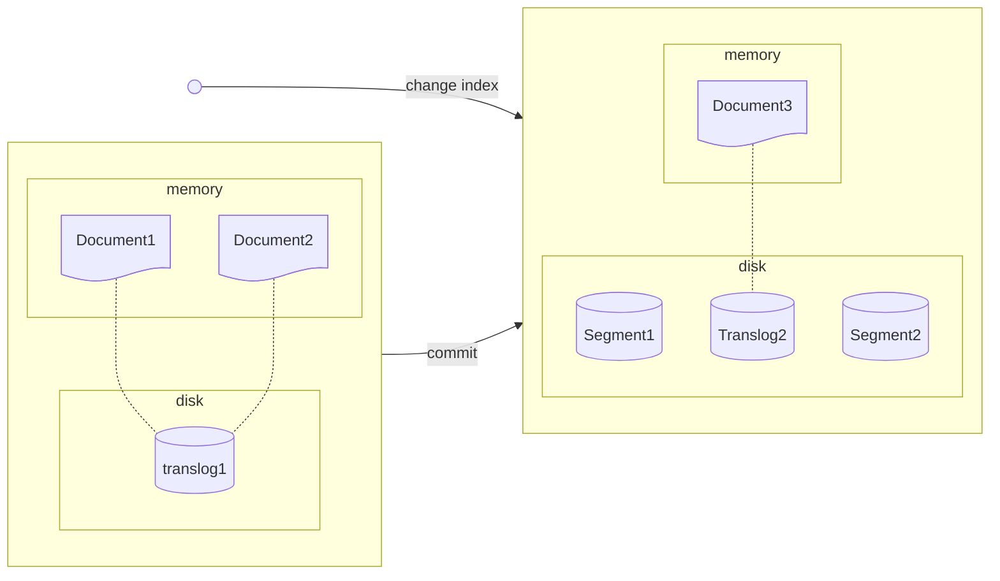
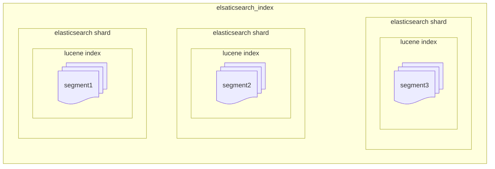

# Elasticsearch

## 2. 엘라스틱서치 기본 동작과 구조

### 2.2 엘라스틱서치 구조 개괄

#### 노드의 역할  

엘라스틱서치의 노드는 데이터 노드, 마스터 노드, 조정 노드 등 여러 역할 중 하나 이상의 역할을 맡아 수행한다.

- 샤드를 보유하고 샤드에 실제 읽기와 쓰기 작업을 수행하는 노드를 **데이터 노드**라고 한다.
- 클러스터를 관리하는 중요한 역할을 하는 노드를 **마스터 노드**라고 한다. 마스터 노드는 마스터 후보 노드 중에서 1대가 선출된다.
- 클라이언트의 요청을 받아서 데이터 노드에 요청을 분배하고 클라이언트에게 응답을 돌려주는 노드는 조정 노드라고 한다.

### 2.3 엘라스틱서치 내부 구조와 루씬

#### 2.3.2 Lucene Commit

Lucene은 파일을 연 시점에 색인이 완료된 문서만 검색할 수 있다.
index의 변경 사항을 검색에 반영하고 싶다면 메모리에 있는 변경 내용을 인덱스 파일에 동기화 작업이 필요하다.
이 작업을 Lucene commit이라고 한다.
작업 결과 immutable segment 파일이 생성된다.

#### 2.3.5 Translog

엘라스틱서치가 비정상적으로 종료된 경우 메모리에 기록된 변경 사항은 유실된다.
데이터 복구를 위해 변경 사항은 먼저 translog 파일에 기록된다.

#### 2.3.4 루씬 인덱스와 엘라스틱서치 인덱스

여러 세그먼트가 모이면 하나의 루씬 인덱스가 된다. 루씬은 이 인덱스 내에서만 검색이 가능하다.
엘라스틱서치 샤드는 이 루씬 인덱스 하나를 래핑한 단위다. 엘라스틱서치 샤드 여러 개가 모이면 엘라스틱서치 인덱스가 된다.

