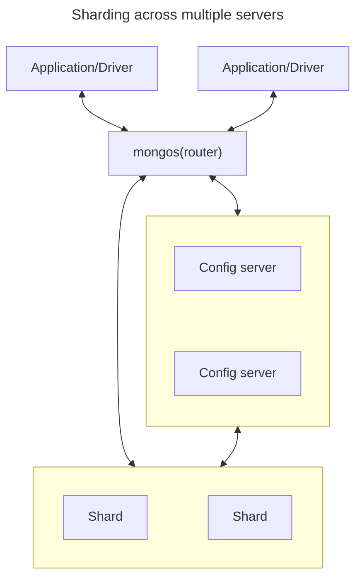

# Ⅰ. Introduction to MongoDB

## 1. Introduction



## 2. Getting Started

### Document

A document is an ordered set of keys with associated values.

### Collection

A collection is a group of documents.

### Database

A database is a group of collections.

### Data Types

```js
{
  a: null,              // Null
  b: true,              // Boolean
  c: NumberInt("3"),    // Number 
  d: NumberLong("3"),   // default 64-bit floating-point number
  e: "foobar",          // String
  f: new Date(),        // Date (No time zone)
  g: /foobar/i,         // Regular expression
  h: ["a","b"],         // Array
  i: {"foo":"bar"},     // Embedded document
  j: ObjectId()         // Object ID
  l: function() {}      // Code
                        // Binary 
}
```

#### _id and ObjectIds

Every document stored in MongoDB must have an "_id" key.
In a single collection, every document must have a unique value for "_id".
The ObjectId class is designed to be lightweight, while still being easy to generate globally unique ways across different machines.
ObjectIds use 12 bytes of storage.

- A 4-byte timestamp, representing the ObjectId's creation, measured in seconds.
- A 5-byte random value generated once per process.
- A 3-byte incrementing counter, initialized to a random value.

```js
// 6777ea91-951dba9964-fc0424
ObjectId('6777ea91951dba9964fc0424')
```

## 3. Creating, Updating, and Deleting Documents

### Inserting Documents

```js
// Insert a single document
db.movies.insertOne({title:"Stan by Me"})

// Reorder inserts to increase performance
db.movies.insertMany(
  [{_id:3,title:"Sixteen"}, {_id:4,title: "Terminator"}, {_id:5,title: "Princess"}],
  {"ordered":false}
)
```

### Removing Documents

```js
// Delete the first document found that matches the filter
db.movies.deleteOne({_id:4})

// Delete all the document that match a filter
db.movies.deleteMany({year:1984})

// Clear an entire collection
db.movies.drop()
```

### Updating Documents

Updating a document is atomic.
Conflicting updates can safely be sent in rapid-fire succession without any documents being corrupted: the last update will "win".

#### Document Replacement

replaceOne takes a filter as the first parameter, but as the second parameter expects a document with which it will replace the document matching the filter.

```js
var joe = {name:"joe",friends:32,enemies:2}
db.users.insertOne(joe)

db.users.replaceOne(
  {name:joe.username},
  {
    username: joe.name,
    relationships: {
      friends: joe.friends,
      enemies: joe.enemies
    }
  }
)
```

#### Using Update Operators

Update operators are special keys that can be used to specify complex update operations.

##### FIELD OPERATORS

```js
// $inc
db.analytics.updateOne(
  {_id: ObjectId("6776b159a04068114efc0422")},  // condition
  {$inc:{pageviews:1}}                          // operator
)

// $set $unset
db.users.updateOne({name:"joe"}, {$set: {favoriteBook:"War and peace"}})
db.users.updateOne({name:"joe"}, {$unset: {favoriteBook:""}})
db.users.updateMany({birthdate:"10/13/1978"}, {$set: {gift:"Happy birthday"}})
```

##### ARRAY OPERATORS

```js
// $push
db.blog.posts.updateOne({title: "A blog post"}, {$push: {comments:"nice post."}})
db.movies.updateOne(
  {genre:"horror"},
  {
    $push: {
      top10: {
        $each: [{name:"Nightmare",rating:6.6}, {name:"Saw",rating:4.3}], 
        $slice: -10,
        $sort: {rating: -1} // descending
      }
    }
  }
)

// $addToSet
db.users.updateOne({name: "joe"},{$addToSet: {emails: "joe@gmail.com"}})

// $pop remove an element from the end/beginning of the array
db.lists.updateOne({name:"joe"}, {$pop: {key: 1|-1}})

// $pull remove all matching elements
db.lists.updateOne({name:"joe"}, {$pull: {todo: "laundry"}})

// manipulate values in arrays: by position or by using the position operator
db.blog.posts.updateOne(
  {post: post_id},
  {$set: {"comments.$[elem].hidden": true}},
  {arrayFilters: [{"elem.votes": {$lte: -5}}]}
)
```

#### Upsert

If no document is found that matches the filter, a new document will be created by combining the criteria and updated documents.
If a matching document is found, it will be updated normally.
It can eliminate the race condition and cut down the amount of code by just sending an upsert to the database.

```js
db.analytics.updateOne({url: "/example"}, {$inc: {pageviews: 1}}, {upsert: true})
db.users.updateOne({name: "joe"}, {$setOnInsert: {createdAt: new Date()}}, {upsert: true})
```

#### Returning Updated Documents

findOneAndUpdate, findOneAndReplace, findOneAndDelete enable you to atomically get the value of a modified document.

```js
db.processes.findOneAndUpdate(
  {status: "READY"},
  {$set: {status:"RUNNING"}},
  {sort:{priority: -1}, returnNewDocument: true}
)
```

## 4. Querying

### Introduction to find

```js
db.users.find(
  {name:"joe",age:27},    // conditions
  {name:1,email:1,_id:0}  // keys
)
```

### Query Criteria

```js
// $lt $lte $gt $gte
db.users.find({age: {$gte:18,$lte:30}})

// $in
db.users.find({user_id: {$in: [12345,"joe"]}})

// $or
db.raffle.find({$or: [{ticket_no:725}, {winner:true}]})

// $not
db.users.find({id_num: {$not: {$mod: [5,1]}}})
```

### Type-Specific Queries

#### null

```js
db.c.find({y: null})                      // {y:null},{x:1}
db.c.find({y: {$eq:null,$exists:true}})   // {y:null}
```

#### Regular Expression

```js
db.users.find({name: {$regex:/joe/i}})
```

#### Querying Arrays

```js
// $all: match more than one element and order doesn't matter
db.food.find({fruit: {$all: ["apple","banana"]}}) 

// $size
db.food.find({fruit: {$size:3}})

// $slice: return a subset of elements for an array key.
db.blog.posts.findOne(criteria, {comments:{$slice:-10}})
db.blog.posts.findOne(criteria, {comments:{$slice:[23,10]}})

// $elemMatch: compare both clauses with a single array element
db.test.find({x: {$elemMatch: {$gt: 10, $lt:20}}})
[
  { _id: ObjectId('678f737788fe250acdfc0421'), x: [ 5, 15 ] },
  { _id: ObjectId('678f737e88fe250acdfc0422'), x: [ 12, 15 ] }
]
```

#### Querying Embedded Documents

```js
// Can query for embedded keys using dot notation
db.people.find({"name.first":"Joe", "name.last": "Schmoe"})
db.blog.find({comments: {$elemMatch:{author:"joe",score:{$gte:5}}}})
```

### where Queries

There are $where clauses, which allow you to execute arbitrary JavaScript as part of your query.
For security, use of $where should be highly restricted or eliminated.

```js
db.foo.find({$where: function() {
  for(var current in this)
    for(var other in this)
      if(current != other && this[current] == this[other])
        return true
  return false
}})
```

Each document has to be converted from BSON to a JavaScript object and then run through the $where expression.
Indexes cannot be used to satisfy a $where either.
Hence, you should use $where only when there is no other way of doing the query.

### Cursors

The database return results from **find** using a *cursor*.
The client-side implementations of cursors generally allow you to control a great deal about the eventual output of a query.
You can limit the number of results, skip over some number of results, sort results by any combination of keys in any direction.

```js
var cursor = db.collection.find() // returns a cursor
while(cursor.hasNext())           // checks that the next result exists
  object = cursor.next()          // fetches it
```

```js
db.hasNext()
```

At this point, the query will be sent to the server.
The shell fetches the first 100 results or first 4MB of results at once so that the next calls to next or hasNext will not have to make trips to the server.
After the client has run through the first set of results, the shell will again contact the database and ask for more results with a getMore request.
getMore requests basically contain an identifier for the cursor and ask the database if there are any more results, returning the next batch if there are.
This process continues until the cursor is exhausted and all results have been returned.

#### Limits, Skip, and Sort

- limit: sets an upper limit.
- skip: skip first n matching documents and return the rest of the matches.
- sort: takes an object: a set of key value pairs where the keys are key names and the values are the sort directions.

MongoDB can't sort documents when documents are bigger than 32MB. It will just error out.

```js
db.foo.find().sort({x:1}).limit(1).skip(10)
```

##### COMPARISON ORDER

1. Minimum value
2. Null
3. Numbers
4. String
5. Object/document
6. Array
7. Binary data
8. Object ID
9. Date
10. Timestamp
11. Regular expression
12. Maximum value

#### Avoiding Large Skips

Skip can be slow, since it has to find and then discard all the skipped results.
Most databases keep more metadata in the index to help with skips, but MongoDB does not yet support this, so large skips should be avoided.

#### Immortal Cursors

On the server side, a cursor takes up memory and resources.
There are a couple of conditions that can cause the death of a cursor.
First, when a cursor finishes iterating through the matching results, it will clean up.
Another way is that, when a cursor goes out of scope on the client side, the drivers send the database a special message to let it know that it can kill that cursor.
Finally, even if the user hasn't iterated through all the results and the cursor is still in scope, after 10 minutes of inactivity, a database cursor will automatically die.

Many drivers have implemented a function called immortal which tells the database not to time out the cursor.
If you turn off a cursor's timeout, you must iterate through all of its results or kill it to make sure it gets closed.
