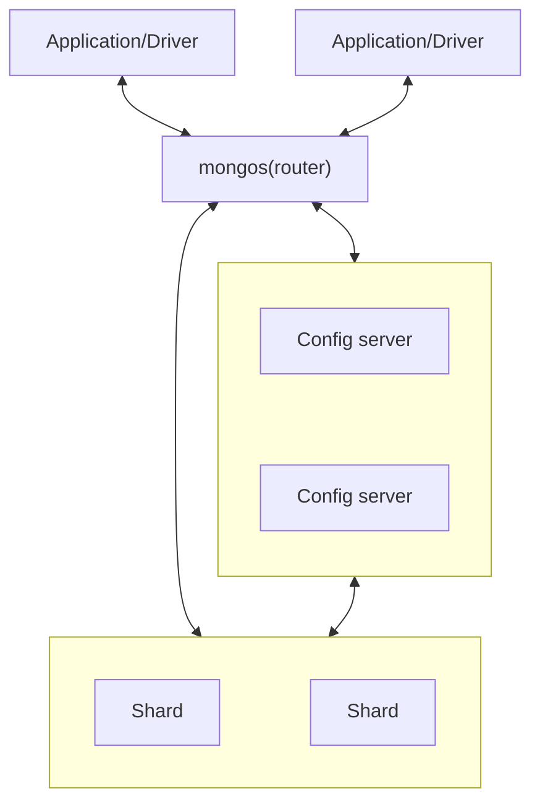

# Ⅰ. Introduction to MongoDB

## 1. Introduction



## 2. Getting Started

### Document

A document is an ordered set of key with associated values.

### Collection

A collection is a group of documents.

### Database

A database is a group of collections.

By concatenating a database name with a collection in that database you can get a fully qualified collection name, which is called a namespace.

### Data Types

```js
{
  a: null,              // Null
  b: true,              // Boolean
  c: NumberInt("3"),    // Number 
  d: NumberLong("3"),   // default 64-bit floating-point number
  e: "foobar",          // String
  f: new Date(),        // Date (No time zone)
  g: /foobar/i,         // Regular expression
  h: ["a","b"],         // Array
  i: {"foo":"bar"},     // Embedded document
  j: ObjectId()         // Object ID
  l: function() {}      // Code
                        // Binary 
}
```

#### _id and ObjectIds

Every document stored in MongoDB must have an "_id" key.
In a single collection, every document must have a unique value for "_id".

The ObjectId class is designed to be lightweight, while still being easy to generate globally unique way across different machines.
It is difficult and time-consuming to synchronize autoincrementing primary keys across multiple servers.
ObjectIds use 12 byte of storage.

- A 4-byte timestamp, representing the ObjectId's creation, measured in seconds.
- A 5-byte random value generated once per process.
- A 3-byte incrementing counter, initialized to a random value.

## 3. Creating, Updating, and Deleting Documents

### Inserting Documents

```js
// Insert a single document
db.movies.insertOne({title:"Stan by Me"})

// Reorder inserts to increase performance
db.movies.insertMany(
  [{_id:3,title:"Sixteen"}, {_id:4,title: "Terminator"}, {_id:5,title: "Princess"}],
  {"ordered":false}
)
```

### Removing Documents

```js
// Delete the first document found that matches the filter
db.movies.deleteOne({_id:4})

// Delete all the document that match a filter
db.movies.deleteMany({year:1984})

// Clear an entire collection
db.movies.drop()
```

### Updating Documents

Updating a document is atomic.
Conflicting update can safely be sent in rapid-fire succession without any documents being corrupted: the last update will "win".

#### Document Replacement

replaceOne takes a filter as the first parameter, but as the second parameter expect a document with which it will replace the document matching the filter.

```js
var joe = {name:"joe",friends:32,enemies:2}
db.users.insertOne(joe)

joe = {username:joe.name,relationships:{friends:joe.friends,enemies:joe.enemies}}
db.users.replaceOne({name:joe.username}, joe)
```

#### Using Update Operators

Update operators are special keys that can be used to specify complex update operations.

##### Fields

```js
// $inc
db.analytics.updateOne(
  {_id: ObjectId("6776b159a04068114efc0422")},
  {$inc:{pageviews:1}}
)

// $set $unset
db.users.updateOne({name:"joe"}, {$set: {favoriteBook:"War and peace"}})
db.users.updateOne({name:"joe"}, {$unset :{favoriteBook:""}})
db.users.updateMany({birthdate:"10/13/1978"}, {$set: {gift:"Happy birthday"}})
```

##### Array

```js
// $push
db.blog.posts.updateOne({title: "A blog post"},{$push:{comments:"nice post."}})
db.movies.updateOne(
  {genre:"horror"},
  {
    $push: {
      top10: {
        $each: [{name:"Nightmare",rating:6.6}, {name:"Saw",rating:4.3}], 
        $slice: -10,
        $sort: {rating:-1}
      }
    }
  }
)

// $addToSet
db.users.updateOne({name:"joe"},{$addToSet: {emails:"joe@gmail.com"}})

// $pop remove an element from the end/beginning of the array
db.lists.updateOne({name:"joe"}, {$pop: {key: 1|-1}})

// $pull remove all matching elements
db.lists.updateOne({name:"joe"}, {$pull: {todo: "laundry"}})

// manipulate values in arrays: by position or by using the position operator
db.blog.posts.updateOne(
  {post: post_id},
  {$set: {comments.$[elem].hidden:true}},
  {arrayFilters: [{elem.votes:{$lte:-5}}]}
)
```

#### Upsert

If no document is found that matches the filter, a new document will be created by combining the criteria and updated documents.
If a matching document is found, it will be updated normally.
It can eliminate the race condition and cut down the amount of code by just sending an upsert to the database.

```js
db.analytics.updateOne({url:"/example"}, {$inc:{pageviews:1}}, {upsert:true})

db.users.updateOne({name:"joe"}, {$setOnInsert:{createdAt:new Date()}}, {upsert:true})
```

#### Returning Updated Documents

findOneAndUpdate, findOneAndReplace, findOneAndDelete enable you to atomically get the value of a modified document.

```js
db.processes.findOneAndUpdate(
  {status: "READY"},
  {$set: {status:"RUNNING"}},
  {sort:{priority: -1}, returnNewDocument: true}
)
```

## 4. Querying
