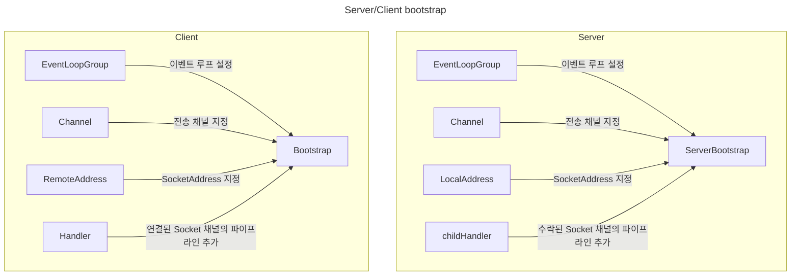
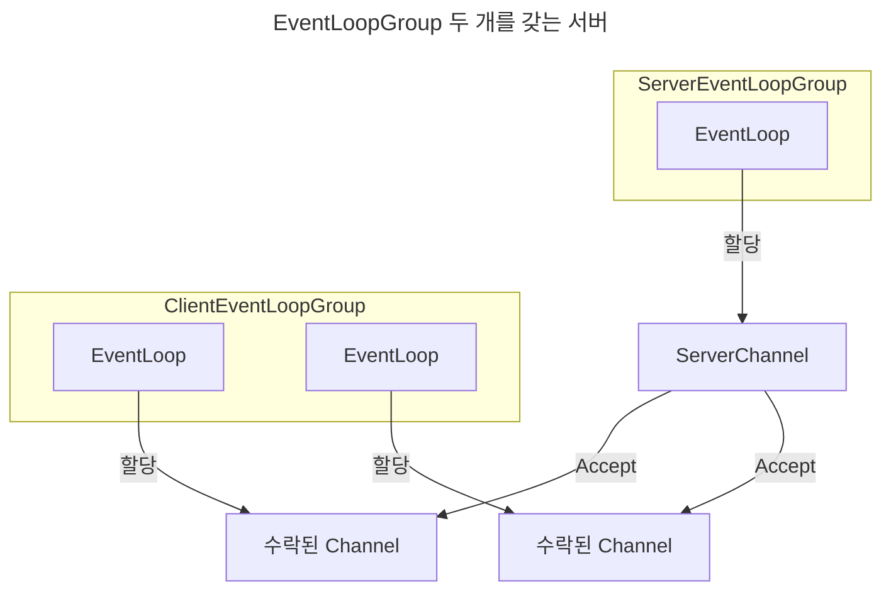
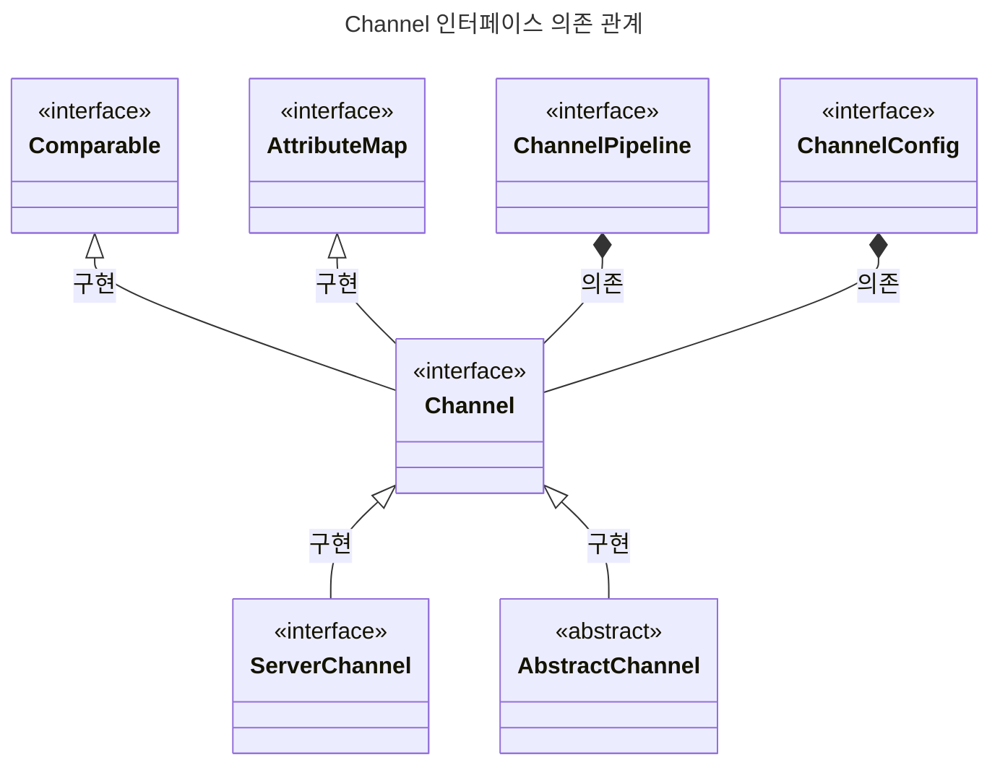
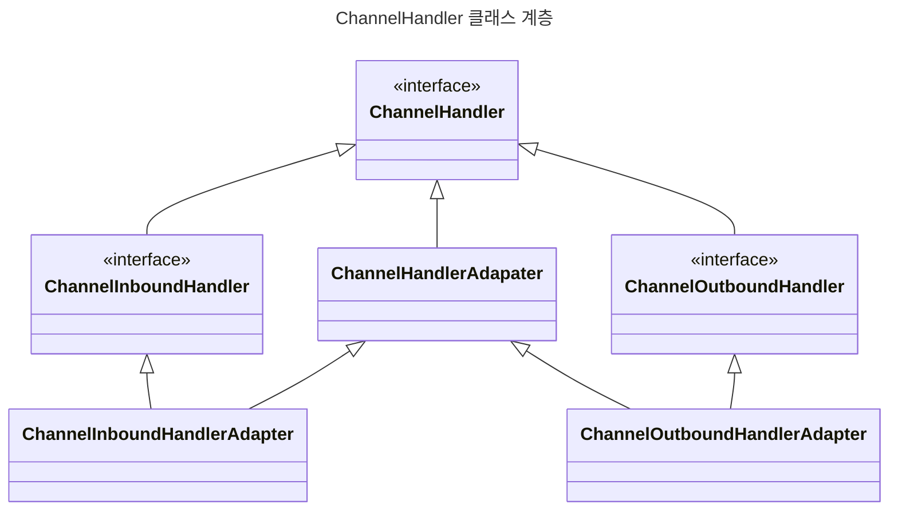
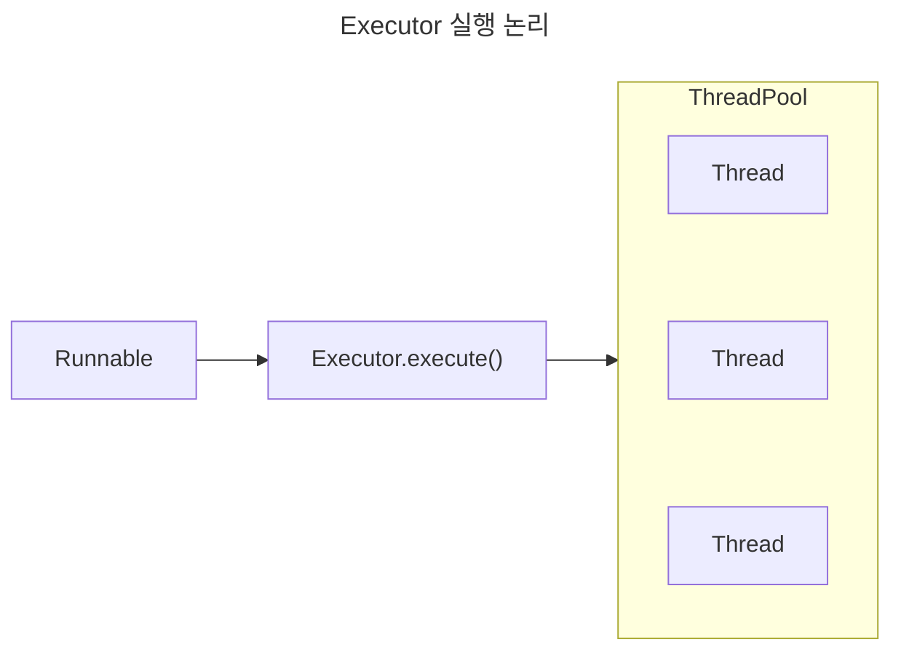
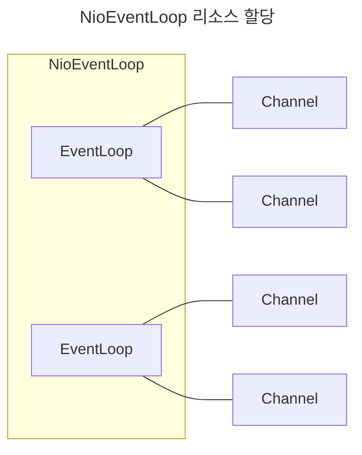
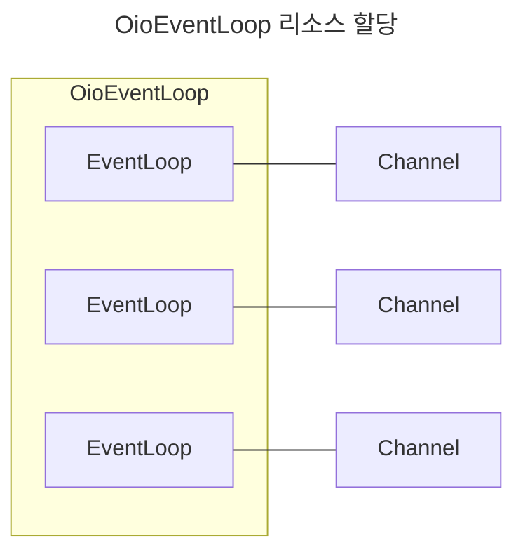
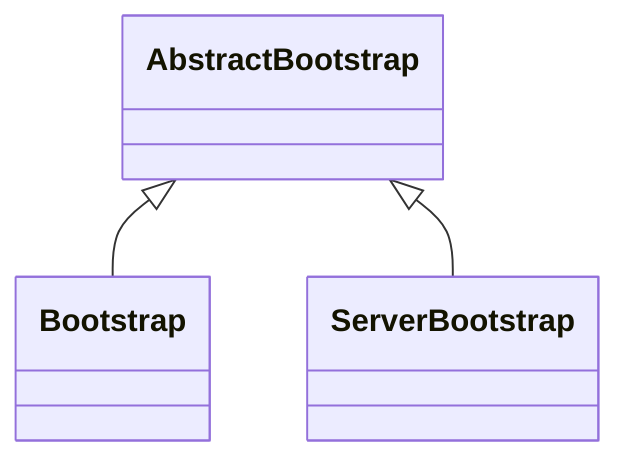
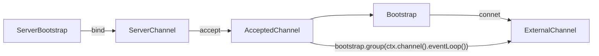

# Netty in action

## 1. 네티: 비동기식 이벤트 기반 네트워킹 프로그래밍

Blocking socket API를 사용하면 IO 작업 시간 동안 CPU를 효율적으로 사용할 수 없다.
CPU 리소스를 효율적으로 사용하기 위해 다수의 thread를 생성해 요청을 처리할 수 있다.
하지만 thread를 계속해서 증가시키면 **context switching** 비용이 증가하면서 오히려 오버헤드가 커지는 문제가 있다.
네티는 Non blocking API를 이용해 효율적으로 네트워크 요청을 처리할 수 있는 네트워크 프레임워크다.

## 2. 첫 번째 네티 애플리케이션

Netty 프레임워크도 socket 인터페이스를 추상화한 프레임워크라 기존 네트워크 설정은 비슷하다.
소켓 채널에 데이터를 전송하기 전에 메인 메소드가 끝나는 것을 막기 위해 소켓 채널 close를 동기 호출한다.



## 3. 네티 컴포넌트와 설계

### EventLoop

- Channel은 수명주기 동안 한 EventLoop에 등록할 수 있다.
- EventLoop 라이프사이클 동안 하나의 thread에 바인딩된다.
- EventLoop에 하나 이상의 Channel을 할당할 수 있다.



## 4. 전송

### Channel

하나 이상의 입출력 작업(예: 읽기 또는 쓰기)을 수행할 수 있는 하드웨어 장치, 파일, 네트워크 소켓과 같은 연결

#### Channel의 생명 주기

| 상태                  | 설명             |
|---------------------|----------------|
| ChannelRegistered   | EventLoop에 등록됨 |
| ChannelActive       | 원격 피어와 연결됨     |
| ChannelInactive     | 연격 피어와 끊어짐     |
| ChannelUnregistered | EventLoop에 제거됨 |



### 네티에서 제공하는 전송

| 이름       | 패키지                         | 설명                           |
|----------|-----------------------------|------------------------------|
| NIO      | io.netty.channel.socket.nio | Selector 기반 방식               |
| Epoll    | io.netty.channel.epoll      | Linux epoll 방식               |
| OIO      | io.netty.channel.socket.oio | java.net 방식(blocking)        |
| Local    | io.netty.channel.local      | VM pipeline 통신               |
| Embedded | io.netty.channel.embedded   | 네트워크 전송 없이 ChannelHandler 이용 |

## 5. ByteBuf

Netty에서 I/O byte를 쉽게 다룰 수 있도록 추상화한 `ByteBuf` 클래스를 제공한다.
ByteBuf에는 read와 write 연산을 위해 필요한 인덱스인 readerIndex와 writerIndex가 각각 존재한다.

```markdown
+-------------------+------------------+------------------+
| discardable bytes |  readable bytes  |  writable bytes  |
|                   |     (CONTENT)    |                  |
+-------------------+------------------+------------------+
|                   |                  |                  |
0      <=      readerIndex   <=   writerIndex    <=    capacity
```

### HeapBuf

Backing array 패턴을 이용하는 ByteBuf 인스턴스이다.
byte 정보를 heap 메모리에 저장하기 때문에 메모리 할당과 해제가 용이하다.

### DirectBuf

고성능 입출력을 위해 OS가 사용하는 메모리에 직접 접근하는 ByteBuf 인스턴스이다.
애플리케이션 버퍼에 있는 데이터를 OS 버퍼로 copy하는 작업을 생략하기 때문에 빠르다.
GC에 의해 메모리가 관리되지 않기 때문에 메모리 할당과 해제에 대한 비용 부담이 크다.

### ByteBufAllocator

ByteBuf 인스턴스의 메모리 할당과 해제 시 발생한다.
오버헤드를 줄이기 위해 ByteBufAllocator 인터페이스를 통해 ByteBuf 인스턴스를 할당하는 데 이용할 수 있는 풀링을 구현한다.

## 6. ChannelHandler와 ChannelPipeline

### ChannelHandler

네티는 작업의 상태 변화를 알리기 위해 고유한 이벤트를 이용하며, 발생한 이벤트를 기준으로 이벤트 핸들러의 동작을 트리거할 수 있다. 채널에서 발생하는 IO 이벤트를 처리하기 위해 개발자는 ChannelHandler를 ChannelPipeline에 등록해 애플리케이션 비즈니스를 작성할 수 있다.

#### ChannelHandler 생명 주기 메소드

| 상태              | 설명                                   |
|-----------------|--------------------------------------|
| handlerAdded    | ChannelPiepline에 추가될 때 호출됨           |
| handlerRemoved  | ChannelPiepline에 제거될 때 호출됨           |
| exceptionCaught | ChannelPiepline에서 처리 중에 오류가 발생하면 호출됨 |

#### I/O ChannelHandler 클래스 계층



#### Sharable

ChannelHandler 인스턴스는 둘 이상의 ChannelPipeline에 바인딩하는 경우 @Sharable 어노테이션을 지정해야 하고 상태를 저장하지 않는 두 가지 조건을 충족해야 한다.

#### 리소스 관리

ChannelInboundHandler.channelRead() 또는 ChannelOutboundHandler.write()를 호출해 데이터를 대상으로 작업할 때 ReferenceCountUtil.release(ByteBuf) 호출해 memory leak이 발생하지 않게 주의해야 한다.

#### ChannelPromise

작업을 완료 후 ChannelPromise.setSuccess() 또는 ChannelPromise.setFailure()를 호출해 ChannelFutureListener가 작업이 완료됐다는 알림을 수신할 수 있도록 해야 한다.

### ChannelPipeline

Channel을 통해 오가는 인바운드 아웃바운드 이벤트를 가로채는 ChanndlerHandler 인스턴스 채인이다.
인바운드 이벤트는 ChannelPipeline에 등록된 handler의 오름차순으로 호출된다.
아웃바운드 이벤트 ChannelPipeline에 등록된 handler의 내림차순으로 호출된다.
이벤트에 해당하는 핸들러가 아닌 경우 stack depth를 낮추기 위해 건너뛴다.

```markdonw
I/O Request
                                           via {@link Channel} or
                                       {@link ChannelHandlerContext}
                                                     |
+---------------------------------------------------+---------------+
|                           ChannelPipeline         |               |
|                                                  \|/              |
|    +---------------------+            +-----------+----------+    |
|    | Inbound Handler  N  |            | Outbound Handler  1  |    |
|    +----------+----------+            +-----------+----------+    |
|              /|\                                  |               |
|               |                                  \|/              |
|    +----------+----------+            +-----------+----------+    |
|    | Inbound Handler N-1 |            | Outbound Handler  2  |    |
|    +----------+----------+            +-----------+----------+    |
|              /|\                                  .               |
|               .                                   .               |
| ChannelHandlerContext.fireIN_EVT() ChannelHandlerContext.OUT_EVT()|
|        [ method call]                       [method call]         |
|               .                                   .               |
|               .                                  \|/              |
|    +----------+----------+            +-----------+----------+    |
|    | Inbound Handler  2  |            | Outbound Handler M-1 |    |
|    +----------+----------+            +-----------+----------+    |
|              /|\                                  |               |
|               |                                  \|/              |
|    +----------+----------+            +-----------+----------+    |
|    | Inbound Handler  1  |            | Outbound Handler  M  |    |
|    +----------+----------+            +-----------+----------+    |
|              /|\                                  |               |
+---------------+-----------------------------------+---------------+
                 |                                  \|/
+---------------+-----------------------------------+---------------+
|               |                                   |               |
|       [ Socket.read() ]                    [ Socket.write() ]     |
|                                                                   |
|  Netty Internal I/O Threads (Transport Implementation)            |
+-------------------------------------------------------------------+
```

### ChannelHandlerContext

ChannelHandler와 ChannelPipeline 간의 연결을 나타내며 ChannelHandler를 ChannelPipeline에 추가할 때마다 생성된다.
Channel이나 ChannelPipeline 인스턴스에서 메소드를 호출하면 이벤트가 전체 파이프라인을 통해 전파된다.
반면 ChannelHandlerContext에서 호출하면 현재 연결된 ChannelHandler에서 가장 가까운 다음 ChannelHandler 메소드로 이벤트가 전파된다.

## 7. EventLoop와 스레딩 모델

### java.util.concurrent.Executor

Thread 캐싱과 재사용으로 성능을 개선 했지만, 여전히 컨텍스트 스위치 비용은 발생한다.



### EventLoop

#### DefaultEventLoop 내부 구현

BlockingQueue에서 task를 poll 후 실행하는 것을 볼 수 있다.
스케줄된 task가 있는 경우 명시된 시간에 task를 실행하기 위해 `task = taskQueue.poll(delayNanos, TimeUnit.NANOSECONDS);` 호출하는 것이 인상적이다.

```java
public class DefaultEventLoop extends SingleThreadEventLoop {
  @Override
  protected void run() {
    for (;;) {
      Runnable task = takeTask();
      if (task != null) {
        runTask(task);
        updateLastExecutionTime();
      }

      if (confirmShutdown()) {
        break;
      }
    }
  }
}
```

```java
public abstract class SingleThreadEventExecutor extends AbstractScheduledEventExecutor implements OrderedEventExecutor {

  protected Runnable takeTask() {
    assert inEventLoop();
    if (!(taskQueue instanceof BlockingQueue)) {
      throw new UnsupportedOperationException();
    }

    BlockingQueue<Runnable> taskQueue = (BlockingQueue<Runnable>) this.taskQueue;
    for (;;) {
      ScheduledFutureTask<?> scheduledTask = peekScheduledTask();
      if (scheduledTask == null) {
        Runnable task = null;
        try {
            task = taskQueue.take();
            if (task == WAKEUP_TASK) {
                task = null;
            }
        } catch (InterruptedException e) {}
        return task;
      } else {
        long delayNanos = scheduledTask.delayNanos();
        Runnable task = null;
        if (delayNanos > 0) {
            try {
                task = taskQueue.poll(delayNanos, TimeUnit.NANOSECONDS);
            } catch (InterruptedException e) {
                // Waken up.
                return null;
            }
        }
        if (task == null) {
            fetchFromScheduledTaskQueue();
            task = taskQueue.poll();
        }

        if (task != null) {
            return task;
        }
      }
    }
  }
}
```

#### ChannelHandler 주의점

Channel Handler는 할당된 EventLoop를 통해 실행된다.
Channel Handler에서 latency가 긴 작업을 호출한다면 starvation 문제가 발생할 수 있다.
latency가 큰 ChannelHandler를 등록할 떄는 `ChannelPipeline.addFirst(EventExecutorGroup group, String name, ChannelHandler handler)` 메소드를 통해 ChannelHandler를 등록해 전달된 EventExecutorGroup에서 실행되도록 하자.





## 8. Bootstrap

개발자가 작성한 ChannelHandler와 ChannelPiepeline을 Channel에 쉽게 연결할 수 있도록 도와주는 클래스이다.  

### Bootstrap class



### 채널에서 클라이언트 부트스트랩

외부 웹 서비스나 데이터베이스 같은 시스템에 통합해야 하는 경우 수락된 Channel의 EventLoop를 Bootstrap의 group() 메소드로 전달해 Eventloop를 공유할 수 있다.
EventLoop를 공유함으로써 컨텍스트 스위치 비용을 절약할 수 있다.



## 9. 단위 테스트

### EmbeddedChannel

인바운드 또는 아웃바운드 데이터를 EmbeddedChannel로 기록해 channel handler 비즈니스를 테스트할 수 있다.

## 10. Codec framework

모든 네트워크 애플리케이션은 피어 간에 전송되는 원시 바이트를 대상 프로그램의 데이터 포맷으로 구문 분석하고 변환하는 방법을 정의해야 한다.
이러한 변환 논리는 바이트의 스트림을 한 포맷에서 다른 포맷으로 변환하는 Encoder와 Decoder로 구성된 Codec에 의해 처리된다.

### Decoder

아웃바운드로 들어온 네트워크 데이터 스트림을 프로그램 메시지 포맷으로 변환한다.

### Encoder

프로그램에서 관리하는 데이터를 네트워크로 전송하기에 적합한 바이트 스트림으로 변환한다.
