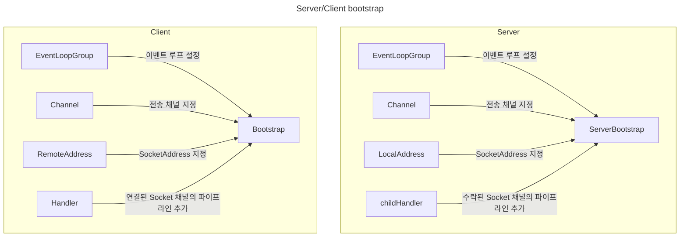
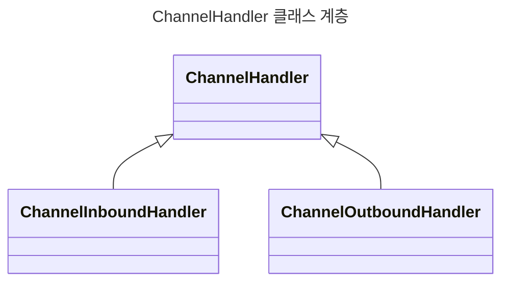
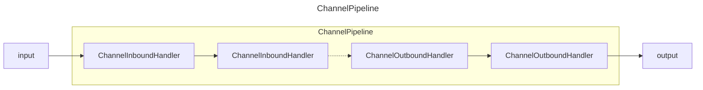
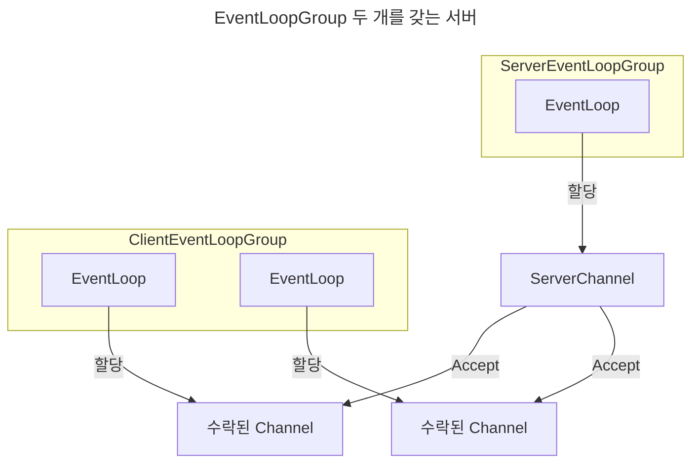

# Netty in action

## 01. 네티: 비동기식 이벤트 기반 네트워킹 프로그래밍

Blocking socket API를 사용하면 IO 작업 시간 동안 CPU를 효율적으로 사용할 수 없다.
CPU 리소스를 효율적으로 사용하기 위해 다수의 thread를 생성해 요청을 처리할 수 있다.
하지만 thread를 계속해서 증가시키면 **context switching** 비용이 증가하면서 오히려 오버헤드가 커지는 문제가 있다.
네티는 Non blocking API를 이용해 효율적으로 네트워크 요청을 처리할 수 있는 네트워크 프레임워크다.

### Channel

하나 이상의 입출력 작업(예: 읽기 또는 쓰기)을 수행할 수 있는 하드웨어 장치, 파일, 네트워크 소켓과 같은 연결

### Callback

자신에 대한 참조를 제공할 수 있는 메소드

### Future

비동기 작업의 결과를 담는 place holder 역할을 하며, 미래에 작업이 완료되면 그 결과에 접근 가능

### 이벤트 루프

이벤트 루프는 한 Channel의 모든 입출력 이벤트를 처리하며 한 스레드에 의해 제어된다.
이벤트 루프는 내부적으로 관심 이벤트 등록, 이벤트를 ChannelHandler로 발송, 추가 동작 스케줄링 작업을 처리한다.

## 02. 첫 번째 네티 애플리케이션

Netty 프레임워크도 socket 인터페이스를 추상화한 프레임워크라 기존 네트워크 설정은 비슷하다.
소켓 채널에 데이터를 전송하기 전에 메인 메소드가 끝나는 것을 막기 위해 소켓 채널 close를 동기 호출한다.

## 03. 네티 컴포넌트와 설계

## EventLoop

- Channel은 수명주기 동안 한 EventLoop에 등록할 수 있다.
- EventLoop 라이프사이클 동안 하나의 thread에 바인딩된다.
- EventLoop에 하나 이상의 Channel을 할당할 수 있다.

