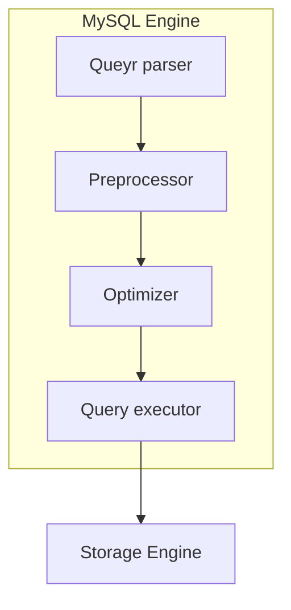

# Real MySQL 8.0

## 2. 설치와 설정

### /usr/local/mysql 디렉토리 구조

1. bin  
MySQL 서버와 클라이언트 프로그램, 유틸리티를 위한 디렉토리
2. data  
로그 파일과 데이터 파일들이 저장되는 디렉토리
3. include  
C++ 헤더 파일들이 저장되는 디렉토리
4. lib  
라이브러리 파일들이 저장된 디렉토리
5. share  
다양한 지원 파일들이 저장돼 있으며, 에러 메시지나 샘플 설정 파일(my.cnf)이 있는 디렉토리

### 서버 연결 테스트

1. `mysql -uroot -p --host=localhost --sock=/tmp/mysql.sock`  
unix 소켓 파일을 이용해 IPC 통신
2. `mysql -root -p`  
unix 소켓 파일을 이용해 IPC 통신을 이용하며 socket 파일은 서버 설정 파일에서 참조
3. `mysql -uroot -p --host=127.0.0.1 --port=3306`  
loopback TCP/IP 접속

```bash
# 명령어를 통해서 IPC와 TCP/IP 통신의 차이를 확인할 수 있다.
lsof -i:3306 
```

### 서버 설정

- 설정 파일
  - /etc/my.cnf
  - /etc/msyql/my.cnf
  - /user/etc/my.cnf
  - ~/.my.cnf
- 시스템 변수
  - 확인 `SHOW (GLOBAL) VARIABLES`
  - 수정 `SET (PERSIST) (GLOBAL) VARIABELS`

## 3. 사용자 및 권한

### identified with

- native pluggable authentication  
비밀번호에 대한 hash(SHA-1) 저장하고 클라이언트가 보낸 비밀번호 hash 값이 일치하는지 단순 비교
- caching sha-2 pluggable authentication  
SHA-2 알고리즘을 이용해 비밀번호 hash를 생성한다. rainbow table & brute force 취약점을 해결하기 위해 salt & key streching 적용했다. 많은 컨넥션을 연결하는 경우 hash 계산하기 위해 CPU 부하가 발생할 수 있다. 해당 취약점을 보안하기 위해 hash 결과값을 메모리에 caching 해 CPU 리소스 소모를 줄일 수 있다. SSL/TLS 또는 RSA 키페어 방식 필요하다.
- PAM Pluggable Authentication
- LDAP Pluggable Authentication

### 고수준 비밀번호

validate passowrd component를 이용해 MySQL 서버의 비밀번호의 유효성 체크 규칙을 추가할 수 있다.

### 역할

`SET GLOBAL activate_all_roles_on_loin=ON;` 명령을 통해 MySQL 로그인 했을 때, 할당된 역할을 자동으로 활성화할 수 있다.

## 4. 아키텍처

### MySQL 엔진 아키텍처

- MySQL 엔진  
  SQL 문장을 분석하거나 최적화 수행
  - 컨넥션 핸들러
  - SQL 파서
  - 옵티마이저
- 스토리지 엔진  
  데이터를 디스크 스토리지에 저장하거나 디스크 스토리지로부터 데이터를 읽음
  - InnoDB
  - MyISM
- 스레딩 구조
  - foreground  
    - MySQL 서버에 접속한 클라이언트 수만큼 존재하며, 주로 각 클라이언트 사용자가 요청하는 쿼리 문장을 처리한다.
  - background
    - insert buffer 병항 스레드
    - log를 디크로 기록하는 스레드
    - InnoBD 버퍼 풀의 데이터를 디스크에 기록하는 스레드
    - 데이터를 버퍼로 읽어오는 스레드
    - 잠금이나 데드락을 모니터링하는 스레드

  ```sql
  SELECT thread_id, nmae, type, processlist_user, processlist_host FROM performance_schema.threads ORDER 
  BY type, thread_id;
  ```

- 쿼리 실행 구조
  - group by나 order by 등 복잡한 처리는 스토리지 엔진 영역이 아닌 MySQL 엔진의 **Query Executor**에서 처리된다.



### InnoDB 스토리지 엔진 아키텍처
