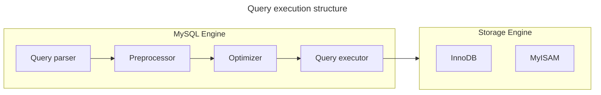
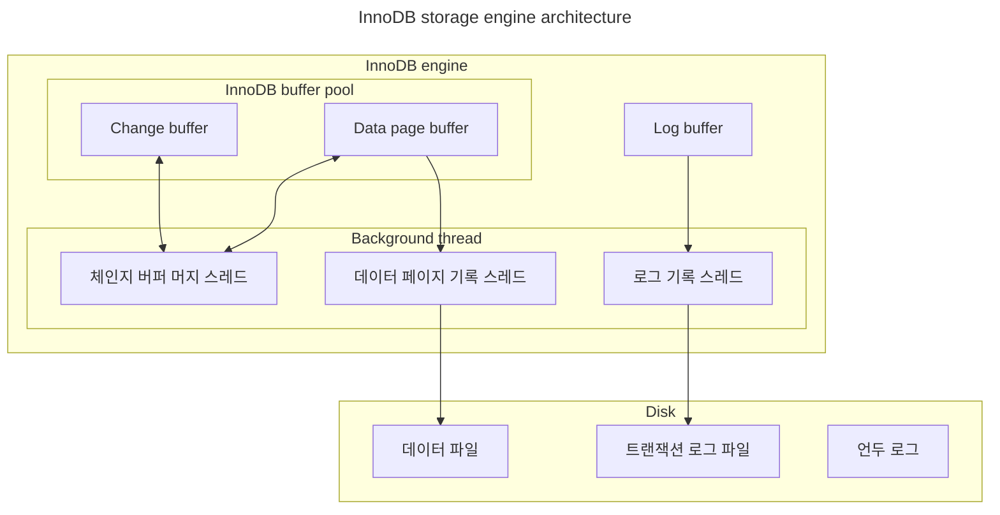
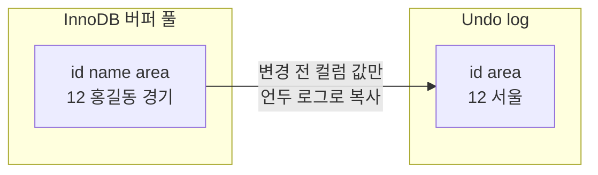
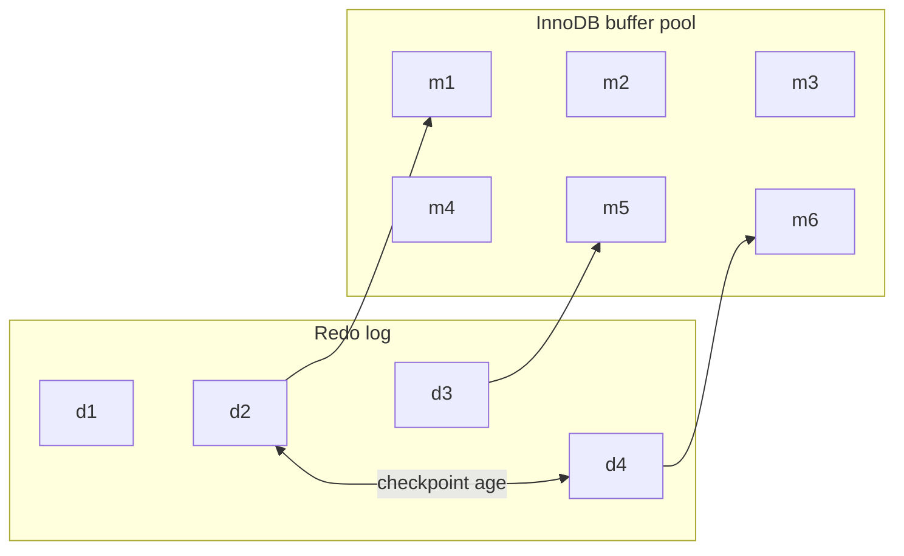

# Real MySQL 8.0

## 2. 설치와 설정

### /usr/local/mysql 디렉토리 구조

1. bin  
MySQL 서버와 클라이언트 프로그램, 유틸리티를 위한 디렉토리
2. data  
로그 파일과 데이터 파일들이 저장되는 디렉토리
3. include  
C++ 헤더 파일들이 저장되는 디렉토리
4. lib  
라이브러리 파일들이 저장된 디렉토리
5. share  
다양한 지원 파일들이 저장돼 있으며, 에러 메시지나 샘플 설정 파일(my.cnf)이 있는 디렉토리

### 서버 연결 테스트

1. `mysql -uroot -p --host=localhost --sock=/tmp/mysql.sock`  
unix 소켓 파일을 이용해 IPC 통신
2. `mysql -root -p`  
unix 소켓 파일을 이용해 IPC 통신을 이용하며 socket 파일은 서버 설정 파일에서 참조
3. `mysql -uroot -p --host=127.0.0.1 --port=3306`  
loopback TCP/IP 접속

```bash
# 명령어를 통해서 IPC와 TCP/IP 통신의 차이를 확인할 수 있다.
lsof -i:3306 
```

### 서버 설정

- 설정 파일
  - /etc/my.cnf
  - /etc/msyql/my.cnf
  - /user/etc/my.cnf
  - ~/.my.cnf
- 시스템 변수
  - 확인 `SHOW (GLOBAL) VARIABLES`
  - 수정 `SET (PERSIST) (GLOBAL) VARIABELS`

## 3. 사용자 및 권한

### identified with

- native pluggable authentication  
비밀번호에 대한 hash(SHA-1) 저장하고 클라이언트가 보낸 비밀번호 hash 값이 일치하는지 단순 비교
- caching sha-2 pluggable authentication  
SHA-2 알고리즘을 이용해 비밀번호 hash를 생성한다. rainbow table & brute force 취약점을 해결하기 위해 salt & key streching 적용했다.
많은 컨넥션을 연결하는 경우 hash 계산하기 위해 CPU 부하가 발생할 수 있다.
해당 취약점을 보안하기 위해 hash 결과값을 메모리에 caching 해 CPU 리소스 소모를 줄일 수 있다. SSL/TLS 또는 RSA 키페어 방식 필요하다.

### 역할

`SET GLOBAL activate_all_roles_on_loin=ON;` 명령을 통해 MySQL 로그인 했을 때, 할당된 역할을 자동으로 활성화할 수 있다.

## 4. 아키텍처

### 4.1 MySQL 엔진 아키텍처

- MySQL 엔진  
  SQL 문장을 분석하거나 최적화 수행
  - 컨넥션 핸들러
  - SQL 파서
  - 옵티마이저
- 스토리지 엔진  
  데이터를 디스크 스토리지에 저장하거나 디스크 스토리지로부터 데이터를 읽음
  - InnoDB
  - MyISAM
- 스레딩 구조
  - foreground
    - MySQL 서버에 접속한 클라이언트 수만큼 존재하며, 주로 각 클라이언트 사용자가 요청하는 쿼리 문장을 처리한다.
  - background
    - change buffer 병합 스레드
    - log를 디스크로 기록하는 스레드
    - InnoDB 버퍼 풀의 데이터를 디스크에 기록하는 스레드
    - 데이터를 버퍼로 읽어오는 스레드
    - 잠금이나 데드락을 모니터링하는 스레드

  ```sql
  SELECT thread_id, nmae, type, processlist_user, processlist_host FROM performance_schema.threads ORDER 
  BY type, thread_id;
  ```

- 쿼리 실행 구조
  - group by나 order by 등 복잡한 처리는 스토리지 엔진 영역이 아닌 MySQL 엔진의 **Query Executor**에서 처리된다.



### 4.2 InnoDB 스토리지 엔진 아키텍처



#### 4.2.1 클러스터링

InnoDB의 모든 테이블은 프라이머리 키를 기준으로 클러스터링되어 저장된다. 즉, 프라이머리키 값의 순서대로 디스크에 저장된다.

#### 4.2.3 Muti Version Concurrency Control

레코드 레벨의 트랜잭션을 지원하는 DBMS가 제공하는 기능이며, MVCC의 가장 큰 목적은 잠금을 사용하지 않는 일관된 읽기를 제공하는데 있다.
InnoDB는 Undo log를 이용해 이 기능을 구현한다.



#### 4.2.7 버퍼풀

디스크의 데이터 파일이나 인덱스 정보를 메모리에 캐시해 두는 공간이다. 쓰기 작업을 지연시켜 일괄 처리할 수 있게 해주는 버퍼 역할도 같이 한다.

##### 4.2.7.2 버퍼 풀의 구조

1. LRU 리스트  
  디스크로부터 한 번 읽어온 페이지를 최대한 오랫동안 InnoDB 버퍼 풀의 메모리에 유지해서 디스크 읽기를 최소화하는 것이다.
2. 플러시 리스트  
  디스크로 동기화되지 않은 데이터를 가진 더티 데이터 페이지의 변경 시점 시준의 페이지 목록을 관리한다.
3. 프리 리스트  
  InnoDB 버퍼 풀에서 실제 사용자 데이터로 채워지지 않은 비어 있는 페이지들의 목록이며, 사용자의 쿼리가 새롭게 디스크의 데이터 페이지를 읽어와야 하는 겨우 사용된다.

##### 4.2.7.3 버퍼 풀과 리두 로그

InnoDB의 버퍼 풀은 디스크에서 읽은 상태로 전혀 변경되지 않은 클린 페이지(clean page)와 갱신 명령으로 변경된 더티 페이지(dirty page)를 가지고 있다.
디스크와 메모리의 데이터 상태를 동기화 하기 위해 InnoDB 스토리지 엔진은 1개 이상의 고정 크기 파일을 갖는 리두 로그를 순환 고리처럼 사용한다.
데이터 변경이 발생하면 로그 엔트리는 더티 페이지를 가르키도록 덮어 쓰여지고 활성 리두 로그 상태가 된다.
로그 파일에 기록될 때마다 로그 포지션은 계속 증가된 값을 갖게 되는데 이를 LSN(Log Sequence Number)이라고 한다.
InnoDB 스토리지 엔진은 주기적으로 **체크포인트 이벤트**를 발행시켜 리두 로그와 버퍼 풀의 더티 페이지를 동기화한다.
가장 최근 체크포인트의 LSN과 마지막 리두 로그 엔트리의 LSN의 차이를 체크포인트 에이지(checkpoint age)라고 한다.



##### 4.2.7.4 버퍼 풀 플러시

- 플러시 리스트 플러시  
  플러시 리스트에서 오래전에 변경된 데이터 페이지 순서대로 디스크에 동기화하는 작업
- LRU 리스트 플러시  
  LRU 리스트에서 사용 빈도가 낮은 데이터 페이지들을 제거해서 새로운 페이들을 읽어올 공간을 만들기 위해 사용

#### 4.2.9 Undo log

- 트랜잭션 보장  
  트랜잭션이 롤백 되면 트랜잭션 도중 변경된 데이터를 변경 전 데이터로 복구해야 하는데, 이때 언두 로그에 백업해둔 이전 버전의 데이터를 이용해 복구한다.
- 격리 수준 보장  
  특정 커넥션에서 데이터를 변경하는 도중에 다른 커넥션에서 데이터를 조회하면 트랜잭션 격리 수준에 맞게 변경 중인 레코드를 읽지 않고 언두 로그에 백업해둔 데이터를 읽어서 반환하기도 한다.

#### 4.2.9.1 언두 로그 레코드 모니터링

트랜잰셕이 commit 되었다고 해서 해당 트랜잭션이 생성한 언두 로그를 즉시 삭제할 수 있는 것은 아니다.
아래 그림에서 B와 C 트랜잭션은 완료됐지만 가장 먼저 시작된 트랜잭션 A는 완료되지 않은 상태다.
트랜잭션 B와 C는 각각 UPDATE와 DELETE 명령을 실행헀으므로 이전의 데이터를 언두 로그에 백업했다.
하지만, 트랜잭션 A가 활성 상태이기 때문에 언두 로그는 삭제되지 않는다.

```mermaid
gantt
    dateFormat X
    axisFormat %s
    section Transaction A
    BEGIN   : 0, 5
    SELECT  : 5, 10
    section Transaction B
    BEGIN   : 10, 15
    UPDATE  : 15, 20
    COMMIT  : 20, 25
    section Transaction C
    BEGIN   : 15, 20
    DELETE  : 20, 25
    COMMIT  : 25, 30
```



##### 4.2.9.2 언두 테이블 스페이스 관리

언두 로그가 저장되는 공간을 언두 테이블스페이스(Undo Tablespace)라고 한다.
언두 테이블스페이스는 1~128개의 롤백 세그먼트(Rollback Segment)를 가지며, 롤백 세그먼트는 1개 이상의 언두 슬롯(Undo slot)을 갖는다.

#### 4.2.10 체인지 버퍼

레코드가 INSERT 되거나 UPDATE 될 때는 데이터 파일을 변경하는 작업뿐 아니라 해당 테이블에 포함된 인덱스를 업데이트하는 작업도 필요하다.
InnoDB는 변경해야 할 인덱스 페이지가 버퍼 풀에 없다면 이를 즉시 실행하지 않고 임시 공간에 저장해 두고 바로 사용자에게 결과를 반환하는 형태로 성능을 향상시키데 되는데, 이때 사용하는 임시 메모리 공간을 체인지 버퍼(Change Buffer)라고 한다.

#### 4.2.11 리두 로그 및 로그 버퍼

데이터베이스 서버에서 리두 로그는 트랜잭션이 커밋되면 즉시 디스크로 기록되도록 설정하는 것을 권장한다.
비정상적으로 서버가 종료 됐을 때 직전까지의 트랜잭션 커밋 내용이 리두 로그에 기록되고, 리두 로그를 이용해 장애 직전 시점까지의 복구가 가능하다.
하지만 트랜잭션이 커밋될 때마다 리두 로그를 디스크에 기록하는 작업은 많은 부하를 유발한다.
그래서 InnoDB 스토리지 엔진에서 리두 로그를 어느 주기로 디스크에 동기화할지를 결정하는 innodb_flush_log_at_trx_commit 시스템 변수를 제공한다.

- 0: 1초에 한 번씩 리두 로그를 디스크로 기록하고 동기화를 실행한다.
- 1: 트랜잭션이 커밋될 때마다 디스크로 기록하고 동기화한다.
- 2: 트랜잭션이 커밋될 때마다 운영체제 메모리 버퍼에 기록되지만 실질적인 동기화는 1초에 한 번식 실행된다.

#### 4.2.12 어댑티브 해시 인덱스

해시 인덱스는 B-Tree 인덱스의 고유번호와 B-Tree 인덱스의 실제 키 값의 조합을 키값으로 사용하고 데이터 페이지 주소를 값으로 관리된다.
B-Tree 루트 노드부터 리프 노드까지 찾아가는 비용 없이 해시 인덱스를 사용해 검색 비용을 줄일 수 있다.

- 어댑티브 해시 인덱스가 성능 향상에 도움 되는 상황
  - 디스크 읽기가 많은 경우
  - 조인이나 LIKE 패턴이 많은 경우
  - 매우 큰 데이터를 가진 테이블의 레코드를 폭 넓게 읽는 경우
- 어댑티브 해시 인덱스가 성능 향상에 도움 되지 않는 상황
  - 디스크 읽기가 많지 않은 경우
  - 동등 비교와 IN 연산자가 많은 경우
  - 쿼리 데이터 중에서 일부 데이터에만 집중되는 경우
