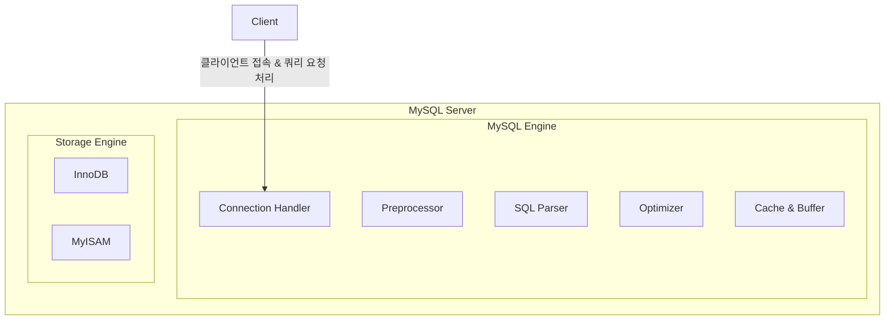
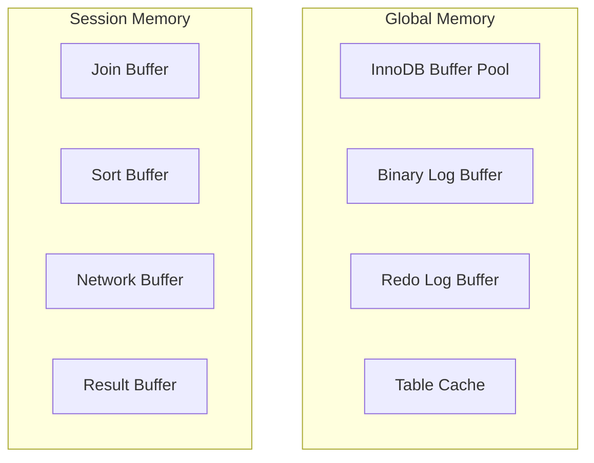
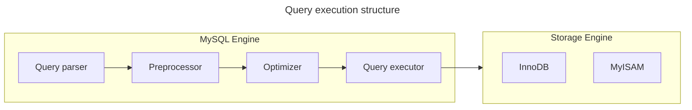
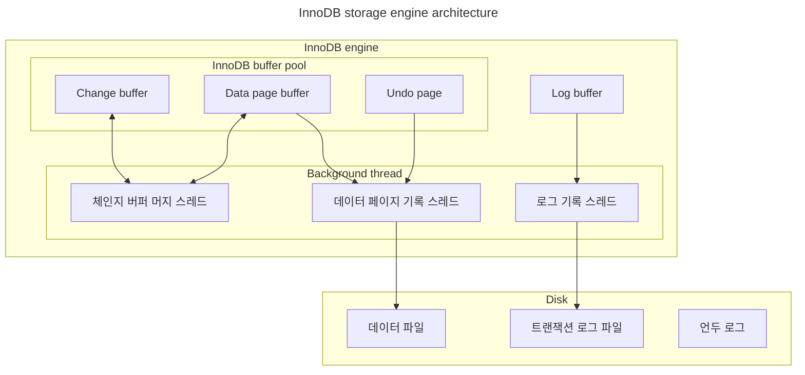
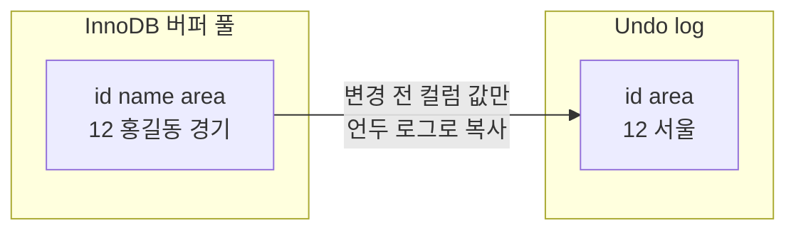
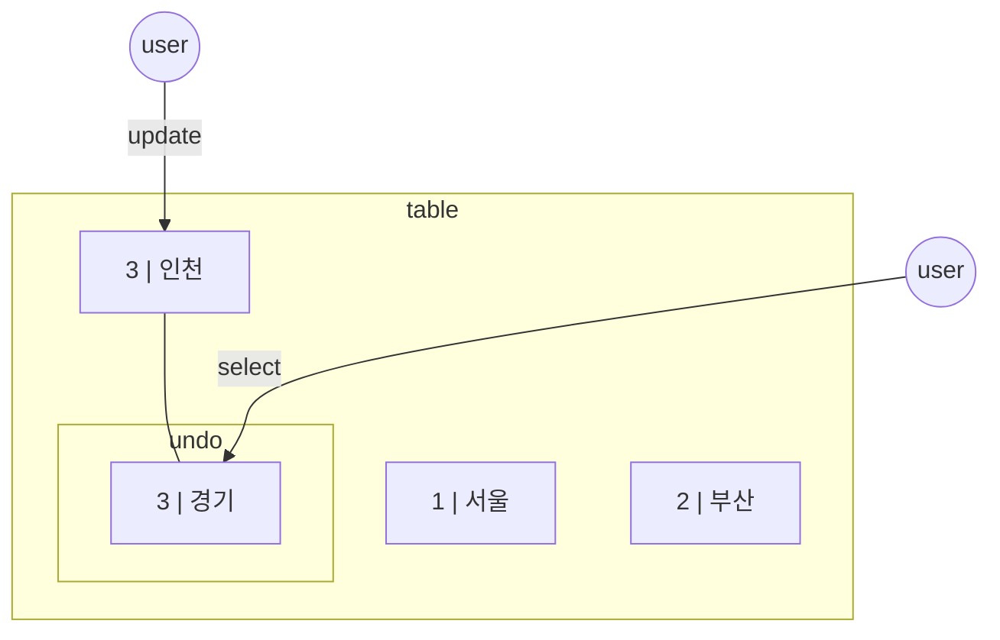
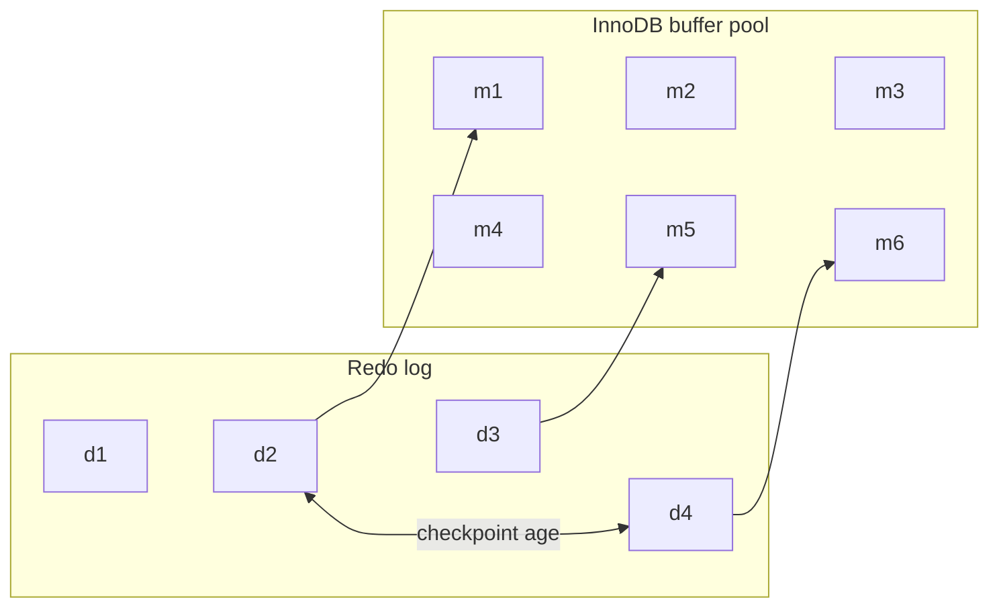

# 4. 아키텍처

## 4.1 MySQL 엔진 아키텍처

### 4.1.1 MySQL 전체 구조

- MySQL 엔진  
요청된 SQL 문장을 분석하거나 최적화하는 역할을 한다.
- 스토리지 엔진  
실제 데이터를 디스크 스토리지에 저장하거나 읽어오는 역할을 한다.
- 핸들러 API  
MySQL 엔진이 스토리지 엔진에게 데이터를 읽거나 쓰라고 요청하는 인터페이스 역할을 한다.



### 4.1.2 스레딩 구조

#### Foreground 스레드

- MySQL 서버에 접속한 클라이언트 수만큼 존재하며, 주로 각 클라이언트 사용자가 요청하는 쿼리 문장을 처리한다.
- InnoDB 테이블은 데이터 버퍼나 캐시에 데이터 쓰기까지만 포그라운드 스레드가 처리하고, 버퍼로부터 디스크까지 기록하는 작업은 백그라운드 스레드가 처리한다.

#### Background 스레드

- change buffer 병합 스레드
- log를 디스크로 기록하는 스레드
- InnoDB 버퍼 풀의 데이터를 디스크에 기록하는 스레드
- 데이터를 버퍼로 읽어오는 스레드
- 잠금이나 데드락을 모니터링하는 스레드

```sql
SELECT thread_id, nmae, type, processlist_user, processlist_host
FROM performance_schema.threads
ORDER BY type, thread_id;
```

### 4.1.3 메모리 할당 및 사용 구조

#### 글로벌 메모리

모든 스레드에서 공유되는 메모리

#### 로컬 메모리

클라이언트 스레드가 쿼리 요청을 처리하는 데 사용하는 메모리



### 4.1.6 쿼리 실행 구조

group by나 order by 등 복잡한 처리는 스토리지 엔진 영역이 아닌 MySQL 엔진의 **Query Executor**에서 처리된다.



## 4.2 InnoDB 스토리지 엔진 아키텍처



### 4.2.1 클러스터링

InnoDB의 모든 테이블은 프라이머리키 값의 순서대로 디스크에 저장된다.
모든 세컨더리 인덱스는 레코드 주소 대신 프라이머리 키의 값을 논리적인 주소로 사용한다.

### 4.2.3 Muti Version Concurrency Control

레코드 레벨의 트랜잭션을 지원하는 DBMS가 제공하는 기능이며, MVCC의 가장 큰 목적은 잠금을 사용하지 않는 일관된 읽기를 제공하는데 있다.
InnoDB는 Undo log를 이용해 이 기능을 구현한다.
여기서 멀티 버전이라 함은 하나의 레코드에 대해 여러 개의 버전이 동시에 관리된다는 의미다.



### 4.2.4 Non-Locking Consistent Read

격리 수준이 SERIALIZABLE이 아닌 READ_UNCOMMITTED나 READ_COMMITED, REPEATABLE_READ 수준인 경우 INSERT와 연결되지 않은 순수한 읽기 작업은 다른 트랜잭션의 변경 작업과 관계없이 항상 잠금을 대기하지 않고 바로 실행된다.



### 4.2.5 자동 데드락 감지

데드락 감지 스레드가 주기적으로 잠금 대기 그래프를 검사해 교착 상태에 빠진 트랜잭션들을 찾아서 그중 하나를 강제 종료한다.
데드락 감지 스레드는 잠금 목록을 검사해야 하기 때문에 잠금 상태가 변경되지 않도록 잠금 테이블에 새로운 잠금을 걸고 데드락을 찾게 된다.
데드락 감지 스레드가 느려지면 서비스 쿼리를 처리 중인 스레드는 작업을 진행하지 목하고 대기하면서 서비스에 악영향을 미치게 된다.
`innodb_deadlock_detect` 시스템 변수를 OFF로 설정하면 데드락 감지 스레드는 작동하지 않는다.
`innodb_lock_wait_timeout` 시스템 변수를 활성화 해 데드락 상황을 해결할 수 있다.

### 4.2.7 InnoDB 버퍼풀

디스크의 데이터 파일이나 인덱스 정보를 메모리에 **캐시해** 두는 공간이다.
쓰기 작업을 지연시켜 일괄 처리할 수 있게 해주는 **버퍼** 역할도 같이 한다.
데이터를 변경하는 쿼리는 데이터 파일이 이곳저곳에 위치한 레코드를 변경하기 때문에 랜덤한 디스크 작업을 발생시킨다.
하지만 버퍼 풀이 이러한 변경된 데이터를 모아서 처리하면 랜덤한 디스크 작업의 횟수를 줄일 수 있다.

#### 4.2.7.2 버퍼 풀의 구조

1. LRU 리스트  
  디스크로부터 한 번 읽어온 페이지를 최대한 오랫동안 InnoDB 버퍼 풀의 메모리에 유지해서 디스크 읽기를 최소화한다.
2. 플러시 리스트  
  디스크로 동기화되지 않은 데이터를 가진 더티 데이터 페이지의 변경 시점 기준의 페이지 목록을 관리한다.
3. 프리 리스트  
  InnoDB 버퍼 풀에서 실제 사용자 데이터로 채워지지 않은 비어 있는 페이지들의 목록이며, 사용자의 쿼리가 새롭게 디스크의 데이터 페이지를 읽어와야 하는 경우 사용된다.

#### 4.2.7.3 버퍼 풀과 리두 로그

InnoDB의 버퍼 풀은 디스크에서 읽은 상태로 전혀 변경되지 않은 클린 페이지(clean page)와 갱신 명령으로 변경된 더티 페이지(dirty page)를 가지고 있다.
디스크와 메모리의 데이터 상태를 동기화 하기 위해 InnoDB 스토리지 엔진은 1개 이상의 고정 크기 파일을 갖는 리두 로그를 순환 고리처럼 사용한다.
데이터 변경이 발생하면 로그 엔트리는 활성 리두 로그 상태가 된다.
로그 파일에 기록될 때마다 로그 포지션은 계속 증가된 값을 갖게 되는데 이를 LSN(Log Sequence Number)이라고 한다.
InnoDB 스토리지 엔진은 주기적으로 **체크포인트 이벤트**를 발행시켜 리두 로그와 버퍼 풀의 더티 페이지를 동기화한다.
가장 최근 체크포인트의 LSN과 마지막 리두 로그 엔트리의 LSN의 차이를 체크포인트 에이지(checkpoint age)라고 한다.



#### 4.2.7.4 버퍼 풀 플러시

InnoDB 스토리지 엔진은 버퍼 풀에서 아직 디스크로 기록되지 않은 더티 페이지들을 성능상의 악영향 없이 디스크에 동기화하기 위해 2개의 플러시 기능을 백그라운드로 실행한다.

- 플러시 리스트 플러시  
  플러시 리스트에서 오래전에 변경된 데이터 페이지 순서대로 디스크에 동기화하는 작업
- LRU 리스트 플러시  
  LRU 리스트에서 사용 빈도가 낮은 데이터 페이지들을 제거해서 새로운 페이들을 읽어올 공간을 만들기 위해 사용

#### 4.2.7.6 버퍼풀의 적재 내용 확인

```sql
SELECT
  it.name table_name,
  ii.name index_name,
  ici.n_cached_pages n_cached_pages
FROM information_schema.innodb_tables it
INNER JOIN information_schema.innodb_indexes ii ON ii.table_id = it.table_id
INNER JOIN information_schema.innodb_cached_indexes ici ON ici.index_id = ii.index_id
WHERE it.name=CONCAT('employees','/','employees');
```

### 4.2.9 Undo log

- 트랜잭션 보장  
  트랜잭션이 롤백 되면 트랜잭션 도중 변경된 데이터를 변경 전 데이터로 복구해야 하는데, 이때 언두 로그에 백업해둔 이전 버전의 데이터를 이용해 복구한다.
- 격리 수준 보장  
  특정 커넥션에서 데이터를 변경하는 도중에 다른 커넥션에서 데이터를 조회하면 트랜잭션 격리 수준에 맞게 변경 중인 레코드를 읽지 않고 언두 로그에 백업해둔 데이터를 읽어서 반환하기도 한다.

#### 4.2.9.1 언두 로그 레코드 모니터링

트랜잰셕이 commit 되었다고 해서 해당 트랜잭션이 생성한 언두 로그를 즉시 삭제할 수 있는 것은 아니다.
아래 그림에서 B와 C 트랜잭션은 완료됐지만 가장 먼저 시작된 트랜잭션 A는 완료되지 않은 상태다.
트랜잭션 B와 C는 각각 UPDATE와 DELETE 명령을 실행헀으므로 이전의 데이터를 언두 로그에 백업했다.
하지만, 트랜잭션 A가 활성 상태이기 때문에 언두 로그는 삭제되지 않는다.

누적된 언두 로그로 인해 디스크의 사용량이 증가하는 것은 그다지 큰 문제가 아닐 수 있다.
하지만 그동안 빈번하게 변경된 레코드를 조회하는 쿼리가 실행되면 InnoDB 스토리지 엔진은 언두 로그의 이력을 필요한 만큼 스캔해야만 필요한 레코드를 찾을 수 있기 때문에 쿼리의 성능이 전박적으로 떨어지게 된다.

```mermaid
gantt
    dateFormat X
    axisFormat %s
    section Transaction A
    BEGIN   : 0, 5
    SELECT  : 5, 10
    section Transaction B
    BEGIN   : 10, 15
    UPDATE  : 15, 20
    COMMIT  : 20, 25
    section Transaction C
    BEGIN   : 15, 20
    DELETE  : 20, 25
    COMMIT  : 25, 30
```



### 4.2.10 체인지 버퍼

레코드가 INSERT 되거나 UPDATE 될 때는 데이터 파일을 변경하는 작업뿐 아니라 해당 테이블에 포함된 인덱스를 업데이트하는 작업도 필요하다.
InnoDB는 변경해야 할 인덱스 페이지가 버퍼 풀에 없다면 이를 즉시 실행하지 않고 임시 공간에 저장해 두고 바로 사용자에게 결과를 반환하는 형태로 성능을 향상시키데 되는데, 이때 사용하는 임시 메모리 공간을 체인지 버퍼(Change Buffer)라고 한다.

### 4.2.11 리두 로그 및 로그 버퍼

데이터베이스 서버에서 리두 로그는 트랜잭션이 커밋되면 즉시 디스크로 기록되도록 설정하는 것을 권장한다.
비정상적으로 서버가 종료 됐을 때 직전까지의 트랜잭션 커밋 내용이 리두 로그에 기록되고, 리두 로그를 이용해 장애 직전 시점까지의 복구가 가능하다.
하지만 트랜잭션이 커밋될 때마다 리두 로그를 디스크에 기록하는 작업은 많은 부하를 유발한다.
그래서 InnoDB 스토리지 엔진에서 리두 로그를 어느 주기로 디스크에 동기화할지를 결정하는 innodb_flush_log_at_trx_commit 시스템 변수를 제공한다.

- 0: 1초에 한 번씩 리두 로그를 디스크로 기록하고 동기화를 실행한다.
- 1: 트랜잭션이 커밋될 때마다 디스크로 기록하고 동기화한다.
- 2: 트랜잭션이 커밋될 때마다 운영체제 메모리 버퍼에 기록되지만 실질적인 동기화는 1초에 한 번식 실행된다.

사용량이 매우 많은 DBMS 서버의 경우에는 이 리두 로그의 기록 작업이 큰 문제가 되는데, 이러한 부분을 보완하기 위해 최대한 ACID 속성을 보장하는 수준에서 버퍼링한다.
이러한 리두 로그 버퍼링에서 사용되는 공간이 로그 버퍼다.

### 4.2.12 어댑티브 해시 인덱스

해시 인덱스는 **B-Tree 인덱스의 고유번호**와 **B-Tree 인덱스의 실제 키 값**의 조합을 키값으로 사용하고 **데이터 페이지 주소**를 값으로 관리된다.
B-Tree 루트 노드부터 리프 노드까지 찾아가는 비용 없이 해시 인덱스를 사용해 검색 비용을 줄일 수 있다.

- 어댑티브 해시 인덱스가 성능 향상에 도움 되지 않는 상황
  - 디스크 읽기가 많은 경우
  - 조인이나 LIKE 패턴이 많은 경우
  - 매우 큰 데이터를 가진 테이블의 레코드를 폭 넓게 읽는 경우
- 어댑티브 해시 인덱스가 성능 향상에 도움 되는 상황
  - 디스크 읽기가 많지 않은 경우
  - 동등 비교와 IN 연산자가 많은 경우
  - 쿼리 데이터 중에서 일부 데이터에만 집중되는 경우

## 4.4 MySQL 로그 파일

AWS RDS의 경우 cloud watch -> Log groups에서 확인 가능

- 에러 로그  
MySQL이 실행되는 도중에 발생하는 에러나 경고를 기록

- 슬로우 쿼리 로그  
설정한 임계 시간보다 쿼리 실행 시간이 오래 걸린 경우 쿼리를 기록
