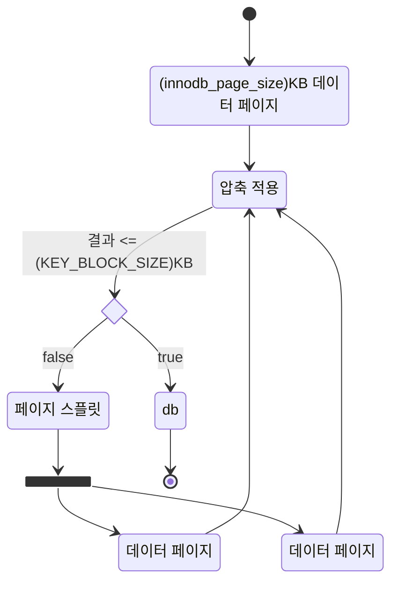

# 6. 데이터 압축

## 6.1 페이지 압축

페이지 압축은 Transparent Page Compression 이라고 불리는데, MySQL 서버가 디스크에 저장하는 시점에 데이터 페이지가 압축되어 저장되고, 반대로 MySQL 서버가 디스크에서 데이터 페이지를 읽어올 때 압축이 해체된다.

- 운영체제별로 특정 버전의 파일 시스템에서만 지원되는 펀치 홀(punch hole)이라 기능 사용
- 하드웨어에서도 펀치홀 기능 지원 필요

## 6.2 테이블 압축

- 버퍼 풀 공간 활용률이 낮음
- 쿼리 처리 성능이 낮음
- 빈번하게 데이터 변경 시 압축륙이 떨어짐

### 6.2.1 압축 테이블 생성



원본 데이터 페이지의 압축 결과가 목표 크기(KEY_BLOCK_SIZE)보다 작거나 같을 때까지 반복해서 페이지를 스플릿하기 때문에 목표 크기가 잘못 설정되면 MySQL 서버 처리 성능이 급격히 떨어질 수 있다.

### 6.2.2 KEY_BLOCK_SIZE 결정

일반적으로 압축 실패육은 3~5% 미만으로 유지할 수 있게 KEY_BLOCK_SIZE를 선택하는 것이 좋다.

```sql
SELECT table_name, index_name, compress_ops, compress_ops_ok, (compress_ops-compress_ops_ok)/compress_ops * 100 as compression_failure_pct 
FROM information_schema.INNODB_CMP_PER_INDEX;
```

### 6.2.3 압축된 페이지의 버퍼 풀 적재 및 사용

InnoDB 스토리지 엔진은 압축된 테이블의 데이터 페이지를 버퍼 풀에 적재하면 압축된 상태와 압축이 해제된 상태 2개 버전을 관리한다. 압축된 테이블에 대해서 버퍼 풀의 공간을 이중으로 사용하믕로써 메모리를 낭비하는 효과를 가진다.
