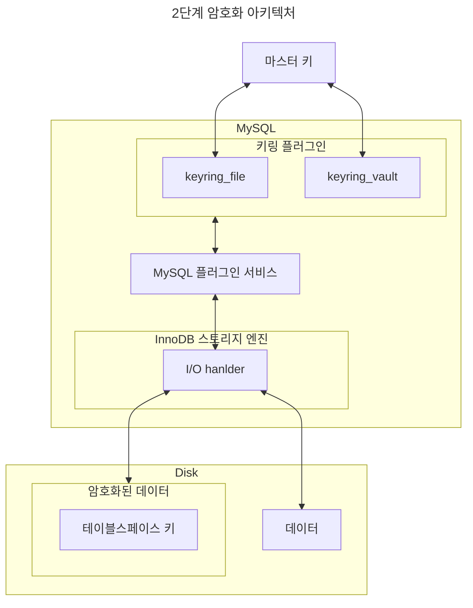

# 7. 데이터 암호화

## 7.1 MySQL 서버의 데이터 암호화

MySQL 암호화 기능은 데이터베이스 서버와 디스크 사이의 데이터를 읽고 쓰기 시점에서 암호화 또는 복호화를 수행한다.
데이터 암호화 기능이 활성화돼 있다고 하더라도 MySQL 내부와 사용자 입장에서는 아무런 차이가 없기 때문에 이런한 암호화 방식을 가르켜 TDE(Transparent Data Encryption)이라고 한다.

### 7.1.1 2단계 키 관리

MySQL 서버의 데이터 암호화는 **마스터 키(master key)** 와 **테이블스페이스 키(tablespace key)** 라는 두종류의 키를 가지고 있는데, 테이블스페이스 키는 프라이빗 키(private key)라고도 한다.
MySQL 서버는 마스터 키를 가져와 암호화된 테이블이 생성될 때마다 해당 테이블을 위한 임의의 테이블스페이스 키를 발급한다.
그리고 MySQL 서버는 마스터 키를 이용해 테이블스페이스 키를 암호화해서 각 테이블의 데이터 파일 헤더에 저장한다.



### 7.1.2 암호화와 성능

- 압축과 암호화를 동시에 적용되면 압축 후 암호화를 적용한다.
- 암호화된 테이블의 읽기는 3 ~ 5배 느리고 쓰기는 5 ~ 6배 느리다.

### 7.1.3 암호화와 복제

MySQL 서버에서 기본적으로 모든 노드는 각자의 마스터 키를 할당해야 한다.
마스터 키 자체가 레플리카로 복제되지 않기 떄문에 테이블스페이스 키 또한 레플리카로 복제되지 않는다.
소스 서버와 레플리카 서버는 서로 다른 마스터 키와 테이블스페이스 키를 관리하기 때문에 암호화 되기 전의 데이터가 동일하더라도 실제 암호화된 테이터 파일의 내용은 완전히 다르다.

MySQL 서버의 백업에서 TDE의 키링(Key Ring) 파일을 백업하지 않는 경우가 있는데, 이 경우 키링 파일을 찾지 못하면 데이터를 복구를 할 수 없게 된다.

## 7.2 keyring_file 플러그인 설치

```bash
## my.cnf
early-plugin-load = keyring_file.so
keyring_file_data = /very/secure/directory/tde_master.key
```

## 7.3 테이블 암호화

### 7.3.1 테이블 생성

```sql
CREATE TABLE tab_encrypted(
    id INT,
    data VARCHAR(100),
    PRIMARY KEY(id)
) ENCRYPTION = 'Y';
```

### 7.3.2 응용 프로그램 암호화와의 비교

응용 프로그램에서 직접 암호화해서 MySQL 서버에 저장하는 경우 칼럼 값이 이미 암호화된 것인지 MySQL 서버는 인지하지 못한다.
그래서 응용 프로그램에서 암호화된 칼럼은 인덱스를 생성하더라도 인덱스의 기능을 100% 활용할 수 없다.
MySQL 서버의 암호화 기능(TDE)을 사용한다면 MySQL 서버는 인덱스 관련된 작업을 모두 처리한 후 최종 디스크에 데이터 페이즐 저장할 때만 암호화하기 때문에 이 같은 제약은 없다.

암호화의 결과로 값은 랜덤한 값을 변경되기 때문에 cluster key의 장점 중 하나인 비슷한 값을 비슷한 위치에 저장해 디스크 random access를 줄이는 효과는 없을 것 같다.

```sql
-- 응용 프로그램 index 검색 O / TDE index 검색  O
SELECT * FROM app_user WHERE enc_birth_year=#{encryptedYear};

-- 응용 프로그램 index 검색 X / TDE index 검색  O
SELECT * FROM app_user WHERE enc_birth_year BETWEEN #{encryptedMinYear} AND #{encryptedMaxYear};
SELECT * FROM app_user ORDER BY enc_birth_year LIMIT 10;
```

## 7.4 언두 로그 및 리두 로그 암호화

`innodb_undo_log_encrypt` 시스템 변수와 `innodb_redo_log_encrypt` 시스템 변수를 이용해 리두 로그와 언두 로그를 암호화된 상태로 저장할 수 있다.
언두 로그나 리두 로그에 암호화를 활성화 또는 비활성화하면 이후부터 생성되는 로그에 적용된다.

## 7.5 바이너리 로그 암호화

바이너리 로그는 의도적으로 긴 시간을 보관하고 있기 떄문에 바이너리 로그 파일의 암호화가 중요할 수 있다.

바이너리 로그와 릴레이 로그 파일의 데이터는 **파일 키(File Key)**로 암호화해서 디스크로 저장하고, 파일 키는 **바이너리 로그 암호화 키**로 암호화해서 각 바이너리 로그와 릴레이 로그 파일의 헤더에 저장된다.
