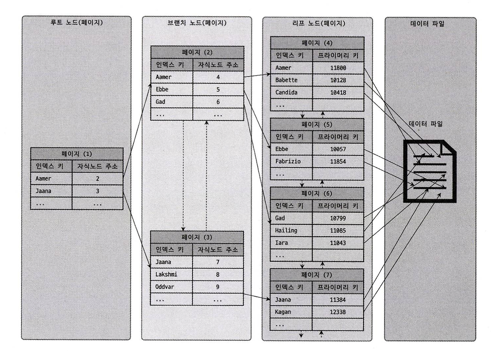

# 8. 인덱스

## 8.1 디스크 읽기 방식

CPU나 메모리처럼 전기적 특성을 띤 장치의 성능은 빠른 속도로 발전했지만 디스크 같은 기계식 장치의 성능은 제한적으로 발전했다.
최근에는 자기 디스크 원판에 의존하는 HDD보다 SSD가 많이 활용되고 있지만 Secondary storage I/O는 컴퓨터에서 가장 느린 부분이다.
데이터베이스의 성능 튜닝은 어떻게 Secondary storage I/O를 줄이느냐가 관건일 때가 많다.

### 8.1.2 랜덤 I/O와 순차 I/O

순차 I/O는 3개의 페이지를 디스크에 기록하기 위해 1번 시스템 콜을 요청한다.
랜덤 I/O는 3개의 페이지를 디스크에 기록하기 위해 3번의 시스템 콜을 요청한다.
순차 I/O는 디스크 헤드를 1번 움직이지만, 랜덤 I/O는 디스크 헤드를 3번 움직인다.
데이터베이스 대부분의 작업은 작은 데이터를 빈번히 읽고 쓰기 때문에 MySQL 서버에는 그룹 커밋이나 버이너리 로그 버퍼 또는 InnoDB 로그 버퍼 등의 기능이 내장돼 있다.

인덱스 레인지 스캔은 데이터를 읽기 위해 주로 랜덤 I/O를 사용하며 풀 테이블 스캔은 순차 I/O를 사용한다.
그래서 큰 테이블의 레코드 대부분을 읽는 작업에서는 인덱스를 사용하지 않고 풀 테이블 스캔을 유도할 때도 있다.

## 8.2 인덱스란

데이터를 빠르게 검색하기 위해 칼럼의 값과 해당 레코드가 저장된 주소를 키와 값의 쌍으로 삼아 인덱스를 만들어 두는 것이다.

- B-Tree 알고리즘
- Hash 인덱스 알고리즘

## 8.3 B-Tree 인덱스

### 8.3.1 구조 및 특성

B-Tree는 트리 구조의 최상위에 하나의 루트 노드가 존재하고 그 하위에 자식 노드가 붙어 있는 형태다.
트리 구조의 가장 하위에 있는 노드를 리프 노드하 하고, 트리 구조에서 루트 노드도 아니고 리프 노드도 아닌 중간의 노드를 브랜치 노드라고 한다.
데이터베이스에서 인덱스와 실제 데이터가 저장된 데이터는 따로 관리되는데, 인덱스의 리프 노드는 데이터 레코드를 찾아가기 위한 주소값을 가지고 있다.

InnoDB 스토리지 엔젠에서는 모든 세컨더리 인덱스 검색에서 데이터 레코드를 읽기 위해서는 반드시 프라이머리 키를 저장하고 있는 B-Tree를 다시 한번 검색해야 한다.

### 8.3.2 B-Tree 인덱스 키 추가 및 삭제

#### 8.3.2.1 인덱스 키 추가

B-Tree에 저장될 때는 저장될 키 값을 이용해 B-Tree 상의 적절할 위치를 검색해야 한다.
저장될 위치가 결정되면 레코드의 키 값과 대상 레코드의 주소 정보를 B-Tree의 리프 노드에 저장한다.
리포 노드가 꽉 차서 더는 저장할 수 없을 대는 리포 노드가 분리(Split)돼야 하는데, 이는 상위 브랜치 노드까지 작업 범위가 넓어진다.
이러한 작업 탓에 B-Tree는 상대적으로 쓰기 작업에 비용이 많이 드는 것으로 알려졌다.

테이블에 레코드를 추가하는 작업 비용을 1이라고 가정하면 해당 테이블의 인덱스에 키를 추가하는 작업 비용을 1.5 정도로 예측하는 것이다.
일반적으로 테이블에 인덱스가 3개가 있다면 이때 테이블에 인덱스가 하나도 없는 경우는 작업 비용이 1이고, 3개인 경우에는 5.5 정도의 비용 정도로 예측한다.

#### 8.3.2.2 인덱스 키 삭제

삭제의 경우 해당 키 값이 저장된 B-Tree의 리프 노드를 찾아서 삭제 마크를 하면 작업이 완료된다.
삭제 마킹된 인덱스 키 공간은 계속 방치하거나 재활용할 수 있다.

#### 8.3.2.3 인덱스 키 변경

변경의 경우 먼저 키 값을 삭제하고 다시 새로운 키 값을 추가하는 작업을 수행한다.

### 8.3.3 B-Tree 인덱스 사용에 영향을 미치는 요소

#### 8.3.3.1 인덱스 키 값의 크기

B-Tree 자식 노드의 개수는 인덱스의 페이지 크기와 키 값의 크기에 따라 결정된다.
인덱스를 구성하는 키의 크기가 커지면 디스크로부터 읽어야하는 횟수가 늘어나고, 메모리 효울도 떨어진다.
$$B-Tree 자식 노드 개수 = \frac{인덱스 페이지 사이즈}{인덱스 키의 크기 + 자식 노드 주소 크기}$$

#### 8.3.3.3 Seletivity(선택도)

인덱스에서 Seletivitiy(선택도) 또는 Cardinality(기수성)은 거의 같은 의미로 사용되며, 모든 인덱스 키 값 가운데 유니크한 값의 수를 의미한다.
저첸 인덱스 키 값은 100개인데, 그중에서 유니크한 값의 수는 10개라면 기수성은 10이다.
인덱스는 기수성이 높을수록 검색 대상이 줄어들기 때문에 빠르게 처리된다.

#### 8.3.3.4 읽어야하는 레코드의 건수

일반적인 DBMS의 옵티마이저에서는 인덱스를 통해 레코드 1건을 읽는 것이 테이블에서 직접 레코드 1건을 읽는 것보다 4~5배 정도 비용이 더 많이 드는 작업인 것으로 예측한다.
인덱스를 통해 읽어야 할 레코드의 건수(옵티마이저가 판단한 예상 건수)가 전체 테이블 레코드의 20~25%를 넘어서면 인덱스를 이용하지 않고 테이블을 모두 직접 읽어서 필요한 레코드만 필터링하는 방식으로 처리하는 것이 효율적이다.

### 8.3.4 B-Tree 인덱스를 통한 데이터 읽기

#### 8.3.4.1 인덱스 레인지 스캔

#### 8.3.4.2 인덱스 풀 스캔

#### 8.3.4.3 인덱스 루스 스캔

#### 8.3.4.4 인덱스 스킵 스캔

### 8.3.5 다중 컬럼 인덱스

### 8.3.6 B-Tree 인덱스의 정렬 및 스캔 방향

### 8.3.7 B-Tree 인덱스의 가용성과 효율성
