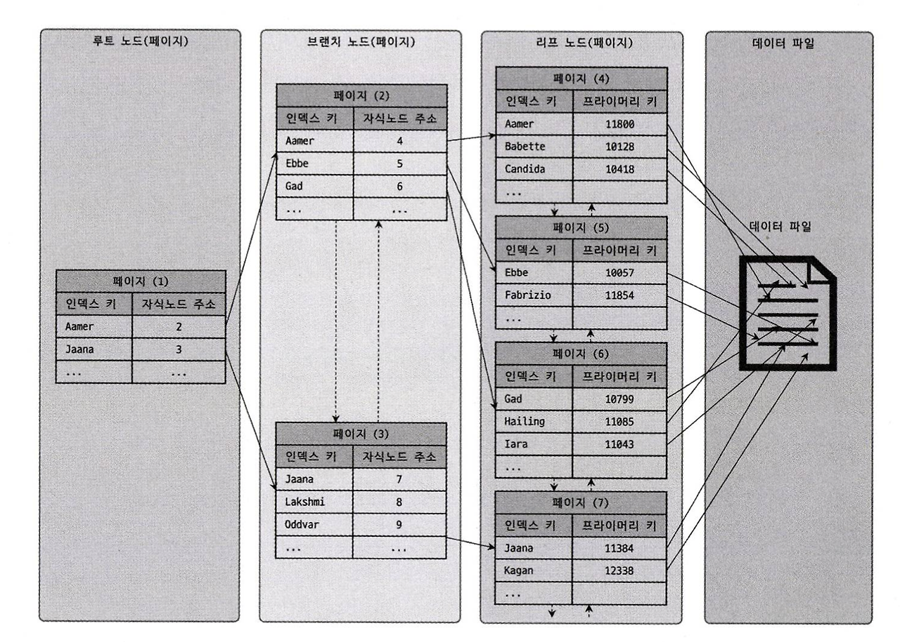
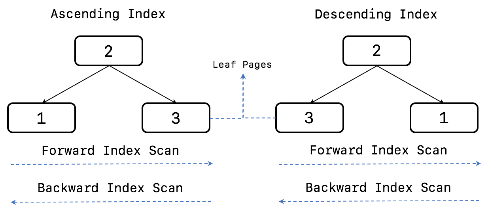
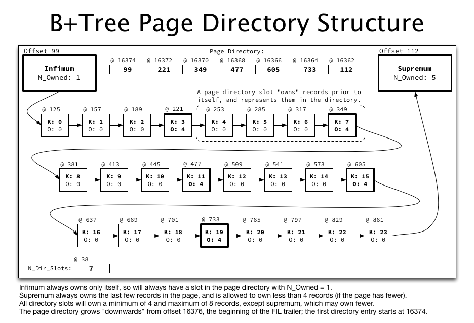

# 8. 인덱스

## 8.1 디스크 읽기 방식

CPU나 메모리처럼 전기적 특성을 띤 장치의 성능은 빠른 속도로 발전했지만 디스크 같은 기계식 장치의 성능은 제한적으로 발전했다.
최근에는 자기 디스크 원판에 의존하는 HDD보다 SSD가 많이 활용되고 있지만 Secondary storage I/O는 컴퓨터에서 가장 느린 부분이다.
데이터베이스의 성능 튜닝은 어떻게 Secondary storage I/O를 줄이느냐가 관건일 때가 많다.

### 8.1.2 랜덤 I/O와 순차 I/O

순차 I/O는 3개의 페이지를 디스크에 기록하기 위해 1번 시스템 콜을 요청한다.
랜덤 I/O는 3개의 페이지를 디스크에 기록하기 위해 3번의 시스템 콜을 요청한다.
순차 I/O는 디스크 헤드를 1번 움직이지만, 랜덤 I/O는 디스크 헤드를 3번 움직인다.
데이터베이스 대부분의 작업은 작은 데이터를 빈번히 읽고 쓰기 때문에 MySQL 서버에는 그룹 커밋이나 버이너리 로그 버퍼 또는 InnoDB 로그 버퍼 등의 기능이 내장돼 있다.

인덱스 레인지 스캔은 데이터를 읽기 위해 주로 랜덤 I/O를 사용하며 풀 테이블 스캔은 순차 I/O를 사용한다.
그래서 큰 테이블의 레코드 대부분을 읽는 작업에서는 인덱스를 사용하지 않고 풀 테이블 스캔을 유도할 때도 있다.

## 8.2 인덱스란

데이터를 빠르게 검색하기 위해 칼럼의 값과 해당 레코드가 저장된 주소를 키와 값의 쌍으로 삼아 인덱스를 만들어 두는 것이다.

- B-Tree 알고리즘
- Hash 인덱스 알고리즘

## 8.3 B-Tree 인덱스

B-Tree는 칼럼의 원래 값을 변형시키지 않고 인덱스 구조체 내에서는 항상 정렬된 상태로 유지한다.
MySQL의 B-Tree 인덱스는 실제 칼럼 값이 1MB이더라도 1MB 전체의 값을 인덱스 키로 사용하는 것이 아니라 1,000바이트(MyISAM) 또는 3,072바이트까지만 잘러서 인덱스 키로 사용한다.

### 8.3.1 구조 및 특성

B-Tree는 트리 구조의 최상위에 하나의 루트 노드가 존재하고 그 하위에 자식 노드가 붙어 있는 형태다.
트리 구조의 가장 하위에 있는 노드를 리프 노드하 하고, 트리 구조에서 루트 노드도 아니고 리프 노드도 아닌 중간의 노드를 브랜치 노드라고 한다.
데이터베이스에서 인덱스와 실제 데이터가 저장된 데이터는 따로 관리되는데, 인덱스의 리프 노드는 데이터 레코드를 찾아가기 위한 주소값을 가지고 있다.



InnoDB 스토리지 엔젠에서는 모든 세컨더리 인덱스 검색에서 데이터 레코드를 읽기 위해서는 반드시 프라이머리 키를 저장하고 있는 B-Tree를 다시 한번 검색해야 한다.

### 8.3.2 B-Tree 인덱스 키 추가 및 삭제

#### 8.3.2.1 인덱스 키 추가

B-Tree에 저장될 때는 저장될 키 값을 이용해 B-Tree 상의 적절할 위치를 검색해야 한다.
저장될 위치가 결정되면 레코드의 키 값과 대상 레코드의 주소 정보를 B-Tree의 리프 노드에 저장한다.
리포 노드가 꽉 차서 더는 저장할 수 없을 대는 리포 노드가 분리(Split)돼야 하는데, 이는 상위 브랜치 노드까지 작업 범위가 넓어진다.
이러한 작업 탓에 B-Tree는 상대적으로 쓰기 작업에 비용이 많이 드는 것으로 알려졌다.

테이블에 레코드를 추가하는 작업 비용을 1이라고 가정하면 해당 테이블의 인덱스에 키를 추가하는 작업 비용을 1.5 정도로 예측하는 것이다.
일반적으로 테이블에 인덱스가 3개가 있다면 이때 테이블에 인덱스가 하나도 없는 경우는 작업 비용이 1이고, 3개인 경우에는 5.5 정도의 비용 정도로 예측한다.

#### 8.3.2.2 인덱스 키 삭제

삭제의 경우 해당 키 값이 저장된 B-Tree의 리프 노드를 찾아서 삭제 마크를 하면 작업이 완료된다.
삭제 마킹된 인덱스 키 공간은 계속 방치하거나 재활용할 수 있다.

#### 8.3.2.3 인덱스 키 변경

변경의 경우 먼저 키 값을 삭제하고 다시 새로운 키 값을 추가하는 작업을 수행한다.

### 8.3.3 B-Tree 인덱스 사용에 영향을 미치는 요소

#### 8.3.3.1 인덱스 키 값의 크기

B-Tree 자식 노드의 개수는 인덱스의 페이지 크기와 키 값의 크기에 따라 결정된다.
인덱스를 구성하는 키의 크기가 커지면 디스크로부터 읽어야하는 횟수가 늘어나고, 메모리 효울도 떨어진다.
$$B-Tree\,자식\,노드\,개수 = \frac{인덱스\,페이지\,사이즈}{인덱스\,키의\,크기 + 자식\,노드\,주소\,크기} = \frac{16KB}{16B + 12B} $$

#### 8.3.3.3 Seletivity(선택도)

인덱스에서 Seletivitiy(선택도) 또는 Cardinality(기수성)은 거의 같은 의미로 사용되며, 모든 인덱스 키 값 가운데 유니크한 값의 수를 의미한다.
전체 인덱스 키 값은 100개인데, 그중에서 유니크한 값의 수는 10개라면 기수성은 10이다.
인덱스는 기수성이 높을수록 검색 대상이 줄어들기 때문에 빠르게 처리된다.

#### 8.3.3.4 읽어야하는 레코드의 건수

일반적인 DBMS의 옵티마이저에서는 인덱스를 통해 레코드 1건을 읽는 것이 테이블에서 직접 레코드 1건을 읽는 것보다 4\~5배 정도 비용이 더 많이 드는 작업인 것으로 예측한다.
인덱스를 통해 읽어야 할 레코드의 건수(옵티마이저가 판단한 예상 건수)가 전체 테이블 레코드의 20\~25%를 넘어서면 인덱스를 이용하지 않고 테이블을 모두 직접 읽어서 필요한 레코드만 필터링하는 방식으로 처리하는 것이 효율적이다.

### 8.3.4 B-Tree 인덱스를 통한 데이터 읽기

#### 8.3.4.1 인덱스 레인지 스캔

인덱스 레인지 스캔은 검색해야 할 인덱스의 범위가 결정됐을 때 사용하는 방식이다.
검색하려는 값의 수나 검색 결과 레코드 건수와 관계없이 레인지 스캔이라고 표현한다.

1. 인덱스에서 조건을 만족하는 값이 저장된 위치를 찾는다.(인덱스 탐색)
2. 1번에서 탐색된 위치부터 필요한 만큼 인덱스를 차례대로 쭉 읽는다.(인덱스 스캔)
3. 2번에서 읽어 들인 인덱스 키와 레코드 주소를 이용해 레코드가 저장된 페이지를 가져오고, 최종 레코드를 읽오온다.

쿼리가 필요로 하는 데이터에 따라 3번 과정은 필요하지 않을 수도 있는데, 이를 **커버링 인덱스**라고 한다. 커버링 인덱스로 처리되는 쿼리는 디스크의 레코드를 읽지 않아도 되기 때문에 랜덤 읽기가 상당히 줄어들고 성능은 그만큼 빨라진다.

#### 8.3.4.2 인덱스 풀 스캔

인덱스의 크기는 테이블의 크기보다 작으므로 직접 테이블을 처음부터 끝까지 읽는 것보다는 인덱스만 읽는 것이 효율적이다.
쿼리가 인덱스에 명시된 칼럼만으로 조건을 처리할 수 있는 경우 주로 이 방식이 사용된다.
인덱스뿐만 아니라 데이터 레코드까지 모두 읽어야 한다면 절대 이 방식으로 처리되지 않는다.

#### 8.3.4.3 인덱스 루스 스캔

인덱스 스캔은 레인지 스캔과 비슷하게 작동하지만 중간에 필요치 않은 인덱스 키 값은 무시(skip)하고 다음으로 넘어가는 형태로 처리된다.
일반적으로 GROUP BY 또는 집합 함수 가운데 MAX() 또는 MIN() 함수에 대해 최적화를 하는 경우에 사용된다.

```SQL
-- INDEX (dept_no, emp_no)
SELECT dept_no, MIN(emp_no) FROM dept_emp 
WHERE dept_no BETWEEN 'd002' AND 'd004' GROUP BY dept_no;
```

#### 8.3.4.4 인덱스 스킵 스캔

다중 칼럼 인덱스의 선행 칼럼을 건너뛰어서 나머지 칼럼만으로도 인덱스 검색이 가능하다.
옵티마이저는 우선 gender 칼럼에서 유니크한 값을 모두 조회해서 주어진 쿼리에 gender 칼럼의 조건을 추가해서 쿼리를 다시 실행하는 형태로 처리한다.

- WHERE 조건절에 조건이 없는 인덱스의 선행 칼럼의 유니크한 값의 개수가 적어야 함
- 쿼리가 인덱스에 존재하는 칼럼만으로 처리 가능해야 함

```SQL
-- INDEX (gender, birth_date)

-- 입력 쿼리
SELECT gender, birth_date FROM employees WHERE birth_date >= '1965-02-01';

-- 최적화 쿼리
SELECT gender, birth_date FROM employees WHERE gender = 'M' AND birth_date >= '1965-02-01';
SELECT gender, birth_date FROM employees WHERE gender = 'F' AND birth_date >= '1965-02-01';
```

### 8.3.5 다중 칼럼(Multi-column) 인덱스

두 개 이상의 칼럼으로 구성된 인덱스를 다중 칼럼 인덱스(복합 칼럼 인덱스)라고 하며, 또한 2개 이상의 칼럼이 연결됐다고 해서 Concatenated Index라고도 한다.
다중 칼럼 인덱스에서 중요한 것은 인덱스의 두 번째 칼럼은 첫 번째 칼럼에 의존해서 정렬돼 있다는 것이다.

### 8.3.6 B-Tree 인덱스의 정렬 및 스캔 방향

인덱스를 생성할 때 설정한 정렬 규칙에 따라서 인덱스의 키 값은 항상 오름차순이거나 내림차순으로 정렬되어 저장된다.
인덱스를 어느 방향으로 읽을지는 쿼리에 따라 옵티마이저가 실시간으로 만들어내는 실행 계획에 따라 결정된다.



- Asecending inde: 작은 값의 인덱스 키가 B-Tree 왼쪽으로 정령 인덱스
- Descending index: 큰 값의 인덱스 키가 B-Tree 왼쪽으로 정령 인덱스
- Forward index scan: 인덱스 키의 크고 작음에 관계없이 인덱스 리프 노드의 왼쪽 페이지부터 오른쪽으로 스캔
- Backward index scan: 인덱스 키의 크고 작음에 관계없이 인덱스 리프 노드의 오른쪽 페이지부터 왼쪽으로 스캔

역순 정렬 쿼리가 정순 정렬 쿼리보다 약 25% 더 시간이 걸린다.

#### 8.3.6.1 페이지 잠금이 Forward index scan에 적합한 구조

B-Tree 리프 페이지는 Double linked list로 연결되어 있기 때문에, 어느 방향이든 이동 자체는 차이가 없다.
하지만 InnoDB 스토리지 엔진에서 페이지 잠금 과정에서 데드락을 방지하기 위해 B-Tree의 왼쪽에서 오른쪽 순서로만 잠금을 획득하도록 하고 있다.
그래서 Forward index scan에서는 다음 페이지 잠금 획득이 간단하지만, Backward index scan에서는 이전 페이지 잠금 획득이 복잡하다.

#### 8.3.6.2 페이지 내에서 인덱스 레코드는 단방향으로만 연결된 구조

일반적으로 인덱스 리프 노드 페이지에는 약 600개의 레코드가 저장될 수 있다.
InnoDB 스토리지 엔진은 하나의 페이지내에서 순차적으로 정렬된 레코드 4~8개 정도씩을 묶어서 대표 키(가장 큰 인덱스 엔트리 키 값)을 선정한다.
그리고 이 대표 키들만 모아서 별도의 리스트를 관리하는데, 이를 **페이지 디렉토리**(Page directory)라고 한다.
하나의 페이지에서 특정 키 값을 검색할 때 Page directory를 이용해 바이너리 서치 방식으로 검색 대상 키를 포함하는 대표 키를 검색한다.
대표 키를 찾으면 그때부터 인덱스 키값 순서대로 연결된 Linked list를 이용해서 대상 레코드를 검색하게 된다.
그런데 페이지 내부 레코드(인덱스 엔트리)들은 Single linked list 구조로 구성되어 있다.

역순 정렬 쿼리가 많은 레코드를 빈번하게 조회하거나 인덱스의 안쪽 또는 뒤쪽만 집중적으로 읽어서 인덱스의 특정 페이지 잠금이 병목이 될 것으로 예상된다면 쿼리에서 사용하는 정렬 순서대로 인덱스를 생성하는 것이 효율적이다.



### 8.3.7 B-Tree 인덱스의 가용성과 효율성

```SQL
SELECT * FROM dept_emp WHERE dept_no = 'd002' and emp_no >= 10114;
```

- INDEX A (dept_no, emp_no)  
- INDEX B (emp_no, dept_no)

공식 명칭은 아니지만 INDEX A는 두 조건이 모두 작업 범위를 결정하는 조건을 "작업 범위 결정 조건"이라고 표현한다.
INDEX B의 dept_no = 'd002' 조건 같이 작업의 범위를 줄이지 못하고 거름종이 역할만 하는 조건을 "필터링 조건" 또는 "체크 조건"이라고 표현한다. 

다른 일반적인 DBMS에서는 NULL 값이 인덱스에 저장되지 않지만 MySQL에서는 NULL 값도 인덱스에 저장된다.

## 8.4 R-Tree 인덱스

공간 인덱스는 R-Tree 인덱스 알고리즘을 이용해 2차원의 데이터를 인덱싱하고 검색하는 목적의 인덱스다.
일반적으로 WGS84(GPS) 기준의 위도, 경도 좌표 저장에 주로 사용된다.
하지만 CAD/CAM 소프트웨어 또는 회로 디자인 등과 같이 좌표 시스템에 기반을 둔 정보에 대해서는 모두 적용할 수 있다.

MBR이란 "Mininum Bounding Rectangle"의 약자로 해당 도형을 감싸는 최소 크기의 사각형을 의미한다.

## 8.5 전문 검색 인덱스

전문 검색에서는 문서 본문의 내용에서 사용자가 검색하게 될 키워드를 분석해 내고, 빠른 검색용으로 사용할 수 있게 이러한 키워드로 인덱스로 구축한다.
키워드의 분석 및 인덱스 구축에는 여러가지 방법이 있을 수 있다.
전문 검색 인덱스는 문서의 키워드를 인덱싱하는 기법에 따라 크게 단어의 어근 분석과 n-gram 분석 알고리즘으로 구분할 수 있다.

### 어근 분석

어근 분석은 검색어로 선정된 단어의 뿌리인 원형을 찾는 작업이다.

### n-gram

본문을 무조건 몇 글자씩 잘라서 인덱싱하는 방법이다.

### 불용어

검색에서 별 가치가 없는 단어를 모두 필터링해서 제거하는 작업이다.

## 8.6 함수 기반 인덱스

### 8.6.1 가상 칼럼을 이용한 인덱스

가상 칼럼은 테이블에 새로운 칼럼을 추가하는 것과 같은 효과를 내기 때문에 실제 테이블 구조가 변경된다는 단점이 있다.

```SQL
ALTER TABLE user
  ADD full_name VARCHAR(30) AS (CONCAT(first_name,' ',last_name)) VIRTUAL,
  ADD INDEX ix_fullname (full_name);
```

### 8.6.2 함수를 이용한 인덱스

함수를 직접 사용하는 인덱스는 테이블의 구조는 변경하지 않고, 계산된 결괏값의 검색을 빠르게 만들준다.
함수 기반 인덱스를 제대로 활용하려면 반드시 조건절에 함수 기반 인덱스에 명시된 표현식이 그대로 사용돼야 한다.

```SQL
CREATE TABLE user(
  user_id BIGINT,
  first_name VARCHAR(10),
  last_name VARCHAR(10),
  PRIMARY KEY (user_id),
  INDEX ix_fullname ((CONCAT(first_name,' ',last_name)))
);

SELECT * FROM user WHERE CONCAT(first_name,' ',last_name)='Matt Lee';
```

## 8.7 멀티 밸류 인덱스

하나의 데이터 레코드가 여러 개의 키 값을 가질 수 있는 형태의 인덱스다.

```SQL
CREATE TABLE user(
  user_id BIGINT,
  first_name VARCHAR(10),
  last_name VARCHAR(10),
  credit_info JSON,
  INDEX mx_creditscorees ( (CAST(credit_info->'$.credit_scores' AS UNSIGNED ARRAY)) )

INSERT INTO user VALUES (1, 'Matt', 'Lee', '{"credit_scores":[360, 353, 351]}');

SELECT * FROM user WHERE 360 MEMBER OF(credit_info->'$.credit_scores');
```

## 8.8 클러스터링 인덱스

MySQL에서 클러스터링은 테이블의 레코드를 비슷한 것(프라미어리 키)들끼리 묶어서 저장하는 형태로 구현되는데, 이는 주로 비슷한 값들을 동시에 조회하는 경우가 많다는 점을 착안한 것이다.
클러스터링 인덱스는 테이블의 프라이머리 키에 대해서만 적용되는 내용이다.
클러스터링 인덱스의 리프 노드에는 레코드의 모든 칼럼이 같이 저장돼 있다.

InnoDB 스토리지 엔진이 프라이머리 키를 선택하는 기준

1. 프라이머리 키가 있으면 프라이머리 키를 클러스터링 키로 선택
2. NOT NULL 옵션의 유니크 인덱스 중에서 첫 번째 인덱스를 클러스터링 키로 선택
3. 자동으로 유니크한 값을 가지도록 증가하는 칼럼을 내부적으로 추가한 후, 클러스터링 키로 선택

### 8.8.2 세컨더리 인덱스에 미치는 영향

InnoDB 테이블에서 세컨더리 인덱스가 실제 레코드가 저장된 주소를 저장하고 있다면, 클러스터링 키 값이 변경될 때마다 데이터 레코드의 주소가 변경되고 해당 테이블의 모든 엔덱스에 저장된 주소 값을 변경해야 할 것이다.
이런 오버헤드를 제거하기 위해 InnoDB 테이블의 모든 세컨더리 인덱스는 해당 레코드가 저장된 주소가 아닌 프라이머리 키 값을 저장한다.

### 8.8.3 클러스터링 인덱스의 장점과 단점

장점

- 프라이머리 키로 검색할 때 처리 성능이 빠름
- 테이블의 모든 세컨더리 인덱스가 프라이머리 키를 가지고 있기 때문에 인덱스만으로 처리될 수 있는 경우가 많음(커버링 인덱스)

단점

- 테이블의 모든 세컨더리 인덱스가 클러스터링 키를 갖기 때문에 클러스터링 키 값의 크기가 클 경우 전체적으로 인덱스 크기가 커짐
- 세컨더리 인덱스를 통해 검색할 때 프라이머리 키로 다시 한번 검색해야 하므로 처리 성능이 느림
- INSERT할 때 프라이머리 키에 의해 레코드의 저장 위치가 결정되기 때문에 처리 성능이 느림
- 프라이머리 키를 변경할 때 레코드를 DELETE하고 INSERT하는 작업이 필요하기 때문에 처리 성능이 느림

웹 서비스와 같은 온라인 트랜잭션 환경(OLTP)에서는 쓰기와 읽기의 비율이 2:8 또는 1:9 정도이기 때문에 조금 느린 쓰기를 감수하고 읽기를 빠르게 유지하는 것이 중요하다.

### 8.8.4 클러스터링 테이블 사용 시 주의사항

#### 8.8.4.1 클러스터링 인덱스의 크기

클러스터링 테이블의 경우 모든 세컨더리 인덱스가 프라이머리 키 값을 포함한다.
그래서 프라이머리 키의 크기가 커지면 세컨더리 인덱스도 자동으로 크기가 커진다.

#### 8.8.4.2 프라이머리 키는 AUTO-INCREMENT 보다는 업무적인 칼럼으로 생성

프라이머리 키로 검색하는 경우(특히 범위로 많은 레코드를 검색하는 경우) 클러스터링되지 않은 테이블에 비해 빠르게 처리될 수 있다.
프라이머리 키는 그 의미만큼이나 중요한 역할을 하기 때문에 대부분 검색에서 상당히 빈번하게 사용되는 것이 일반적이다.
그러므로 칼럼의 크기가 크더라도 업무적으로 해당 레코드를 대표할 수 있다면 그 칼럼을 프라이머리 키로 설정하는 것이 좋다.

#### 8.8.4.3 프라이머리 키는 반드시 명시할 것

InooDB 테이블에 프라이머리 키를 정의하지 않으면 InnoDB 스토리지 엔진이 내부적으로 일련번호 컬럼을 추가한다.
하지만 이렇게 추가된 칼럼은 사용자게 보이지 않기 때문에 사용할 수가 없다.
또한 ROW 기반의 복제나 InnoDB Cluster에서는 모든 테이블이 프라이머리 키를 가져야만 정상적인 복제 성능을 보장하기도 한다.

#### 8.8.4.4 AUTO-INCREMENT 칼럼을 인조 식별자로 사용하는 경우

세컨더리 인덱스(복합)도 필요하고 프라이머리 키의 크기도 길다면 AUTO_INCREMENT 칼럼을 추가하고 이를 프라이머리 키로 설정하면 된다.
로그 테이블과 같이 조회보다는 INSERT 위주의 테이블들은 AUTO_INCREMENT를 이용한 인조 식별자(Surrogate key)를 프라이머리 키로 설정하는 것이 성능 향상에 도움이 된다.

## 8.9 유니크 인덱스

유니크는 테이블이나 인덱스에 같은 값을 2개 이상 저장될 수 없음을 의미하는데, MySQL에서는 인덱스 없이 유니크 제약만 설정할 방법이 없다.
유니크 엔덱스에는 NULL도 저장될 수 있는데, NULL은 특정 값이 아니므로 2개 이상 저장될 수 있다.

### 8.9.1 유니크 인덱스와 일반 세컨더리 인덱스 비교

#### 8.9.1.2 인덱스 읽기

1개의 레코드를 읽느냐 2개 이상의 레코드를 읽느냐의 차이만 있을 뿐 읽어야할 레코드 건수가 같다면 성능 차이는 미미하다.

#### 8.9.1.2 인덱스 쓰기

유니크 인덱스는 반드시 중복 체크를 해야 하므로 인덱스 쓰기 작업을 버퍼링하지 못한다.
MySQL에서는 유니크 인덱스에서 중복된 값을 체크할 때는 읽기 잠금을 사용하고, 쓰기를 할 때는 쓰기 잠금을 사용하는데 이 과정에서 데드락이 빈번히 발생한다.

## 8.10 외래키

외래키 제약이 설정되면 자동으로 연관된 테이블 칼럼에 인덱스까지 생성된다.

- 테이블의 변경이 발생하는 경우에만 잠금 경합이 발생한다.
- 외래키와 연관되지 않은 칼럼의 변경은 최대한 잠금 경합을 발생시키지 않는다.
