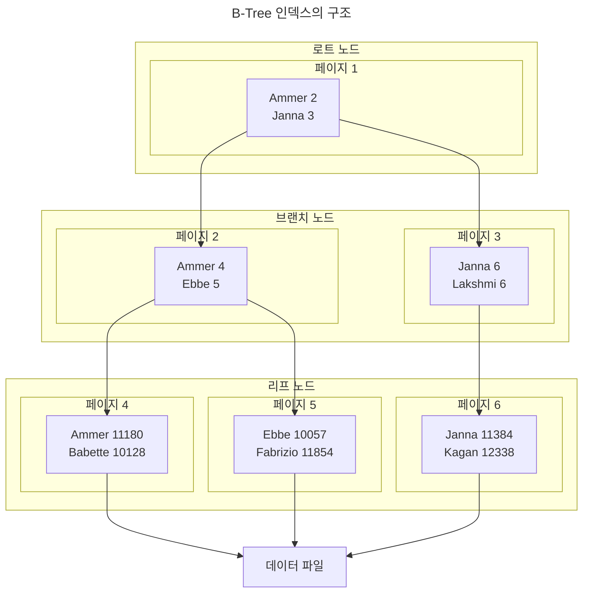

# 8. 인덱스

## 8.1 디스크 읽기 방식

### 8.1.1 하드 디스크 드라이브(HDD)와 솔리드 스테이트 드라이브(SSD)

SSD의 장점은 기존 하드 디스크 드라이브보다 랜덤 I/O가 훨씬 빠르다는 것이다.
데이터베이스 서버에서 순차 I/O 작업은 비중이 크지 않고 랜덤 I/O를 통해 작은 데이터를 읽고 쓰는 작업이 대부분이므로 SSD의 장점은 DBMS용 스토리지에 최적이라고 볼 수 있다.

### 8.1.2 랜덤 I/O와 순차 I/O

순차 I/O는 3개의 페이지를 디스크에 기록하기 위해 1번 시스템 콜을 요청했지만, 랜던 I/O는 3개의 페이지를 디스크에 기록하기 위해 3번의 시스템 콜을 요청한다.

SSD 드라이브에서도 랜덤 I/O는 여전히 순차 I/O보다 전체 스로풋이 떨어진다.

## 8.2 인덱스란?

데이터를 빠르게 검색하기 위해 칼럼의 값과 해당 레코드가 저장된 주소를 키와 값의 쌍으로 삼아 인덱스를 만들어 두는 것이다.

- 프라이머리 키는 그 레코드를 대표하는 칼럼의 값으로 만들어진 인덱스를 의미한다. 이 칼럼은 테이블에서 해당 레코드를 식별할 수 있는 기준값이 되기 때문에 식별자라고도 부른다. 프라이머리 키는 NULL 값을 허용하지 않으며 중복을 허용하지 않는다.
- 프라이머리 키를 제외한 나머지 모든 인덱스는 세컨더리 인덱스(Secondary Index)로 분류한다.
- B-Tree 인덱스는 카럼의 값을 변형하지 않고 원래의 값을 이용해 인덱싱하는 알고리즘이다.
- Hash 인덱스 알고리즘은 카럼의 값으로 해시값을 계산해서 인덱싱하는 알고리즘으로 매운 빠른 검색을 지원한다. 하지만 값을 변형해서 인덱싱하므로 전방 일치와 같이 값의 일부만 검색하거나 범위를 검색할 때는 해시 인덱스를 사용할 수 없다. Hash 인덱스는 주로 메모리 기반의 데이터베이스에서 많이 사용한다.

## 8.3 B-Tree 인덱스

B-Tree의 B는 Binary의 약자가 아니라 Balanced를 의미한다.

### 8.3.1 구조 및 특성

B-Tree는 트리 구조의 최상위에 하나의 루트 노드가 존재하고 그 하위에 자식 노드가 붙어 있는 형태다.
트리 구조의 가장 하위에 있는 노드를 리프 노드하 하고, 트리 구조에서 루트 노드도 아니고 리프 노드도 아닌 중간의 노드를 브랜치 노드라고 한다.
데이터베이스에서 인덱스와 실제 데이터가 저장된 데이터는 따로 관리되는데, 인덱스의 리프 노드는 
항상 실제 데이터 레코드를 찾아가기 위한 주소값을 가지고 있다.

MyISAM 스토리지 엔진의 인덱스와 InnoDB 스토리지 엔지의 인덱스의 큰 차이점은 세컨더리 인덱스를 통해 데이터 파일의 레코드를 찾아가는 방법에 있다.
MyISAM 테이블은 세컨더리 인덱스가 물리적인 주소를 가지는 반면 InnoDB 테이블은 프라이머리 키를 주소처럼 사용하기 때문에 논리적인 주소를 가진다고 볼 수 있다.

### 8.3.2 B-Tree 인덱스 키 추가 및 삭제

#### 8.3.2.1 인덱스 키 추가

B-Tree에 저장될 때는 저장될 키 값을 이용해 B-Tree 상의 적절할 위치를 검색해야 한다.
저장될 위치가 결정되면 레코드의 키 값과 대상 레코드의 주소 정보를 B-Tree의 리프 노드에 저장한다.
리포 노드가 꽉 차서 더는 저장할 수 없을 대는 리포 노드가 분리(Split)돼야 하는데, 이는 상위 브랜치 노드까지 작업 범위가 넓어진다.

테이블에 레코드를 추가하는 작업 비용을 1이라고 가정하면 해당 테이블의 인덱스에 키를 추가하는 작업 비용을 1.5 정도로 예측하는 것이다. 일반적으로 테이블에 인덱스가 3개가 있다면 이때 테이블에 인덱스가 하나도 없는 경우는 작업 비용이 1이고, 3개인 경우에는 5.5 정도의 비용 정도로 예측한다.

#### 8.3.2.2 인덱스 키 삭제 & 변경

삭제의 경우 해당 키 값이 저장된 B-Tree의 리프 노드를 찾아서 삭제 마크를 하면 작업이 완료된다.
삭제 마킹된 인덱스 키 공간은 계속 방치하거나 재활용할 수 있다.
변경의 경우 먼저 키 값을 삭제하고 다시 새로운 키 값을 추가하는 작업을 수행한다.

### 8.3.3 B-Tree 인덱스 사용에 영향을 미치는 요소
