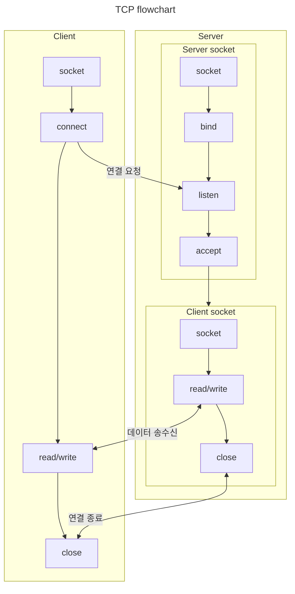
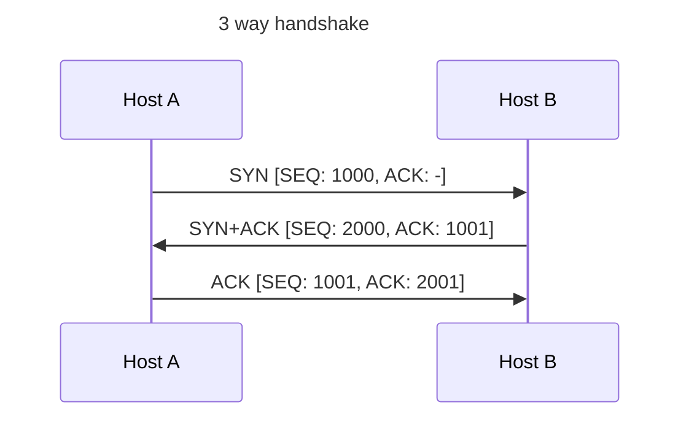
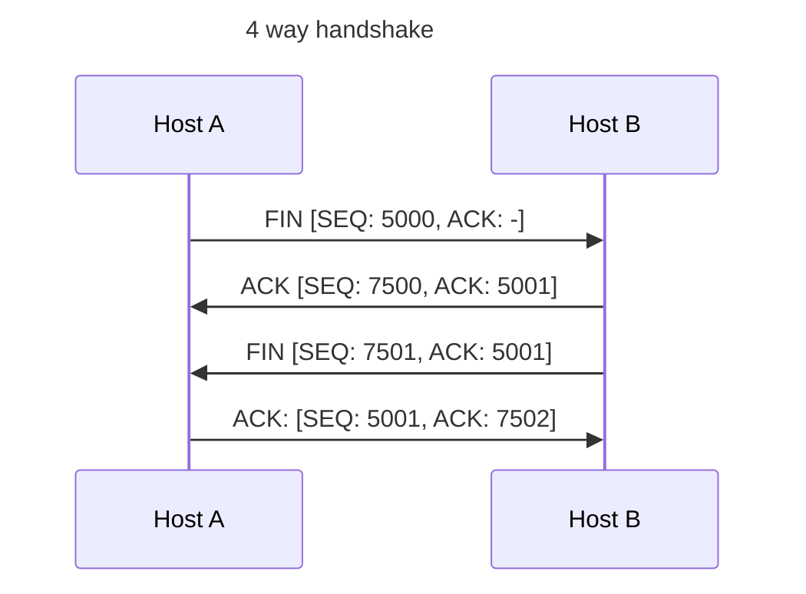
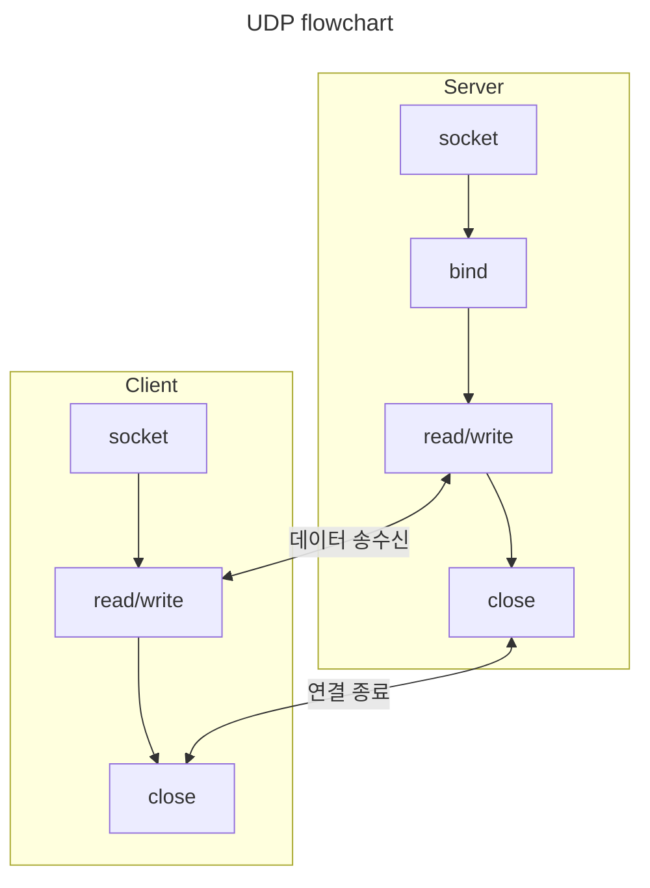

# TCP/IP 소켓프로그래밍

## Network socket

호스트(End system)에서 실행되고 있는 프로그램이 물리적으로 연결된 네트워크 인프라를 이용해 다른 호스트에서 실행되고 있는 프로그램으로 데이터를 송수신할 수 있는 커널 인터페이스

## TCP



- TCP 데이터는 경계가 없어서 stream이라고 표현
- unreliable 채널(IP)에서 reliable 하게 데이터를 전송
  - ack 수신 못하면(packet/ack 유실 or timeout) packet 재전송
  - sliding window(윈도우 사이즈 만큼 packet을 동시에 보낼 수 있음)
- congestion control
  - congestion window(cwnd)
  - additive increase & multiplicative decrease(AIMD)
  - slow start & ssthresh
- 3 way handshake



- 4 way handshake



- half close(shutdown)
  - `close` 함수를 통해 stream을 닫으면 입출력 모두 불가능하기 때문에 데이터를 더 이상 수신할 수 없다. 보낼 데이터가 없지만 수신할 데이터가 있는 경우 `shutdown` 함수를 호출하여 EOF를 상대 호스트에 전달한다. EOF를 받은 호스트는 상대 호스트가 더 이상 송신할 데이터가 없다는 것을 알 수 있다.
- time wait 상태
  - 4 way handshake에서 마지막 ack이 유실된다면 상대 호스트는 영원히 ACK을 받지 못해 connection을 close 못하고 dangling 되는 문제가 발생한다. 상대방 호스트가 dangling 되는 상태를 막기 위해 연결 종료를 요청한 호스트가 ACK 응답을 상대 애플이케이션에 제대로 전달하기 위해 일정 시간 대기하는 상태다.
- 다중 접속 서버
  - multi process
  - multi thread
  - IO multiplexing

## UDP



- unreliable 데이터 전송
- multicast
  - multicast 서버는 multicast 그룹 대상으로 데이터를 전송
  - multicast 그룹에 속한 클라이언트는 데이터를 수신 가ㅇ
  - muticast group address range (224.0.0.0 ~ 239.255.255.255)
  - multicast를 지원하지 않는 라우터에서는 tunneling 기술 필요
- broadcast
  - 같은 네트워크 환경에 있는 호스트에게 데이터 전송
  - Directed broadcast(x.y.z.255) x.y.z 네트워크에 속한 모든 호스트에게 broadcast
  - Local broadcast(255.255.255.255) 호스트가 연결되어 있는 네트웨크의 모든 호스트에게 broadcast

## Kernel API

- multi process
  - process 생성 (fork)
  - process 종료 (wait, waitpid)
  - multi process 환경에서 socket을 사용한다면 parent process와 chlid process 모두 socket을 참조socket을 release 하기 위해 두 process 모두 close를 호출
- signal handler
  - 특정 signal(kernel이 작업을 완료) 이후 다음 작업을 trigger하기 위해 함수를 등록
    - signal, sigaction, alarm
    - SIGALRM: alram 함수 호출을 통해서 등록된 시간이 된 상황
    - SIGINT: CTRL+C가 입력된 상황
    - SIGCHLD: 자식 프로세스가 종료된 상황
- IPC (pipe)
  - 운영체제가 제공하는 공유 메모리를 이용해 통신
- IO multiplexing
  - 하나의 통신채널을 통해서 둘 이상의 데이터(시그널)를 전송하는 기술
  - select 함수를 이용해 file descriptors 관찰해 하나의 스레드에서 다수의 IO를 처리
- system call vs standard IO
  - standard IO는 입출력 버퍼를 사용해 system call 감소로 성능 향상
  - fdopen 함수를 이용해 socket의 입출력을 분리하고 표준 입출력 이용
  - 출력 FILE을 fclose 한다면, 연결된 file descriptor와 socket 모두 정리
  - dup 함수를 이용해 file descriptor 복사

```c
FILE *readfp = fdopen(sock, "r");
FILE *writefp = fdopen(sock, "w");

shutdown(fileno(writefp), SHUT_WR);
fclose(writefp);
```

## 고성능 IO multiplexing

- epoll, kqueue, /dev/poll, IOCP
- 관심있는 file descriptor를 운영체제에게 전달하고 변경 사항만 전달 받음
  - 불필요한 select call(system call) 감소
